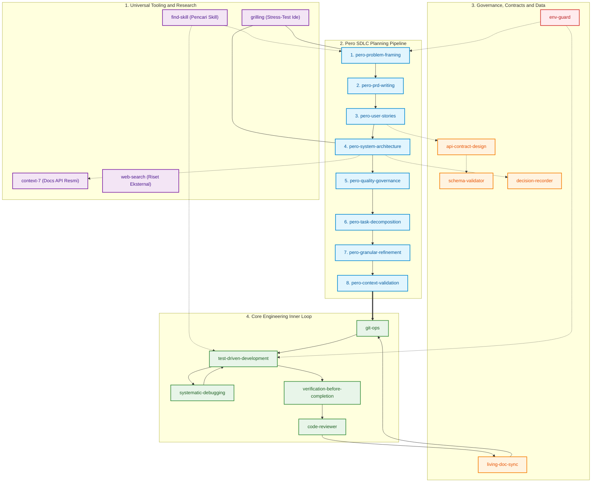
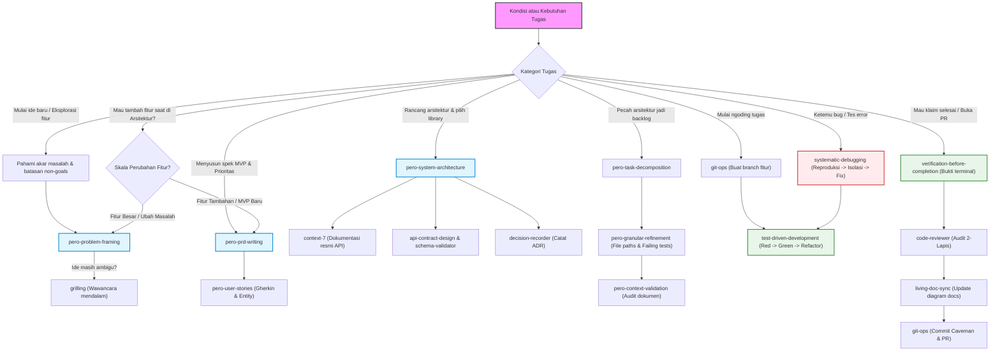
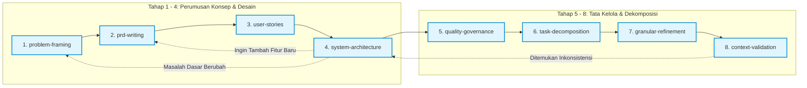
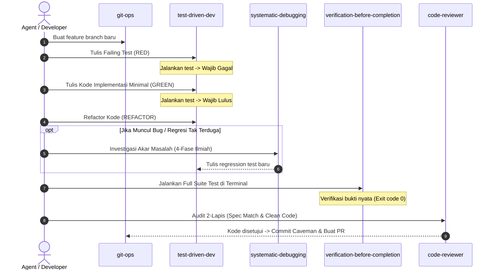

# Pero Agent Skills (`pero-agent-skills`)

[](LICENSE)
[](#katalog-lengkap-22-skill-universal)
[](#)

> **Ekosistem Standar SDLC & Rekayasa Agen AI Universal (Polyglot) yang Disiplin, Anti-Sycophancy, dan Berbahasa Ramah (ELI5).**

---

## Penjelasan Sederhana (ELI5)

> Bayangkan **Pero Agent Skills** ini seperti **Kotak Perkakas Robot Insinyur Ajaib**:
> - Ketika dipasang di proyek apa pun (Web, Mobile, Backend, AI, Database), asisten AI Anda otomatis bertransformasi menjadi **Insinyur Senior yang Sangat Disiplin**:
> - **Tidak Asal Tebak**: Selalu mendiagnosa akar masalah terlebih dahulu sebelum meresepkan solusi (*Problem Framing & Systematic Debugging*).
> - **Membangun dengan Denah Matang**: Menyusun fondasi dan aturan kualitas sebelum menyuruh tukang bekerja (*SDLC Pipeline*).
> - **Anti-Pujian Palsu (*Anti-Sycophancy*)**: Jujur berbasis bukti teknis dan berani menolak ide yang berisiko merusak sistem.
> - **Wajib Bukti Nyata (*Evidence Before Assertions*)**: Dilarang mengklaim selesai sebelum ada bukti tes terminal yang 100% lulus.
> - **Bahasa Ramah**: Menjelaskan konsep rumit dengan analogi sehari-hari yang mudah dimengerti siapa saja.

---

## Instalasi Cepat (1-Line Command)

Pasang seluruh 22 skill dan aturan tata kelola ke proyek Anda cukup dengan **satu baris perintah**:

```bash
curl -fsSL https://raw.githubusercontent.com/okyFaishal/pero-agent-skills/main/install.sh | bash
```

Atau jika ingin mengarahkan ke folder proyek tertentu:

```bash
curl -fsSL https://raw.githubusercontent.com/okyFaishal/pero-agent-skills/main/install.sh | bash -s -- /path/ke/proyek-anda
```

---

## Peta Navigasi Ekosistem Pero

Diagram di bawah menggambarkan bagaimana ke-22 skill saling berinteraksi dan mengalir dari tahap ide mentah hingga kode siap rilis:



---

## Pohon Keputusan: Kapan Menggunakan Skill Apa

Gunakan diagram alur keputusan (*Decision Flowchart*) berikut untuk menentukan skill yang tepat sesuai situasi yang dihadapi:



---

## Alur 8 Tahap Pero SDLC Pipeline & Siklus Umpan Balik

Pipeline perencanaan Pero mengalir secara bertahap dari tahap hulu ke hilir. Jika terdapat perubahan kebutuhan atau penambahan fitur di tengah jalan, alur kembali ke tahap spesifikasi yang relevan:



> **Catatan Mengenai Umpan Balik (*Feedback Loop*)**:
> Jangan melompat langsung ke `pero-granular-refinement` saat ingin menambahkan fitur baru di tahap arsitektur. Kembalilah ke `pero-prd-writing` atau `pero-problem-framing` agar cakupan (*scope*) dan kontrak sistem tetap selaras.

---

## Siklus Koding Disiplin (The Inner Engineering Loop)

Setelah perencanaan selesai, setiap tugas dieksekusi melalui siklus koding teruji (*Test-Driven Development*) dan gerbang pembuktian terminal:



---

## Katalog Lengkap 22 Skill Universal

| No | Skill | Kategori | Kapan Digunakan (*Trigger*) | Input ➡️ Output Utama |
|---|---|---|---|---|
| 1 | `pero-problem-framing` | Pero SDLC | Memulai proyek baru, eksplorasi ide mentah pengguna | Ide mentah ➡️ `docs/ProblemFraming.md` |
| 2 | `pero-prd-writing` | Pero SDLC | Menyusun PRD formal, prioritas fitur MVP (P0/P1/P2) & NFR | Problem Framing ➡️ `docs/PRD.md` |
| 3 | `pero-user-stories` | Pero SDLC | Menulis skenario uji Gherkin (`Given/When/Then`) & model data | PRD ➡️ `docs/SystemSpec.md` |
| 4 | `pero-system-architecture` | Pero SDLC | Merancang denah arsitektur sistem, komponen, & diagram Mermaid | System Spec ➡️ `docs/Architecture.md` |
| 5 | `pero-quality-governance` | Pero SDLC | Menetapkan aturan thread-safety, batas kualitas & review gate | Architecture ➡️ `docs/Governance.md` |
| 6 | `pero-task-decomposition` | Pero SDLC | Memecah spesifikasi sistem menjadi backlog 6 domain | Arsitektur & Spek ➡️ `docs/TaskBacklog.md` |
| 7 | `pero-granular-refinement` | Pero SDLC | Menajamkan kartu tugas dengan file path, signature, & failing test | Task Backlog ➡️ Kartu Tugas Siap Koding |
| 8 | `pero-context-validation` | Pero SDLC | Mengaudit konsistensi antar seluruh dokumen & diagram Mermaid | Seluruh `docs/*.md` ➡️ Laporan Validasi Silang |
| 9 | `find-skill` | Tooling | Mencari skill yang relevan di folder `.agents/skills/` | Kata kunci tugas ➡️ Rekomendasi Skill |
| 10 | `context-7` | Tooling | Membaca dokumentasi resmi library/API via Context7 MCP | Nama paket/library ➡️ Dokumentasi Resmi Terverifikasi |
| 11 | `web-search` | Tooling | Riset internet terarah untuk pemecahan masalah & fakta rilis | Query pencarian ➡️ Fakta & Solusi Teruji |
| 12 | `grilling` | Discipline | Wawancara mendalam pohon keputusan & stress-test ide/desain | Ide/Rancangan ambigu ➡️ Kesepakatan Desain Solid |
| 13 | `test-driven-development` | Discipline | Menulis kode fitur/bugfix (Siklus Red-Green-Refactor) | Kartu Tugas ➡️ Failing Test + Implementasi Lulus |
| 14 | `systematic-debugging` | Discipline | Menemukan bug atau kegagalan tes tanpa trial-and-error | Bug/Error ➡️ Root Cause + Fix Terisolasi |
| 15 | `verification-before-completion` | Discipline | Sebelum mengklaim tugas selesai atau membuat PR | Hasil kerja ➡️ Bukti Log Terminal Nyata |
| 16 | `code-reviewer` | Discipline | Review 2-lapis sebelum merge: Kesesuaian spek & kode bersih | Diff Kode ➡️ Checklist Audit Kualitas |
| 17 | `api-contract-design` | Architecture | Merancang kontrak antarmuka data REST, GraphQL, atau gRPC | Kebutuhan API ➡️ Dokumen Kontrak & Endpoint |
| 18 | `schema-validator` | Data | Memvalidasi integritas skema JSON, DTO, dan serialisasi | Data Payload ➡️ Status Validasi Skema |
| 19 | `decision-recorder` | Governance | Mencatat riwayat keputusan arsitektur/teknis (`ADR`/`PDR`) | Keputusan Desain ➡️ `docs/decisions/*.md` |
| 20 | `living-doc-sync` | Docs | Menyinkronkan diagram & dokumentasi saat kode berubah | Perubahan Kode ➡️ Update Diagram Arsitektur |
| 21 | `git-ops` | Operations | Operasi branching, commit Caveman, template PR, dan gh CLI | Perubahan Kode ➡️ Git Branch & PR Bersih |
| 22 | `env-guard` | Security | Melindungi file `.env`, kredensial, & filter perintah bahaya | Seluruh Operasi ➡️ Proteksi Rahasia & Keamanan |

---

## Tiga Pilar Tata Kelola Inti

1. **Skill-First Protocol**: Agent wajib mengecek `.agents/skills/` sebelum mengambil tindakan apa pun.
2. **Anti-Sycophancy & Technical Rigor**: Kebenaran teknis di atas menyenangkan pengguna. Dilarang menggunakan pujian kosong (*"Ide hebat!"*).
3. **Bahasa Sederhana (ELI5)**: Setiap konsep teknis wajib dijelaskan dengan analogi konkret sehari-hari tanpa menimbun jargon membingungkan.

---

## Lisensi
Distributed under the MIT License. Created by **Pero**.

