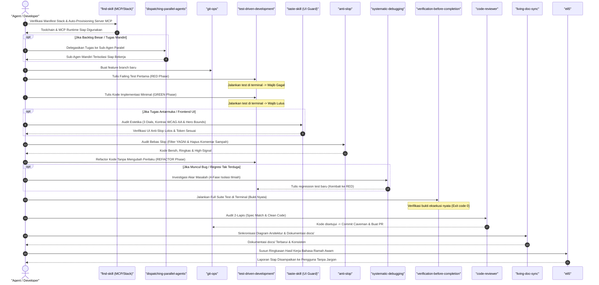

# Pero Agent Skills (`pero-agent-skills`)

[](LICENSE)
[](#katalog-lengkap-30-skill-universal)
[](#peta-navigasi-ekosistem-pero)

> **Ekosistem Standar SDLC & Rekayasa Agen AI Universal (Polyglot) yang Disiplin, Anti-Sycophancy, dan Berbahasa Ramah (ELI5).**

---

## Penjelasan Sederhana (ELI5)

> Bayangkan **Pero Agent Skills** ini seperti **Kotak Perkakas Robot Insinyur Ajaib**:
> - Ketika dipasang di proyek apa pun (Web, Mobile, Backend, AI, Database), asisten AI Anda otomatis bertransformasi menjadi **Insinyur Senior yang Sangat Disiplin**:
> - **Tidak Asal Tebak**: Selalu mendiagnosa akar masalah terlebih dahulu sebelum meresepkan solusi (*Problem Framing & Systematic Debugging*).
> - **Membangun dengan Denah Matang**: Menyusun fondasi dan aturan kualitas sebelum menyuruh tukang bekerja (*SDLC Pipeline*).
> - **Anti-Pujian Palsu (*Anti-Sycophancy*)**: Jujur berbasis bukti teknis dan berani menolak ide yang berisiko merusak sistem (*LLM Council*).
> - **Bebas Sampah Sintetis (*Anti-Slop*)**: Menolak kode berlebih (YAGNI), komentar sepele, dan kode tiruan palsu (*anti-slop*).
> - **Wajib Bukti Nyata (*Evidence Before Assertions*)**: Dilarang mengklaim selesai sebelum ada bukti tes terminal yang 100% lulus.
> - **Bahasa Ramah**: Menjelaskan konsep rumit dengan analogi sehari-hari yang mudah dimengerti siapa saja (*ELI5*).

---

## Instalasi Cepat (1-Line Command)

Pasang seluruh 30 skill dan aturan tata kelola ke proyek Anda cukup dengan **satu baris perintah**:

```bash
curl -fsSL https://raw.githubusercontent.com/okyFaishal/pero-agent-skills/main/install.sh | bash
```

Atau jika ingin mengarahkan ke folder proyek tertentu:

```bash
curl -fsSL https://raw.githubusercontent.com/okyFaishal/pero-agent-skills/main/install.sh | bash -s -- /path/ke/proyek-anda
```

---

## Peta Navigasi Ekosistem Pero

Diagram di bawah menggambarkan bagaimana ke-30 skill saling berinteraksi dan mengalir dari tahap ide mentah hingga kode siap rilis:

```mermaid
flowchart TB
    %% STYLING
    classDef sdlc fill:#e1f5fe,stroke:#0288d1,stroke-width:2px,color:#01579b;
    classDef engine fill:#e8f5e9,stroke:#388e3c,stroke-width:2px,color:#1b5e20;
    classDef govern fill:#fff3e0,stroke:#f57c00,stroke-width:2px,color:#e65100;
    classDef tool fill:#f3e5f5,stroke:#7b1fa2,stroke-width:2px,color:#4a148c;
    classDef guard fill:#ffebee,stroke:#d32f2f,stroke-width:2px,color:#b71c1c;

    subgraph TOOLING ["1. Universal Tooling, Discovery & Multi-Agent Dispatch"]
        FS["find-skill<br/>(Stack Fingerprinting & JIT MCP)"]:::tool
        C7["context-7<br/>(Official API Docs via MCP)"]:::tool
        WS["web-search<br/>(Targeted Web Research)"]:::tool
        GRL["grilling<br/>(Idea & Spec Stress-Test)"]:::tool
        COU["llm-council<br/>(5-Advisor AI Council)"]:::tool
        DPA["dispatching-parallel-agents<br/>(Parallel Subagents)"]:::tool
        SDD["subagent-driven-development<br/>(Autonomous Backlog Loop)"]:::tool
        TS["taste-skill<br/>(Anti-Slop UI & 3-Dial Engine)"]:::tool
        ELI5["eli5<br/>(Plain English Explanation)"]:::tool
    end

    subgraph SDLC ["2. Pero SDLC Planning Pipeline (Universal)"]
        S1["1. pero-problem-framing"]:::sdlc
        S2["2. pero-prd-writing"]:::sdlc
        S3["3. pero-user-stories"]:::sdlc
        S4["4. pero-system-architecture<br/>(Toolchain & MCP Server)"]:::sdlc
        S5["5. pero-uiux-design<br/>(Design System & Wireframes)"]:::sdlc
        S6["6. pero-quality-governance"]:::sdlc
        S7["7. pero-task-decomposition"]:::sdlc
        S8["8. pero-granular-refinement"]:::sdlc
        S9["9. pero-context-validation"]:::sdlc
        S10["10. pero-change-management<br/>(Scope Pivot & Anti-Zombie)"]:::sdlc
    end

    subgraph CONTRACTS ["3. Governance, Contracts & Data Architecture"]
        API["api-contract-design"]:::govern
        SCH["schema-validator"]:::govern
        DEC["decision-recorder<br/>(10 Types: PFDR to CRDR)"]:::govern
        DOC["living-doc-sync"]:::govern
        ENV["env-guard"]:::guard
    end

    subgraph ENGINE ["4. Core Engineering Inner Loop"]
        GIT["git-ops"]:::engine
        TDD["test-driven-development"]:::engine
        DBG["systematic-debugging"]:::engine
        AS["anti-slop"]:::guard
        VBC["verification-before-completion"]:::engine
        REV["code-reviewer"]:::engine
    end

    %% Discovery & Tooling Connections
    FS -.->|"Intent Dispatch"| S1
    FS -.->|"Scan Manifest & JIT MCP"| S4
    FS -.->|"Skill Match"| TDD

    GRL --- S1
    GRL --- S2
    GRL --- S3
    GRL --- S4
    GRL --- S5
    GRL --- S6
    GRL --- S7
    GRL --- S8
    GRL --- S9
    COU ---|"Strategic Deliberation"| S1
    COU ---|"MVP Scope Review"| S2
    COU ---|"Architecture Review"| S4
    COU ---|"UI/UX Design Review"| S5

    TS -.->|"UI Brief & Tokens"| S5
    TS -.->|"Dial & Scope Allocation"| S7
    TS -.->|"3 Dials & Token Hex"| S8
    TS -.->|"UI Pre-Flight Audit"| AS

    WS -.->|"Problem Research & Citations"| S1
    WS -.->|"External Docs & Benchmark"| S4
    WS -.->|"Error Research"| DBG

    C7 -.->|"Live API Specs & MCP Specs"| S4
    C7 -.->|"Component & Library Docs"| S5
    C7 -.->|"SDK Signatures & Type Contracts"| S8

    DPA -.->|"Parallel Problem Framing"| S1
    DPA -.->|"Parallel Persona & Market Research"| S2
    DPA -.->|"Parallel Story & Spec Drafting"| S3
    DPA -.->|"Parallel Prototyping & Spikes"| S4
    DPA -.->|"Parallel UI/UX Research Squad"| S5
    DPA -.->|"Parallel Governance Benchmarks"| S6
    DPA -.->|"Domain Task Batching"| S7
    DPA -.->|"Parallel Card Prep"| S8
    DPA -.->|"Parallel 8-Way Audit Squad"| S9
    DPA -.->|"Mass Debugging"| DBG

    SDD ==>|"Autonomous Task Flow"| S7
    SDD ==>|"Iterative Refinement"| S8
    SDD ==>|"Continuous Execution"| ENGINE

    %% SDLC Pipeline Flow
    S1 --> S2
    S2 --> S3
    S3 --> S4
    S4 --> S5
    S5 --> S6
    S6 --> S7
    S7 --> S8
    S8 --> S9

    %% Context Validation Audit Connections
    S9 -.->|"Audit Problem Alignment"| S1
    S9 -.->|"Audit PRD Scope Match"| S2
    S9 -.->|"Audit Story & Entity Model"| S3
    S9 -.->|"Audit Architecture Alignment"| S4
    S9 -.->|"Audit Design System Alignment"| S5
    S9 -.->|"Audit Governance & Rules"| S6
    S9 -.->|"Audit Backlog Tasks"| S7
    S9 -.->|"Audit Task Refinement"| S8

    %% SDLC to Contracts & Governance
    S1 -.->|"PFDR"| DEC
    S2 -.->|"PDR"| DEC
    S3 -.-> API
    S3 -.->|"SDR"| DEC
    API -.-> SCH
    S4 -.->|"ADR"| DEC
    S5 -.->|"DDR"| DEC
    S6 -.->|"GDR"| DEC
    S7 -.->|"TDR"| DEC
    S8 -.->|"RDR"| DEC
    S9 -.->|"VDR"| DEC
    S10 -.->|"CRDR"| DEC
    S10 -.->|"Reconcile Task Backlog"| S7

    %% SDLC to Engineering Execution
    S9 ==> GIT

    %% Engineering Inner Loop
    GIT --> TDD
    TDD --> AS
    AS --> VBC
    VBC --> REV
    REV --> DOC
    DOC --> GIT

    %% Bug / Test Failure Recovery
    TDD -.->|"Test Failure / Bug"| DBG
    DBG -.->|"Regression Test (Red)"| TDD

    %% Security & Communication Overlays
    ENV -.->|"Secret & Command Guard"| ENGINE
    ENV -.->|"Perimeter Safety"| S1
    ELI5 -.->|"ELI5 Output Translation"| SDLC
    ELI5 -.->|"User-Friendly Explanation"| ENGINE
```



---

## Pohon Keputusan: Kapan Menggunakan Skill Apa

Gunakan diagram alur keputusan (*Decision Flowchart*) berikut untuk menentukan skill yang tepat sesuai situasi yang dihadapi:

```mermaid
flowchart TD
    START["Kondisi atau Kebutuhan Tugas"] --> Q_DISCOVER{"Apakah sudah tahu skill yang tepat?"}

    %% Cabang 0: Penemuan Skill & Stack Detection via find-skill
    Q_DISCOVER -->|"Belum / Butuh Setup Stack & MCP"| SK_FS["find-skill<br/>(Pindai Manifest & Auto-Provisioning MCP)"]
    SK_FS -->|"Rekomendasi Skill & Setup Tools"| Q_CAT{"Pilih Kategori Tugas"}
    Q_DISCOVER -->|"Sudah Tahu Kategori Tugas"| Q_CAT

    %% Cabang 1: Tahap S1 - Problem Framing
    Q_CAT -->|"1. Mulai ide baru / Eksplorasi masalah"| SK_PF["pero-problem-framing<br/>(Akar Masalah & Non-Goals)"]
    SK_PF -->|"Ide masih ambigu & butuh stress-test?"| SK_GRL1["grilling<br/>(Wawancara Mendalam & Uji Asumsi)"]
    SK_PF -->|"Riset masalah & pasar masif paralel?"| SK_DPA_S1["dispatching-parallel-agents<br/>(Sub-Agen Riset Masalah Paralel)"]
    SK_PF -->|"Validasi data pasar & fakta eksternal?"| SK_WS_S1["web-search<br/>(Riset Web Terarah & Sitasi)"]
    SK_PF -->|"Pivot berisiko / Dilema arah strategis?"| SK_COU1["llm-council<br/>(Musyawarah 5 Penasihat AI)"]

    %% Cabang 2: Tahap S2 - PRD Writing
    Q_CAT -->|"2. Susun spek MVP & Prioritas Fitur"| SK_PRD["pero-prd-writing<br/>(Dokumen PRD & Matriks P0/P1/P2)"]
    SK_PRD -->|"Eksplorasi persona & analisis kompetitor paralel?"| SK_DPA_S2["dispatching-parallel-agents<br/>(Sub-Agen Analisis Persona)"]
    SK_PRD -->|"Trade-off prioritas P0 vs P1 berisiko?"| SK_COU2["llm-council<br/>(Musyawarah Dewan Penasihat)"]
    SK_PRD --> SK_US["pero-user-stories<br/>(Gherkin & Model Entitas)"]

    %% Cabang 3: Tahap S3 - User Stories & Contracts
    Q_CAT -->|"3. Rancang user stories & skenario uji"| SK_US
    SK_US -->|"Drafting story lintas modul paralel?"| SK_DPA_S3["dispatching-parallel-agents<br/>(Sub-Agen Story Lintas Domain)"]
    SK_US --> SK_API["api-contract-design & schema-validator<br/>(Kontrak Endpoint & Schema DTO)"]

    %% Cabang 4: Tahap S4 - Arsitektur & Teknologi
    Q_CAT -->|"4. Rancang arsitektur & teknologi sistem"| SK_ARCH["pero-system-architecture<br/>(Tech Stack & Server MCP)"]
    SK_ARCH -->|"Eksplorasi prototipe / spike paralel?"| SK_DPA_S4["dispatching-parallel-agents<br/>(Sub-Agen Prototipe & Spike)"]
    SK_ARCH -->|"Butuh dokumentasi resmi library via MCP?"| SK_C7["context-7<br/>(Dokumentasi Resmi API / MCP)"]
    SK_ARCH -->|"Riset arsitektur eksternal & benchmark?"| SK_WS_S4["web-search<br/>(Riset Web Terarah)"]
    SK_ARCH -->|"Trade-off arsitektur berat / Dilema stack?"| SK_COU3["llm-council<br/>(Musyawarah Arsitektur Dewan)"]
    SK_ARCH -->|"Catat riwayat keputusan arsitektur?"| SK_ADR["decision-recorder<br/>(Dokumentasi 10 Tipe: PFDR s/d CRDR)"]
    SK_ARCH --> SK_UIUX

    %% Cabang 5: Tahap S5 - Desain Frontend UI/UX
    Q_CAT -->|"5. Desain UI / Design System / Dashboard"| SK_UIUX["pero-uiux-design<br/>(Design System, Wireframes & 5 States)"]
    SK_UIUX -->|"Engine Anti-Slop & 3 Dials"| SK_TS["taste-skill<br/>(Brief Inference & 3 Dials)"]
    SK_UIUX -->|"Catat Keputusan Desain Visual"| SK_DDR["decision-recorder<br/>(DDR Record)"]
    SK_UIUX --> SK_GOV["pero-quality-governance<br/>(A11y, Concurrency & Review Gates)"]

    %% Cabang 6: Tahap S6 - Tata Kelola Kualitas
    Q_CAT -->|"6. Tetapkan standar kualitas & konkurensi"| SK_GOV
    SK_GOV -->|"Benchmarking standar keamanan paralel?"| SK_DPA_S5["dispatching-parallel-agents<br/>(Sub-Agen Audit Keamanan Paralel)"]
    SK_GOV --> SK_DECOMP

    %% Cabang 7: Revisi / Tambah / Ubah / Hapus Fitur (Change Request)
    Q_CAT -->|"7. Ingin tambah/ubah/hapus fitur mid-flight?"| SK_CM["pero-change-management<br/>(Change Triage, Blast Radius & Anti-Zombie ➡️ CRDR)"]
    SK_CM -->|"Pivot Masalah Pokok"| SK_PF
    SK_CM -->|"Fitur Baru / Scope MVP"| SK_PRD
    SK_CM -->|"Kontrak / Skenario Baru"| SK_US
    SK_CM -->|"Penyesuaian Backlog Tugas"| SK_DECOMP

    %% Cabang 8: Tahap S7 & S8 - Dekomposisi & Refinement
    Q_CAT -->|"8. Pecah arsitektur jadi backlog berfase"| SK_DECOMP["pero-task-decomposition<br/>(Backlog 6 Domain)"]
    SK_DECOMP -->|"Pecah backlog independen ke sub-agen?"| SK_DPA_S6["dispatching-parallel-agents<br/>(Domain Task Batching)"]
    SK_DECOMP --> SK_GRAN["pero-granular-refinement<br/>(Kartu Tugas Siap Koding)"]
    SK_GRAN -->|"Penajaman kartu tugas massal paralel?"| SK_DPA_S7["dispatching-parallel-agents<br/>(Sub-Agen Penajaman Kartu)"]
    SK_GRAN -->|"Ambil signature SDK resmi via Context7?"| SK_C7_S7["context-7<br/>(SDK Method Signatures)"]
    SK_GRAN --> SK_VALID["pero-context-validation<br/>(Audit Ketertelusuran 8-Arah ➡️ ValidationReport & VDR)"]

    %% Cabang 9: Tahap Eksekusi Koding & TDD
    Q_CAT -->|"9. Eksekusi backlog otonom berkelanjutan"| SK_SDD["subagent-driven-development<br/>(Loop Otonom Sub-Agen)"]
    SK_SDD --> SK_GIT1["git-ops<br/>(Buat Feature Branch)"]
    Q_CAT -->|"10. Mulai koding tugas spesifik manual"| SK_GIT1
    SK_GIT1 --> SK_TDD["test-driven-development<br/>(Red -> Green -> Refactor)"]
    SK_TDD --> SK_AS["anti-slop<br/>(Filter YAGNI & Komentar Sampah)"]

    %% Cabang 10: Troubleshooting & Mass Debugging
    Q_CAT -->|"11. Menemukan bug / Test error"| SK_DBG["systematic-debugging<br/>(4-Fase Isolasi Akar Masalah)"]
    SK_DBG -->|"Banyak berkas tes gagal mandiri?"| SK_DPA_DBG["dispatching-parallel-agents<br/>(Mass Debugging Sub-Agen)"]
    SK_DBG -->|"Riset pola error eksternal?"| SK_WS_DBG["web-search<br/>(Investigasi Error Online)"]
    SK_DBG --> SK_TDD

    %% Cabang 11: Keamanan & Sanitasi Lingkungan
    Q_CAT -->|"12. Proteksi rahasia / .env / shell safety"| SK_ENV["env-guard<br/>(Secret Redaction & Command Guard)"]

    %% Cabang 12: Selesai, Review, Sinkronisasi & ELI5
    Q_CAT -->|"13. Mau klaim selesai / Buka PR"| SK_VBC["verification-before-completion<br/>(Bukti Terminal Exit 0)"]
    SK_VBC --> SK_REV["code-reviewer<br/>(Audit 2-Lapis Spek & Kualitas)"]
    SK_REV --> SK_SYNC["living-doc-sync<br/>(Update Diagram docs)"]
    SK_SYNC --> SK_GIT2["git-ops<br/>(Commit Caveman & PR)"]
    SK_GIT2 --> SK_ELI5["eli5<br/>(Penjelasan Ramah Awam ke Pengguna)"]

    %% Node Styling
    style START fill:#f3e5f5,stroke:#7b1fa2,stroke-width:2px,color:#4a148c
    style SK_FS fill:#f3e5f5,stroke:#7b1fa2,stroke-width:2px,color:#4a148c
    style SK_TS fill:#f3e5f5,stroke:#7b1fa2,stroke-width:2px,color:#4a148c
    style SK_UIUX fill:#e1f5fe,stroke:#0288d1,stroke-width:2px,color:#01579b
    style SK_PF fill:#e1f5fe,stroke:#0288d1,stroke-width:2px,color:#01579b
    style SK_PRD fill:#e1f5fe,stroke:#0288d1,stroke-width:2px,color:#01579b
    style SK_US fill:#e1f5fe,stroke:#0288d1,stroke-width:2px,color:#01579b
    style SK_ARCH fill:#e1f5fe,stroke:#0288d1,stroke-width:2px,color:#01579b
    style SK_GOV fill:#e1f5fe,stroke:#0288d1,stroke-width:2px,color:#01579b
    style SK_DECOMP fill:#e1f5fe,stroke:#0288d1,stroke-width:2px,color:#01579b
    style SK_GRAN fill:#e1f5fe,stroke:#0288d1,stroke-width:2px,color:#01579b
    style SK_VALID fill:#e1f5fe,stroke:#0288d1,stroke-width:2px,color:#01579b
    style SK_CM fill:#fff3e0,stroke:#f57c00,stroke-width:2px,color:#e65100
    style SK_TDD fill:#e8f5e9,stroke:#388e3c,stroke-width:2px,color:#1b5e20
    style SK_AS fill:#ffebee,stroke:#d32f2f,stroke-width:2px,color:#b71c1c
    style SK_DBG fill:#ffebee,stroke:#d32f2f,stroke-width:2px,color:#b71c1c
    style SK_ENV fill:#ffebee,stroke:#d32f2f,stroke-width:2px,color:#b71c1c
    style SK_VBC fill:#e8f5e9,stroke:#388e3c,stroke-width:2px,color:#1b5e20
    style SK_REV fill:#e8f5e9,stroke:#388e3c,stroke-width:2px,color:#1b5e20
    style SK_ELI5 fill:#f3e5f5,stroke:#7b1fa2,stroke-width:2px,color:#4a148c
```



---

## Alur 10 Tahap Pero SDLC Pipeline & Siklus Umpan Balik

Pipeline perencanaan Pero mengalir secara bertahap dari tahap hulu ke hilir. Jika terdapat perubahan kebutuhan atau penambahan fitur di tengah jalan, alur dipandu oleh `pero-change-management` untuk kembali ke tahap spesifikasi yang relevan:

```mermaid
flowchart LR
    %% STYLING
    classDef stage fill:#e1f5fe,stroke:#0288d1,stroke-width:2px,color:#01579b;
    classDef highlight fill:#e0f2fe,stroke:#0369a1,stroke-width:2px,color:#0c4a6e;

    subgraph PHASE1 ["Tahap 1 - 5: Perumusan Konsep, Spesifikasi, Arsitektur & Desain UI/UX"]
        P1["1. pero-problem-framing<br/>(Akar Masalah & Non-Goals)<br/>Protokol: Adaptive Squad & Grilling Gate"]:::stage
        P2["2. pero-prd-writing<br/>(Fitur MVP & Matriks Prioritas)<br/>Protokol: 3-Track Squad & Scope Gate"]:::stage
        P3["3. pero-user-stories<br/>(Gherkin & Model Entitas Domain)<br/>Protokol: Fixed 5-Specialist Squad & Contract Gate"]:::stage
        P4["4. pero-system-architecture<br/>(Tech Stack & Server MCP)<br/>Protokol: Fixed 5-Specialist Architecture Squad"]:::stage
        P5["5. pero-uiux-design<br/>(Design System & Wireframe)<br/>Protokol: Fixed 5-Specialist Design Squad"]:::highlight

        P1 --> P2
        P2 --> P3
        P3 --> P4
        P4 --> P5
    end

    subgraph PHASE2 ["Tahap 6 - 10: Tata Kelola, Dekomposisi, Validasi & Manajemen Perubahan"]
        P6["6. pero-quality-governance<br/>(Batas Kualitas & Concurrency)<br/>Protokol: Fixed 5-Specialist Governance Squad"]:::stage
        P7["7. pero-task-decomposition<br/>(Backlog Berfase 6-Domain)<br/>Protokol: Fixed 5-Specialist Backlog Squad"]:::stage
        P8["8. pero-granular-refinement<br/>(7 Anatomi Presisi & Red Spec)<br/>Protokol: Fixed 5-Specialist Refinement Squad"]:::highlight
        P9["9. pero-context-validation<br/>(Audit Lintas Dokumen & Diagram)<br/>Protokol: Fixed 5-Specialist Validation Squad"]:::stage
        P10["10. pero-change-management<br/>(Scope Pivot & Anti-Zombie)<br/>Protokol: Change Triage & CRDR Record"]:::highlight

        P6 --> P7
        P7 --> P8
        P8 --> P9
        P9 -.->|"Revisi Mid-Flight"| P10
    end

    %% Pipeline Inter-Phase Connection
    P5 --> P6

    %% Feedback loops & Change Management Cascade
    P5 -.->|"Revisi Alur Interaksi"| P3
    P5 -.->|"Revisi Komponen Arsitektur"| P4
    P9 -.->|"Inkonsistensi Desain UI/UX"| P5
    P9 -.->|"Ditemukan Inkonsistensi Arsitektur"| P4
    P9 -.->|"Inkonsistensi Spek / Scope MVP"| P2
    P9 -.->|"Inkonsistensi Masalah Pokok"| P1
    P9 -.->|"Inkonsistensi Skenario User Story"| P3
    P10 -.->|"Pivot Masalah Pokok"| P1
    P10 -.->|"Revisi Scope MVP"| P2
    P10 -.->|"Revisi Kontrak Data"| P3
    P10 -.->|"Revisi Arsitektur"| P4
    P10 -.->|"Revisi Sistem Desain"| P5
    P10 -.->|"Rekonsiliasi Backlog Tugas"| P7
```



> **Catatan Mengenai Umpan Balik (*Feedback Loop*)**:
> Jangan melompat langsung ke `pero-granular-refinement` saat ingin menambahkan fitur baru di tahap arsitektur. Kembalilah ke `pero-prd-writing` atau `pero-problem-framing` agar cakupan (*scope*) dan kontrak sistem tetap selaras.

---

## Siklus Koding Disiplin (The Inner Engineering Loop)

Setelah perencanaan selesai, setiap tugas dieksekusi melalui siklus koding teruji (*Test-Driven Development*) dan gerbang pembuktian terminal:



---

## Katalog Lengkap 30 Skill Universal

| No | Skill | Kategori | Kapan Digunakan (*Trigger*) | Input ➡️ Output Utama |
|---|---|---|---|---|
| 1 | [`pero-problem-framing`](skills/pero-problem-framing/SKILL.md) | Pero SDLC | Memulai proyek baru, eksplorasi ide mentah pengguna | Ide mentah ➡️ `docs/ProblemFraming.md` & `PFDR` |
| 2 | [`pero-prd-writing`](skills/pero-prd-writing/SKILL.md) | Pero SDLC | Menyusun PRD formal, prioritas fitur MVP (P0/P1/P2) & NFR | Problem Framing ➡️ `docs/PRD.md` & `PDR` |
| 3 | [`pero-user-stories`](skills/pero-user-stories/SKILL.md) | Pero SDLC | Menulis skenario uji Gherkin (`Given/When/Then`) & model data | PRD ➡️ `docs/SystemSpec.md` & `SDR` |
| 4 | [`pero-system-architecture`](skills/pero-system-architecture/SKILL.md) | Pero SDLC | Merancang denah arsitektur sistem, komponen, & diagram Mermaid | System Spec ➡️ `docs/Architecture.md` & `ADR` |
| 5 | [`pero-uiux-design`](skills/pero-uiux-design/SKILL.md) | Pero SDLC | Merancang wireframe, token tema, hierarki visual & sistem desain | System Spec & Arsitektur ➡️ `docs/DesignSystem.md` & `DDR` |
| 6 | [`pero-quality-governance`](skills/pero-quality-governance/SKILL.md) | Pero SDLC | Menetapkan aturan thread-safety, batas kualitas & review gate | Architecture & Design ➡️ `docs/Governance.md` & `GDR` |
| 7 | [`pero-task-decomposition`](skills/pero-task-decomposition/SKILL.md) | Pero SDLC | Memecah spesifikasi sistem menjadi backlog 6 domain | Arsitektur, Spek & Desain ➡️ `docs/TaskBacklog.md` & `TDR` |
| 8 | [`pero-granular-refinement`](skills/pero-granular-refinement/SKILL.md) | Pero SDLC | Menajamkan kartu tugas dengan file path, signature, & failing test | Task Backlog ➡️ `docs/tasks/TASK-[ID].md` & `RDR` |
| 9 | [`pero-context-validation`](skills/pero-context-validation/SKILL.md) | Pero SDLC | Mengaudit konsistensi antar seluruh 9 dokumen & diagram Mermaid | Seluruh `docs/*.md` ➡️ `docs/ValidationReport.md` & `VDR` |
| 10 | [`pero-change-management`](skills/pero-change-management/SKILL.md) | Pero SDLC | Mengorkestrasi revisi, penambahan (ADD), modifikasi (MODIFY), atau penghapusan (REMOVE) fitur mid-flight | Instruksi Revisi Pengguna ➡️ `docs/decisions/CRDR-[YYYYMMDDHHmm].md` & Rekonsiliasi Task |
| 11 | [`find-skill`](skills/find-skill/SKILL.md) | Tooling | Mencari skill yang relevan di folder `.agents/skills/` | Kata kunci tugas ➡️ Rekomendasi Skill |
| 12 | [`context-7`](skills/context-7/SKILL.md) | Tooling | Membaca dokumentasi resmi library/API via Context7 MCP | Nama paket/library ➡️ Dokumentasi Resmi Terverifikasi |
| 13 | [`web-search`](skills/web-search/SKILL.md) | Tooling | Riset internet terarah untuk pemecahan masalah & fakta rilis | Query pencarian ➡️ Fakta & Solusi Teruji |
| 14 | [`grilling`](skills/grilling/SKILL.md) | Discipline | Wawancara mendalam pohon keputusan via ask_question & multi-opsi fleksibel | Ide/Rancangan ambigu ➡️ Kesepakatan Desain Solid |
| 15 | [`test-driven-development`](skills/test-driven-development/SKILL.md) | Discipline | Menulis kode fitur/bugfix (Siklus Red-Green-Refactor) | Kartu Tugas ➡️ Failing Test + Implementasi Lulus |
| 16 | [`systematic-debugging`](skills/systematic-debugging/SKILL.md) | Discipline | Menemukan bug atau kegagalan tes tanpa trial-and-error | Bug/Error ➡️ Root Cause + Fix Terisolasi |
| 17 | [`verification-before-completion`](skills/verification-before-completion/SKILL.md) | Discipline | Sebelum mengklaim tugas selesai atau membuat PR | Hasil kerja ➡️ Bukti Log Terminal Nyata |
| 18 | [`code-reviewer`](skills/code-reviewer/SKILL.md) | Discipline | Review 2-lapis sebelum merge: Kesesuaian spek & kode bersih | Diff Kode ➡️ Checklist Audit Kualitas |
| 19 | [`api-contract-design`](skills/api-contract-design/SKILL.md) | Architecture | Merancang kontrak antarmuka data REST, GraphQL, atau gRPC | Kebutuhan API ➡️ Dokumen Kontrak & Endpoint |
| 20 | [`schema-validator`](skills/schema-validator/SKILL.md) | Data | Memvalidasi integritas skema JSON, DTO, dan serialisasi | Data Payload ➡️ Status Validasi Skema |
| 21 | [`decision-recorder`](skills/decision-recorder/SKILL.md) | Governance | Mencatat riwayat keputusan teknis 10 tipe (`PFDR`, `PDR`, `SDR`, `ADR`, `DDR`, `GDR`, `TDR`, `RDR`, `VDR`, `CRDR`) | Keputusan Desain ➡️ `docs/decisions/[TYPE]-[YYYYMMDDHHmm].md` |
| 22 | [`living-doc-sync`](skills/living-doc-sync/SKILL.md) | Docs | Menyinkronkan diagram & dokumentasi saat kode berubah | Perubahan Kode ➡️ Sinkronisasi 9 Dokumen `docs/` & Decision Records |
| 23 | [`git-ops`](skills/git-ops/SKILL.md) | Operations | Operasi branching, commit Caveman, template PR, dan gh CLI | Perubahan Kode ➡️ Git Branch & PR Bersih |
| 24 | [`env-guard`](skills/env-guard/SKILL.md) | Security | Melindungi file `.env`, kredensial, & filter perintah bahaya | Seluruh Operasi ➡️ Proteksi Rahasia & Keamanan |
| 25 | [`eli5`](skills/eli5/SKILL.md) | Tooling / Discipline | Menyederhanakan konsep teknis rumit, audit kejelasan dokumen teknis, & analogi awam | Teks/Konsep rumit ➡️ Penjelasan Sederhana, Beranalogi & Mengalir Alami |
| 26 | [`anti-slop`](skills/anti-slop/SKILL.md) | Discipline / Quality | Menolak kode berlebih (YAGNI), komentar sepele, basa-basi AI, dan mock palsu | Perubahan Kode/Teks ➡️ Hasil Bersih, Ringkas & Bebas Slop |
| 27 | [`llm-council`](skills/llm-council/SKILL.md) | Discipline / Architecture | Musyawarah 5 sudut pandang AI, peer-review anonim & vonis ketua untuk keputusan berisiko tinggi | Dilema Keputusan / Trade-Off ➡️ Rekomendasi Sintesis Dewan |
| 28 | [`dispatching-parallel-agents`](skills/dispatching-parallel-agents/SKILL.md) | Tooling / Operations | Pendelegasian tugas mandiri & mass debugging ke sub-agen paralel tanpa shared state | Backlog/Error Mandiri ➡️ Eksekusi Sub-Agen Serentak & Lolos Uji |
| 29 | [`subagent-driven-development`](skills/subagent-driven-development/SKILL.md) | Discipline / Operations | Eksekusi backlog otonom berkelanjutan via sub-agen segar & task review gate | Task Backlog ➡️ Implementasi Teruji & PR Siap Merge |
| 30 | [`taste-skill`](skills/taste-skill/SKILL.md) | Tooling / Quality | Merancang landing page, dashboard, data table, wizard & redesign produk bebas AI slop | Brief / Design Tokens ➡️ UI Estetis, Motion Dial & Tipografi Berkarakter |

---

## Empat Pilar Tata Kelola Inti

1. **Skill-First Protocol**: Agent wajib mengecek `.agents/skills/` sebelum mengambil tindakan apa pun.
2. **Anti-Sycophancy & Technical Rigor**: Kebenaran teknis di atas menyenangkan pengguna. Dilarang menggunakan pujian kosong (*"Ide hebat!"*).
3. **Bahasa Sederhana (ELI5)**: Setiap konsep teknis wajib dijelaskan dengan analogi konkret sehari-hari tanpa menimbun jargon membingungkan.
4. **Anti-Slop Engineering**: Menghilangkan boilerplate berlebih (YAGNI), komentar tidak penting, dan kode tiruan palsu.

---

## Lisensi
Distributed under the MIT License. Created by **Pero**.


