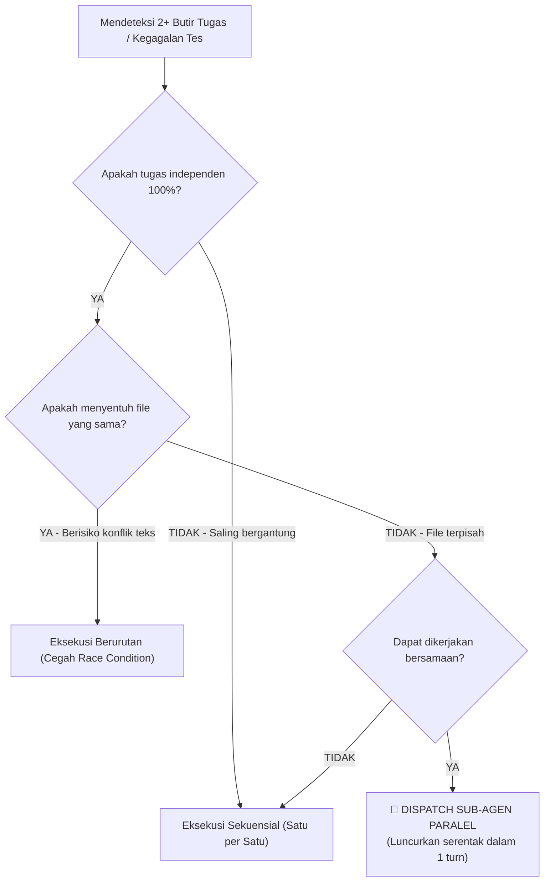

# Universal Parallel Agent Dispatching Protocol (`dispatching-parallel-agents`)

## Overview
**Origin**: *obra/superpowers Multi-Agent Parallel Dispatch Pattern + Actor Model Distributed Task Coordination*.  
Skill ini adalah **"Protokol Orkestrasi & Pendelegasian Sub-Agen Paralel"**. Bertindak sebagai panduan bagi agen koordinator untuk memecah dan mendelegasikan 2 atau lebih tugas yang sepenuhnya independen ke beberapa sub-agen secara serentak (*parallel execution*) dalam satu putaran alat, menghemat waktu eksekusi secara drastis serta menjaga memori (*context window*) agen utama tetap bersih.

> **Analogi Sederhana (ELI5):**  
> Bayangkan seorang **Mandor Utama Proyek Bangunan**:
> - **Pekerjaan Sekuensial (Lambat)**: Ada 3 lampu putus di Lantai 1, Lantai 2, dan Lantai 3. Mandor menyuruh satu teknisi mengganti lampu di Lantai 1, menunggu sampai selesai, baru naik ke Lantai 2, lalu ke Lantai 3. Waktunya terbuang 3 kali lebih lama.
> - **Parallel Dispatch (Cepat & Rapi)**: Karena ketiga lampu tidak saling terhubung, mandor langsung memanggil **3 teknisi sekaligus secara bersamaan**:
>   - Teknisi A: *"Ganti bohlam di Lantai 1."*
>   - Teknisi B: *"Ganti bohlam di Lantai 2."*
>   - Teknisi C: *"Ganti bohlam di Lantai 3."*
> 
> Ketiganya bekerja bersamaan di lantai masing-masing tanpa saling senggol. Setelah semuanya melapor selesai, mandor menyalakan saklar utama untuk memastikan seluruh gedung menyala terang (*integrasi akhir*).

---

## Landasan Teori & Referensi Industri Nyata

Skill ini dibangun di atas 3 pilar rekayasa sistem terdistribusi, orkestrasi multi-agen otonom, dan optimasi jendela konteks yang memadukan asal-usul seminal (*Foundational Classics*) dengan studi peer-reviewed 5 tahun terakhir (2021–2026) dan panduan arsitektur agen resmi:

### 1. Actor Model & Shared-Nothing Isolation in Multi-Agent Systems
Model komputasi terdistribusi di mana setiap unit agen (*actor/sub-agent*) memiliki memori mandiri dan berkomunikasi murni melalui pertukaran pesan tanpa status bersama (*no shared state*) untuk mencegah korupsi memori.
*   **Referensi 1 (Foundational Classic / Asal-Usul Historis)**: *Carl Hewitt, Peter Bishop, & Richard Steiger*, "A Universal Modular ACTOR Formalism for Artificial Intelligence" (IJCAI '73, 1973) & *Gul Agha*, "Actors: A Model of Concurrent Computation in Distributed Systems" (MIT Press).
*   **Referensi 2 (Prioritas 1: Validasi Empiris Peer-Reviewed 2021–2026)**: *Sirui Hong, Mingchen Zhuge, Jonathan Chen, et al.*, "MetaGPT: Meta Programming for A Multi-Agent Collaborative Framework" (International Conference on Learning Representations - ICLR, 2024) & *Q. Wu et al.*, "AutoGen: Enabling Next-Gen LLM Applications via Multi-Agent Conversation" (COLING, 2024).
*   **Referensi 3 (Prioritas 2: Standar Resmi / Fallback Specification)**: *Anthropic Research*, "Building Effective Agents: Orchestrator-Workers and Parallel Subagent Workflows" (Anthropic Engineering Publications, Des 2024).

### 2. Fork-Join Task Decomposition & Non-Interfering Concurrency
Pola pemrosesan konkurensi di mana pekerjaan yang tidak memiliki dependensi disebar serentak (*fork*), dieksekusi di workspace terisolasi, lalu digabungkan kembali oleh agen ketua (*join*).
*   **Referensi 1 (Foundational Classic / Asal-Usul Historis)**: *Doug Lea*, "A Java Fork/Join Framework" (ACM Conference on Java Grande, 2000).
*   **Referensi 2 (Prioritas 1: Validasi Empiris Peer-Reviewed 2021–2026)**: *W. Chen, Y. Su, et al.*, "AgentVerse: Facilitating Multi-Agent Collaboration and Exploring Emergent Behaviors in Task Decomposition" (International Conference on Learning Representations - ICLR, 2024).
*   **Referensi 3 (Prioritas 2: Standar Resmi / Fallback Specification)**: *POSIX IEEE Std 1003.1c*, "Standard for Information Technology — Portable Operating System Interface: Threads and Concurrency Primitives" (IEEE, 2018).

### 3. Context Window Preservation & Cognitive Load Optimization
Optimasi efisiensi model AI dengan membatasi rentang informasi yang diterima tiap pekerja agar context window agen utama tidak jenuh dan terhindar dari degradasi performa di tengah dokumen (*lost-in-the-middle*).
*   **Referensi 1 (Foundational Classic / Asal-Usul Historis)**: *Herbert A. Simon*, "Designing Organizations for an Information-Rich World" (Johns Hopkins University Press, 1971).
*   **Referensi 2 (Prioritas 1: Validasi Empiris Peer-Reviewed 2021–2026)**: *N. F. Liu, K. Lin, et al.*, "Lost in the Middle: How Language Models Use Long Contexts" (Transactions of the Association for Computational Linguistics - TACL, MIT Press, Vol. 12, 2024).
*   **Referensi 3 (Prioritas 2: Standar Resmi / Fallback Specification)**: *Anthropic Engineering*, "Context Window Management & Subagent Isolation Patterns" (Anthropic Research, 2024).

---

## Kapan Menggunakan Paralel vs Sekuensial (*Decision Flowchart*)



### ✅ Kondisi yang WAJIB Dijalankan Secara Paralel:
1. **Kegagalan Banyak Berkas Tes (*Mass Debugging*)**: 2 atau lebih berkas pengujian (`*.test.ts`, `test_*.py`) gagal di subsistem berbeda dengan akar masalah terisolasi.
2. **Eksekusi Kartu Tugas Lintas Domain**: Pengerjaan kartu tugas dari `docs/TaskBacklog.md` pada fase yang sama yang menyentuh direktori terpisah (misal: modul utilitas Core vs komponen UI Web vs handler API Backend).
3. **Riset & Benchmark Pustaka**: Membandingkan 2 atau lebih alternatif library/framework secara bersamaan sebelum merancang arsitektur.

### ❌ DILARANG Menggunakan Paralel Untuk:
1. **Mengedit Berkas yang Sama**: Dua sub-agen dilarang memodifikasi file target yang sama (akan memicu penimpaan kode / *merge conflict*).
2. **Ketergantungan Alur Berurutan (*Sequential Dependencies*)**: Tugas B membutuhkan hasil atau kode keluaran dari Tugas A.
3. **Kegagalan Berantai (*Cascade Failures*)**: Banyak tes gagal akibat satu kesalahan konfigurasi dasar (cukup perbaiki akar utamanya sekali).

---

## 4 Langkah Siklus Kerja Paralel (*The 4-Step Parallel Pattern*)

```
┌─────────────────────────────────────────────────────────────┐
│             SIKLUS EKSEKUSI MULTI-AGEN PARALEL              │
├─────────────────────────────────────────────────────────────┤
│ 1. Identify Independent Domains  : Petakan batas isolasi    │
│ 2. Create Focused Agent Prompts : Rancang instruksi mandiri │
│ 3. Dispatch in Parallel          : Panggil subagent serentak│
│ 4. Review, Integrate & Verify    : Validasi suite tes penuh │
└─────────────────────────────────────────────────────────────┘
```

### 1. Identifikasi Domain Independen (*Identify Independent Domains*)
Petakan berkas yang akan disentuh oleh masing-masing tugas:
* Sub-tugas A: Hanya memodifikasi `src/utils/date.ts` dan `tests/utils/date.test.ts`.
* Sub-tugas B: Hanya memodifikasi `src/schemas/user.ts` dan `tests/schemas/user.test.ts`.
* Pastikan tidak ada berkas iris/bersama yang diedit secara bersamaan.

### 2. Buat Prompt Sub-Agen yang Mandiri & Terfokus (*Focused Agent Tasks*)
Setiap sub-agen harus menerima instruksi yang mandiri tanpa perlu membaca seluruh riwayat obrolan panjang agen utama:
* **Ruang Lingkup Spesifik**: Satu target berkas atau subsistem.
* **Tujuan Jelas**: Buat tes spesifik lulus 100% (*Green*).
* **Batasan Ketat**: Dilarang mengubah berkas di luar ruang lingkup yang ditentukan.
* **Ekspektasi Output**: Ringkasan singkat berkas apa yang diubah dan bukti kelulusan tes.

### 3. Luncurkan Bersamaan dalam Satu Putaran (*Dispatch in Parallel*)
Luncurkan seluruh sub-agen secara serentak dalam satu putaran pemanggilan alat:

```text
invoke_subagent(
  Subagents: [
    { TypeName: "self", Role: "Date Util Engineer", Prompt: "Implementasikan format fungsi tanggal di src/utils/date.ts..." },
    { TypeName: "self", Role: "Schema Engineer", Prompt: "Implementasikan validasi skema user di src/schemas/user.ts..." }
  ]
)
```

### 4. Tinjau Hasil & Integrasikan (*Review, Integrate & Verify*)
Setelah seluruh sub-agen menyelesaikan tugasnya dan melaporkan hasilnya:
1. Baca ringkasan perubahan dari masing-masing sub-agen.
2. Pastikan tidak ada modifikasi berkas yang saling bertabrakan.
3. Jalankan pengujian penuh di terminal ([`verification-before-completion`](../verification-before-completion/SKILL.md)) untuk membuktikan bahwa seluruh sistem bekerja harmonis (Exit code 0).

---

## Contoh Struktur Prompt Sub-Agen yang Baik

```markdown
Perbaiki 2 tes yang gagal di tests/auth/token_verifier.test.ts:

1. "should reject expired token" - mengharapkan error TokenExpiredError tapi menerima null.
2. "should handle malformed signature" - mengharapkan status 401.

Batasan:
- Hanya modifikasi src/auth/token_verifier.ts dan tests/auth/token_verifier.test.ts.
- Jangan mengubah file konfigurasi atau modul auth lainnya.
- Terapkan TDD: jalankan tes, perbaiki hingga lulus, dan pastikan anti-slop.

Kembalikan:
- Ringkasan akar masalah singkat.
- Baris kode yang diperbaiki.
- Konfirmasi bahwa tes tests/auth/token_verifier.test.ts lulus 100%.
```

---

## Integrasi dengan Skill Lain di Repositori
 
*   **[`pero-problem-framing`](../pero-problem-framing/SKILL.md)** (Stage 1): Menerjunkan *Adaptive Squad* (3 agen inti + 1–3 agen spesialis) secara paralel untuk memvalidasi persona, pasar, dan kelayakan teknis.
*   **[`pero-prd-writing`](../pero-prd-writing/SKILL.md)** (Stage 2): Menerjunkan *3-Track Research Squad* paralel untuk alur perjalanan pengguna, benchmark NFR, dan matriks prioritas MVP.
*   **[`pero-user-stories`](../pero-user-stories/SKILL.md)** (Stage 3): Menerjunkan *Fixed 5-Specialist Squad* paralel untuk merumuskan skenario Gherkin, model data ERD, kontrak API, matriks RBAC, dan FSM.
*   **[`pero-system-architecture`](../pero-system-architecture/SKILL.md)** (Stage 4): Menerjunkan *Fixed 5-Specialist Architecture Squad* paralel untuk mengevaluasi runtime, penyimpanan, model konkurensi, perimeter keamanan, dan toolchain.
*   **[`pero-uiux-design`](../pero-uiux-design/SKILL.md)** (Stage 5): Menerjunkan *Fixed 5-Specialist Design Squad* paralel untuk denah wireframe, token tema, status 5 komponen, dan audit a11y WCAG AAA.
*   **[`pero-quality-governance`](../pero-quality-governance/SKILL.md)** (Stage 6): Menerjunkan *Fixed 5-Specialist Governance Squad* paralel untuk benchmarking standar keamanan, thread-safety, matriks linter, dan supply chain lockfile.
*   **[`pero-task-decomposition`](../pero-task-decomposition/SKILL.md)** (Stage 7): Menerjunkan *Fixed 5-Specialist Backlog Squad* paralel untuk menyusun backlog 5 fase dan 6 domain dengan pembagian tugas S/M.
*   **[`pero-granular-refinement`](../pero-granular-refinement/SKILL.md)** (Stage 8): Menerjunkan *Fixed 5-Specialist Refinement Squad* paralel untuk menajamkan kartu tugas granular dengan 7 anatomi presisi dan failing test spec.
*   **[`pero-context-validation`](../pero-context-validation/SKILL.md)** (Stage 9): Menerjunkan *Fixed 5-Specialist Validation Squad* paralel untuk mengaudit ketertelusuran 8-arah (*8-way traceability*) dan sintaksis diagram Mermaid.
*   **[`pero-change-management`](../pero-change-management/SKILL.md)** (Stage 10 / Companion): Menerjunkan sub-agen investigasi dampak (*blast radius scan*) saat terjadi revisi, penambahan, atau penghapusan fitur mid-flight.
*   **[`subagent-driven-development`](../subagent-driven-development/SKILL.md)**: Mesin konveyor eksekusi sekuensial yang memanggil `dispatching-parallel-agents` saat mendeteksi tugas-tugas independen dalam satu fase.
*   **[`systematic-debugging`](../systematic-debugging/SKILL.md)**: Menerjunkan sub-agen terpisah untuk mengisolasi dan memperbaiki kegagalan tes di berbagai subsistem secara serentak (*Mass Debugging*).
*   **[`test-driven-development`](../test-driven-development/SKILL.md)**: Standar koding mutlak yang wajib diterapkan oleh setiap sub-agen pelaksana (Red-Green-Refactor).
*   **[`anti-slop`](../anti-slop/SKILL.md)**: Menjaga agar kode yang dihasilkan sub-agen paralel bersih dari boilerplate YAGNI dan komentar sepele.
*   **[`verification-before-completion`](../verification-before-completion/SKILL.md)**: Memverifikasi bukti log eksekusi terminal nyata dari setiap sub-agen sebelum integrasi akhir.

---

## Anti-Patterns & Hal yang Dilarang

*   ❌ **Pekerja Saling Bertabrakan (*File Collision*)**: Mengirim 2 sub-agen untuk mengedit berkas yang sama pada saat bersamaan.
*   ❌ **Instruksi Mengambang**: Memberikan instruksi umum seperti *"Tolong bantu perbaiki bug di proyek"* tanpa menyebutkan berkas spesifik.
*   ❌ **Lupa Verifikasi Integrasi Akhir**: Menganggap pekerjaan selesai begitu sub-agen melapor tanpa menjalankan verifikasi menyeluruh (*full suite test*) di agen utama.

