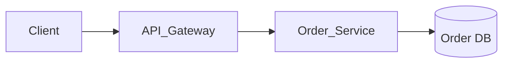
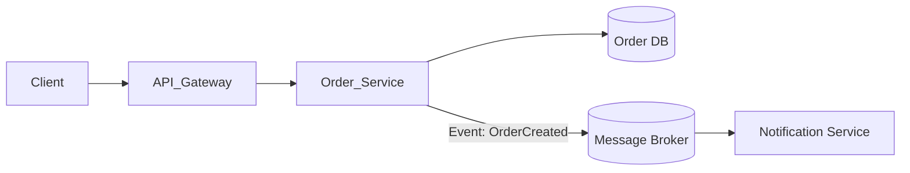

# Universal Living Documentation Synchronizer (`living-doc-sync`)

## Overview
**Origin**: *Living Documentation: Continuous Knowledge Sharing by Design (Cyrille Martraire) + Docs-as-Code Standard*.  
Skill ini adalah **"Penjaga Keselarasan Arsitektur Hidup & Anti-Dokumentasi Basi"**. Mencegah terjadinya *Documentation Drift*—kondisi di mana dokumentasi teknis, diagram alur Mermaid, spesifikasi API, dan README tertinggal atau berbohong dibandingkan kode sumber nyata di repositori.

> **Analogi Sederhana (ELI5):**  
> Bayangkan **Peta Navigasi GPS Mobil**:
> - **Dokumentasi Basi (Drift)**: Peta kertas cetakan sepuluh tahun lalu yang tidak tahu ada jalan layang baru atau jalan buntu. Pengemudi (pengembang atau AI baru) akan tersesat dan menabrak.
> - **Living Documentation**: Sistem GPS digital yang otomatis memperbarui rute setiap kali ada pembongkaran jalan (*commit/PR*). Denah dan jalan raya selalu 100% cocok dengan kondisi aspal nyata.

---

## 3 Siklus Sinkronisasi Dokumen Hidup

```
┌─────────────────────────────────────────────────────────────┐
│          3 SIKLUS LIVING DOCUMENTATION RECONCILIATION       │
├─────────────────────────────────────────────────────────────┤
│ 1. Drift Detection  : Deteksi perubahan via git diff        │
│ 2. Octa-Doc Sync    : Sinkronkan 8 Dokumen Inti & Keputusan │
│ 3. Syntax Guard     : Audit diagram Mermaid & link berkas   │
└─────────────────────────────────────────────────────────────┘
```

---

### Siklus 1: Automated Drift Detection (Deteksi Perubahan Nyata)
Sebelum menyatakan tugas selesai atau membuat PR, jalankan audit diff:
```bash
git diff --name-only HEAD~1  # Atau git status
```
Evaluasi dampak perubahan kode terhadap dokumentasi:
1. **Perubahan Masalah Pokok / Batasan**: Jika ada pivot atau pergeseran non-goals → Wajib perbarui `docs/ProblemFraming.md` & `docs/decisions/PFDR-[YYYYMMDDHHmm].md`.
2. **Perubahan Lingkup Fitur MVP**: Jika ada penambahan/pemangkasan fitur P0/P1/P2 → Wajib perbarui `docs/PRD.md` & `docs/decisions/PDR-[YYYYMMDDHHmm].md`.
3. **Perubahan Kontrak API / DTO / Model Domain**: Jika ada modifikasi schema payload, endpoint, atau model entitas → Wajib perbarui `docs/SystemSpec.md` & `docs/decisions/SDR-[YYYYMMDDHHmm].md`.
4. **Perubahan Arsitektural / Komponen**: Jika ada penambahan modul, folder baru, database baru, atau protokol komunikasi baru → Wajib perbarui `docs/Architecture.md` & `docs/decisions/ADR-[YYYYMMDDHHmm].md` serta `README.md`.
5. **Perubahan Standar Kualitas / Aturan Thread**: Jika ada perubahan linter, concurrency model, atau secret policy → Wajib perbarui `docs/Governance.md` & `docs/decisions/GDR-[YYYYMMDDHHmm].md`.
6. **Perubahan Backlog Tugas**: Jika tugas selesai, dipecah, atau dependensi berubah → Wajib perbarui `docs/TaskBacklog.md` & `docs/decisions/TDR-[YYYYMMDDHHmm].md`.
7. **Perubahan Spesifikasi Tugas Granular**: Jika file path, signature method, kasus batas, atau failing test berubah → Wajib perbarui `docs/tasks/TASK-[ID].md` & `docs/decisions/RDR-[YYYYMMDDHHmm].md`.
8. **Perubahan Audit Integritas & Status Rilis**: Jika ada cascade update atau perubahan status kesiapan rilis → Wajib perbarui `docs/ValidationReport.md` & `docs/decisions/VDR-[YYYYMMDDHHmm].md`.
9. **Perubahan Dependensi / Cara Menjalankan**: Jika ada package baru atau script run/build berubah → Wajib perbarui `README.md`.

---

### Siklus 2: Octa-Doc Synchronization (Penyelarasan 8 Lapis Ekosistem)

| Lapisan Dokumen | Berkas Target | Hal yang Wajib Diselaraskan |
|---|---|---|
| **Lapis 1: Problem & Boundaries** | `docs/ProblemFraming.md` / `PFDR` | Definisi akar masalah, batasan In-Scope vs Non-Goals, metrik sukses. |
| **Lapis 2: Product Requirements** | `docs/PRD.md` / `PDR` | Matriks prioritas P0/P1/P2, user persona, user workflow. |
| **Lapis 3: System Specification** | `docs/SystemSpec.md` / `SDR` | Skenario uji Gherkin, model entitas domain (ERD), kontrak API/event. |
| **Lapis 4: System Architecture** | `docs/Architecture.md` / `ADR` | Diagram C4 (Context/Container), komponen Clean Architecture, MCP server. |
| **Lapis 5: Quality Governance** | `docs/Governance.md` / `GDR` | Aturan thread-safety, linter matrix, mutation testing, PII log masking. |
| **Lapis 6: Task Backlog** | `docs/TaskBacklog.md` / `TDR` | Alur 5 fase backlog, ukuran S/M, dependensi `Depends On`, `Parallel Safe`. |
| **Lapis 7: Granular Refinement** | `docs/tasks/TASK-[ID].md` / `RDR`| 7 Anatomi presisi, invarian pre/post-conditions, blast radius, Red spec. |
| **Lapis 8: Context Validation** | `docs/ValidationReport.md` / `VDR`| Matriks ketertelusuran 7-arah, 3 severity tiers, vonis Go/No-Go. |
| **Etalase Ekosistem** | `README.md` | Diagram alur, katalog skill, instruksi instalasi & dependensi. |

---

### Siklus 3: Mermaid & Document Syntax Guard
Setiap kali memperbarui diagram Mermaid pada file Markdown:
1. **Gunakan Syntax Valid**:
   - Berikan tanda kutip ganda pada label dengan karakter khusus: `id["User Service (Auth & RBAC)"]`.
   - Hindari tag HTML langsung di dalam node Mermaid.
2. **Gunakan Tautan Relatif yang Valid**:
   - Pastikan setiap link dokumen mengarah ke berkas nyata yang benar-benar ada.

---

## Contoh Penyelarasan: Menambah Modul Baru

**Sebelum Sinkronisasi (Contoh Drift - Diagram Usang):**


**Setelah Sinkronisasi (Contoh Living Sync - Sinkron dengan Kode):**


---

## Tabel Anti-Pola (*Anti-Patterns*)

| Pola Terlarang | Mengapa Berbahaya? | Solusi Wajib |
|---|---|---|
| **Documentation Debt / Later Syndrome** | Menunda update dokumentasi dengan alasan *"nanti dirapikan sekaligus"*. | Jadikan update dokumen sebagai kriteria kelulusan (*Definition of Done*) PR saat ini. |
| **Dead Diagram** | Diagram gambar statis (PNG/JPG) yang tidak bisa di-version control dan cepat basi. | Selalu gunakan diagram berbasis teks terkelola (*Mermaid as Code*). |
| **Duplicate Truth** | Menuliskan daftar endpoint di 3 file berbeda secara manual sehingga mudah inkonsisten. | Miliki satu Single Source of Truth (SSOT) dan gunakan referensi silang. |
| **Corrupted Escape Syntax** | Karakter formula LaTeX rusak seperti `$\rightarrow$` yang terpotong menjadi `ightarrow`. | Gunakan simbol panah bersih `→` atau escape LaTeX `\rightarrow` yang valid. |

---

## Checklist Verifikasi Mandiri (*Self-Validation Gate*)

Sebelum menyelesaikan pekerjaan:
- [ ] Telah menjalankan `git diff --name-only` untuk mengaudit seluruh file yang diubah.
- [ ] Diagram Mermaid di `docs/Architecture.md` / `README.md` selaras dengan struktur kode terbaru.
- [ ] Perubahan endpoint, schema, atau method signature telah tercatat di `docs/SystemSpec.md`.
- [ ] Panduan instalasi dan dependensi baru (jika ada) telah diuji dan dituliskan di `README.md`.
- [ ] Tidak ada sintaks Mermaid yang rusak dan tidak ada tautan file (*broken link*) yang mati.
