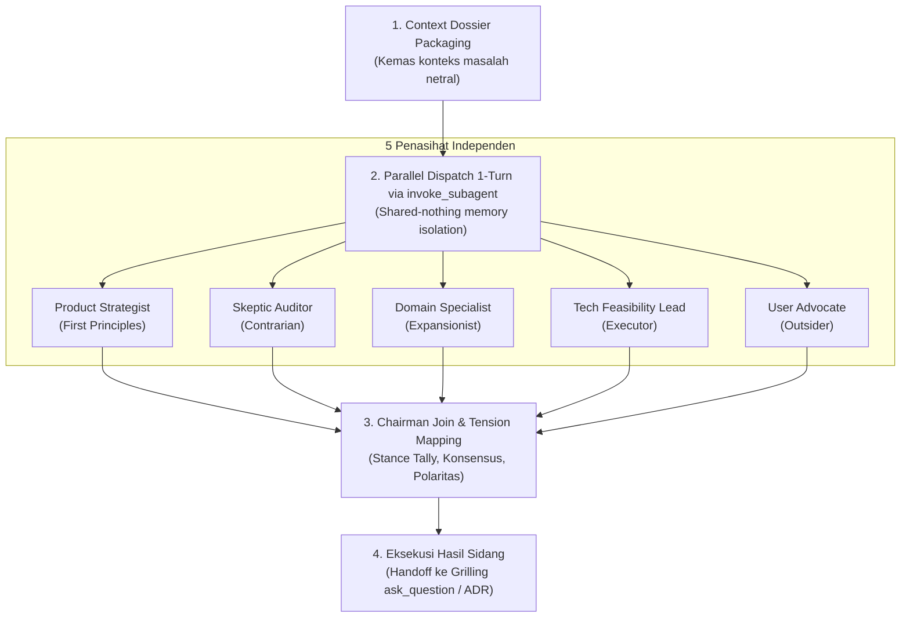

# Universal LLM Council Protocol (`llm-council`)

## Overview
**Origin**: *Andrej Karpathy's Multi-Agent LLM Council Architecture + Dialectical Inquiry & Devil's Advocacy Frameworks*.  
Skill ini adalah **"Protokol Musyawarah Dewan 5 Penasihat AI"**. Menggantikan bias jawaban tunggal AI yang cenderung asal setuju (*sycophancy*) dengan menggelar sidang dewan multi-agen independen: 5 persona penasihat dengan sudut pandang bertolak belakang menganalisis masalah, saling menguji argumen secara anonim (*peer-review*), lalu Ketua Sidang merumuskan sintesis rekomendasi konkret.

> **Analogi Sederhana (ELI5):**  
> Bayangkan Anda sedang bingung menentukan jalan bercabang untuk masa depan bisnis/sistem Anda:
> - **AI Tanpa Dewan (Satu Konsultan Asal Setuju)**: Konsultan hanya mengangguk dan berkata, *"Semua ide Anda brilian!"* tanpa memberitahu bahwa jalan yang Anda pilih jurangnya curam.
> - **Dengan LLM Council (Ruang Rapat 5 Penasihat Ahli)**: Anda mengumpulkan 5 orang di meja bundar:
>   1. **Si Pengkritik (*Contrarian*)**: Mencari di mana letak ranjau dan kenapa rencana ini bisa bangkrut/rusak.
>   2. **Si Pemikir Prinsip Dasar (*First Principles*)**: Menghapus asumsi rumit dan bertanya, *"Sebenarnya inti masalah apa yang sedang kita selesaikan?"*.
>   3. **Si Visioner (*Expansionist*)**: Menghitung potensi keuntungan terbesar jika sistem ini berkembang pesat.
>   4. **Si Pengamat Awam (*Outsider*)**: Melihat dengan kacamata orang luar yang tidak memiliki kepentingan emosional.
>   5. **Si Eksekutor Praktis (*Executor*)**: Bertanya tegas, *"Bagaimana cara mengerjakannya hari Senin besok dengan tenaga yang ada?"*.
> 
> Setelah kelimanya berdebat, Ketua Sidang memberikan kesimpulan: di mana mereka sepakat, di mana mereka bertengkar, dan jalan keluar paling aman untuk Anda.

---

## Landasan Teori & Referensi Industri Nyata

Skill ini dibangun di atas 3 pilar rekayasa musyawarah multi-agen, inkuiri dialektis peredam bias, dan sintesis kompromi arsitektural yang memadukan karya klasik (*Foundational Classics*) dengan studi peer-reviewed 5 tahun terakhir (2021–2026) dan standar resmi:

### 1. Multi-Agent Debate & Deliberative Consensus (Anti-Sycophancy)
Pengambilan keputusan berbasis perdebatan multi-agen independen untuk mengikis bias halusinasi, sikap asal setuju (*sycophancy*), dan kenaifan model tunggal.
*   **Referensi 1 (Foundational Classic / Asal-Usul Historis)**: *Herbert A. Simon*, "Administrative Behavior: A Study of Decision-Making Processes in Administrative Organization (Bounded Rationality)" (Macmillan, 1947/1976) & *Andrej Karpathy*, "LLM Council Architecture" (2023).
*   **Referensi 2 (Prioritas 1: Validasi Empiris Peer-Reviewed 2021–2026)**: *Yilun Du, Shuang Li, Antonio Torralba, Joshua B. Tenenbaum, & Igor Mordatch*, "Improving Factuality and Reasoning in Language Models through Multiagent Debate" (MIT CSAIL & Google DeepMind, ICML 2024) & *C. Chan et al.*, "ChatEval: Towards Better LLM-based Evaluators through Multi-Agent Debate" (International Conference on Learning Representations - ICLR, 2024).
*   **Referensi 3 (Prioritas 2: Standar Resmi / Fallback Specification)**: *Percy Liang et al.*, "Holistic Evaluation of Language Models (HELM) & Multi-Perspective Deliberation" (Stanford Center for Research on Foundation Models - CRFM, Annals of the NY Academy of Sciences, 2023).

### 2. Strategic Dialectical Inquiry & Anonymized Peer-Review
Teknik pengujian asumsi secara tajam melalui benturan argumen berlawanan (*devil's advocacy*) yang diulas secara anonim untuk mencegah bias penjangkaran (*anchoring effect*).
*   **Referensi 1 (Foundational Classic / Asal-Usul Historis)**: *Richard O. Mason & Ian I. Mitroff*, "Challenging Strategic Planning Assumptions: Theory, Cases, and Techniques" (John Wiley & Sons, 1981) & *Irving L. Janis*, "Victims of Groupthink" (Houghton Mifflin).
*   **Referensi 2 (Prioritas 1: Validasi Empiris Peer-Reviewed 2021–2026)**: *X. Liang, S. Hao, et al.*, "Encouraging Divergent Thinking in Large Language Models via Multi-Persona Deliberation" (Findings of the Association for Computational Linguistics: EMNLP, 2023).
*   **Referensi 3 (Prioritas 2: Standar Resmi / Fallback Specification)**: *OpenAI Research*, "Self-Critiquing Models for Assisting Human Evaluators and Multi-Perspective Stress-Testing" (OpenAI Research, 2022).

### 3. Multi-Criteria Architecture Trade-Off Analysis (ATAM)
Metodologi evaluasi kompromi teknis terstruktur lintas dimensi kualitas (performa, maintainability, keandalan, dan waktu rilis).
*   **Referensi 1 (Foundational Classic / Asal-Usul Historis)**: *Rick Kazman, Mark Klein, & Paul Clements*, "Evaluating Software Architectures: Methods and Case Studies (ATAM Tradeoff Synthesis)" (Addison-Wesley, 2002).
*   **Referensi 2 (Prioritas 1: Validasi Empiris Peer-Reviewed 2021–2026)**: *N. Ford, M. Richards, et al.*, "Software Architecture: The Hard Parts - Modern Trade-Off Analysis for Distributed Systems" (O'Reilly Media / IEEE Software, 2021/2023).
*   **Referensi 3 (Prioritas 2: Standar Resmi / Fallback Specification)**: *ISO/IEC/IEEE 42010:2022*, "Software, systems and enterprise — Architecture description (Clause 5.7: Architectural Decisions and Rationale)" (International Organization for Standardization, 2022).

---

## Kapan Menggunakan Council (*When to Use*)

### Pemicu Utama (Trigger Words)
Gunakan council saat mendeteksi kata kunci:
* `"council this"`, `"run the council"`, `"war room this"`, `"sidang dewan"`, `"debatkan opsi ini"`, `"stress-test keputusan ini"`.
* `"apakah sebaiknya A atau B"`, `"pilih arsitektur mana"`, `"pivot strategi"`, `"trade-off besar"`.

### Situasi yang Tepat:
* **Dilema Arsitektur & Teknologi**: Menimbang Monolith vs Microservices, PostgreSQL vs MongoDB, REST vs Event-Driven Queue.
* **Prioritas Fitur Produk & MVP**: Menentukan apakah fitur tertentu wajib masuk P0 atau ditunda ke P1/P2.
* **Strategi Bisnis & Monetisasi**: Menentukan model penetapan harga (*pricing model*), strategi peluncuran, atau perombakan fokus pengguna.
* **Keputusan Build vs Buy**: Memilih membuat modul sendiri atau berlangganan layanan pihak ketiga.

### DILARANG Menggunakan Council Untuk:
* Pertanyaan faktual dengan jawaban pasti (misal: *"Apa sintaks perulangan di Go?"*).
* Tugas koding mikro (misal: *"Tolong tambahkan validasi email di form ini"*).
* Perbaikan bug yang sudah jelas baris kodenya (gunakan `systematic-debugging`).

---

## Karakter 5 Penasihat Dewan (*The Five Advisors*) & Taksonomi Ganda

Untuk menjamin konsistensi di seluruh tahapan Pero SDLC sekaligus mempertahankan arketipe pemikiran universal, kursi dewan menerapkan **Taksonomi Kanonikal Ganda (*Dual-Taxonomy*)**:

```
┌─────────────────────────────────────────────────────────────────────────────┐
│                 DEWAN 5 PENASIHAT INDEPENDEN (LLM COUNCIL)                  │
├─────────────────────────────────────────────────────────────────────────────┤
│ 1. Product Strategist (The First Principles) : Dekonstruksi akar logika     │
│ 2. Skeptic Auditor (The Contrarian)         : Menyerang celah & titik buta  │
│ 3. Domain Specialist (The Expansionist)     : Pasar, regulasi & defensibility│
│ 4. Tech Feasibility Lead (The Executor)     : Kelayakan teknis & anti-bloat │
│ 5. User Advocate (The Outsider)             : Suara pengguna & inersia lama │
└─────────────────────────────────────────────────────────────────────────────┘
```

1. **Product Strategist / The First Principles Thinker (Si Pemikir Prinsip Dasar)**:
   - *Fokus*: Membongkar dogma dan kebiasaan lama. Bertanya apa tujuan paling fundamental, apakah pertanyaan yang diajukan sudah tepat, dan apakah solusi ini bernilai riil 10x bagi pengguna atau hanya fitur kosmetik semu.
2. **Skeptic Auditor / The Contrarian (Si Pengkritik Tajam / Devil's Advocate)**:
   - *Fokus*: Mengasumsikan rencana memiliki cacat tersembunyi yang akan menyebabkannya gagal total. Mencari titik kegagalan fatal (*fatal blind spots*), beban pemeliharaan tersembunyi, skenario terburuk (*worst-case*), dan alasan terkuat untuk membatalkan inisiatif.
3. **Domain Specialist / The Expansionist (Si Visioner Pasar & Regulasi)**:
   - *Fokus*: Menimbang dinamika persaingan industri, parit pertahanan (*moat*), dan kepatuhan hukum/regulasi (GDPR, UU PDP, standar finansial). Bertanya apakah produk ini mudah ditiru oleh raksasa teknologi dalam hitungan minggu.
4. **Tech Feasibility Lead / The Executor (Si Praktisi Nyata & Arsitek)**:
   - *Fokus*: Kelayakan eksekusi teknis, utang teknis (*technical debt*), batas performa, ketergantungan API pihak ketiga yang rapuh, dan penegakan batas minimalis (Anti-Slop / YAGNI). *"Bisa tidak diselesaikan dengan kode yang 10x lebih sederhana?"*.
5. **User Advocate / The Outsider (Si Pengamat Netral & Suara Pengguna)**:
   - *Fokus*: Menghilangkan bias orang dalam (*curse of knowledge*). Menilai kejelasan nilai bagi orang awam, resistensi terhadap perubahan alur kerja lama (inersia adopsi), dan beban kognitif yang ditanggung pengguna akhir.

---

## Alur Sidang 3-Fase Berbasis Eksekusi Paralel (*Parallel Council Protocol*)

Untuk membasmi bias jangkar (*anchoring effect*) di mana penasihat terpengaruh oleh ucapan penasihat lain, sidang dewan **WAJIB dijalankan secara paralel dalam 1 putaran alat (*single turn*)** memanfaatkan [`dispatching-parallel-agents`](../dispatching-parallel-agents/SKILL.md):



### Fase 1: Pengemasan Dossier Masalah (Context Dossier Packaging)
Agen utama memindai dokumen dan bukti relevan di repositori (`ProblemFraming`, `PRD`, `Architecture`, atau log pengujian) dan menyusun satu draf dossier masalah yang ringkas, faktual, dan netral tanpa mengarahkan penasihat ke kesimpulan tertentu.

### Fase 2: Pendelegasian Paralel Serentak (1-Turn Parallel Dispatch)
Agen utama memanggil perkakas `invoke_subagent` dengan array 5 sub-agen sekaligus dalam satu pemanggilan:
```text
invoke_subagent(
  Subagents: [
    { TypeName: "self", Role: "Council: Product Strategist", Prompt: "[Dossier + Mandat First Principles + Kontrak Format]" },
    { TypeName: "self", Role: "Council: Skeptic Auditor", Prompt: "[Dossier + Mandat Contrarian + Kontrak Format]" },
    { TypeName: "self", Role: "Council: Domain Specialist", Prompt: "[Dossier + Mandat Expansionist + Kontrak Format]" },
    { TypeName: "self", Role: "Council: Tech Feasibility Lead", Prompt: "[Dossier + Mandat Executor + Kontrak Format]" },
    { TypeName: "self", Role: "Council: User Advocate", Prompt: "[Dossier + Mandat Outsider + Kontrak Format]" }
  ]
)
```
- **Shared-Nothing Isolation**: Setiap penasihat berjalan di proses mandiri tanpa saling melihat teks penasihat lain, membasmi fenomena *groupthink* dan bias urutan.
- **Kontrak Format Laporan Mandiri**: Setiap penasihat mengembalikan teks ringkas (<200 kata) mencakup:
  1. *Sikap Dewan (Stance)*: Sangat Mendukung / Mendukung Bersyarat / Menolak Keras / Usulkan Pivot Total.
  2. *Tesis Utama (ELI5)*: 1–2 kalimat analogi sederhana.
  3. *3 Titik Serangan/Kritik Tajam*: Titik buta atau asumsi rapuh.
  4. *Batasan Non-Goals Wajib*: Hal yang mutlak dilarang dibuat.
  5. *1 Dilema Strategis Pengguna*: Pertanyaan kompromi terpenting.

### Fase 3: Penggabungan & Sintesis Ketua Sidang (*Chairman Join & Synthesis*)
Setelah kelima sub-agen mengembalikan laporannya, Ketua Sidang (agen utama) memproses keluaran dengan protokol 3-langkah:
1. **Perhitungan Sebaran Sikap (*Stance Tally*)**: Menghitung berapa penasihat yang mendukung, bersyarat, menolak, atau menuntut pivot.
2. **Ekstraksi Konsensus Bulat/Kuat**: Mengunci poin-poin yang disuarakan oleh minimal $\ge 3$ penasihat sebagai ketetapan bersama (misal: fitur tertentu wajib dibuang ke Non-Goals).
3. **Pemetaan Benturan Argumen (*Dialectical Tensions & Polarities*)**: Memetakan trade-off tajam antar-penasihat (kecepatan rilis vs parit pertahanan, fleksibilitas kustomisasi vs kesederhanaan arsitektur).
4. **Penyerahan Hasil (*Handoff*)**:
   - Jika berada di alur SDLC (misal: `pero-problem-framing` Stage 4): mentransformasi benturan argumen menjadi paket pertanyaan terstruktur untuk perkakas modal `ask_question`.
   - Jika berada di keputusan teknis independen: membukukan keputusan ke `docs/decisions/ADR-[YYYYMMDDHHmm].md`.

---

## Format Standar Laporan Sidang Dewan

```markdown
# 🏛️ Hasil Sidang LLM Council: [Topik / Keputusan]

- **Konteks Masalah**: [Ringkasan singkat latar belakang dan opsi yang diuji]
- **Tanggal**: [YYYY-MM-DD]
- **Metode Eksekusi**: Parallel Dispatch via `invoke_subagent` (5 Sub-Agen Terisolasi)

---

### 📊 Sebaran Sikap Dewan (Stance Tally)
- **Sangat Mendukung**: [X suara]
- **Mendukung Bersyarat Ketat**: [Y suara]
- **Menolak Keras / Usul Pivot**: [Z suara]

---

### 🗣️ Pandangan Ringkas 5 Penasihat

1. **Product Strategist (The First Principles)**: [Kritik esensi dasar & eliminasi asumsi semu]
2. **Skeptic Auditor (The Contrarian)**: [Kritik titik buta fatal & skenario terburuk failure mode]
3. **Domain Specialist (The Expansionist)**: [Kritik lanskap industri, parit pertahanan & regulasi]
4. **Tech Feasibility Lead (The Executor)**: [Kritik kelayakan teknis, beban arsitektur & anti-bloat]
5. **User Advocate (The Outsider)**: [Kritik inersia kebiasaan lama & beban kognitif pengguna]

---

### ⚖️ Matriks Titik Temu & Benturan Dialektis

*   🤝 **Titik Konsensus (Disepakati $\ge 3$ Penasihat)**:
    - [Poin kesepakatan 1: Rekomendasi Non-Goals terkuat]
    - [Poin kesepakatan 2: Asumsi berbahaya yang berhasil dieliminasi]
*   ⚡ **Benturan Kompromi Utama (Dialectical Tensions)**:
    - *[Dilema Trade-off A vs B]*: [Penjelasan perdebatan antara risiko kegagalan vs percepatan rilis]

---

### 🏆 Vonis Ketua Sidang & Rekomendasi Langkah Nyata

*   **Pilihan Terpilih**: **[Nama Opsi / Solusi Rekomendasi]**
*   **Alasan Penentuan**: [Sintesis rasional mengapa opsi ini dipilih berdasarkan konsensus dan mitigasi benturan dewan]
*   **Langkah Aksi Konkret (Senin Pagi)**:
    1. [Langkah 1: Tindakan terukur]
    2. [Langkah 2: Pemasangan guardrail teknis]
*   **Pencatatan Keputusan**: Salin vonis ini ke `docs/decisions/ADR-[YYYYMMDDHHmm].md` atau `PFDR-[YYYYMMDDHHmm].md`.
```

---

## Integrasi dengan Skill Lain

*   **[`pero-problem-framing`](../pero-problem-framing/SKILL.md)**: Gunakan dewan saat memilih target persona utama atau menimbang arah pivot masalah.
*   **[`pero-prd-writing`](../pero-prd-writing/SKILL.md)**: Gunakan dewan saat memotong cakupan fitur MVP (P0 vs P1) yang kontroversial.
*   **[`pero-system-architecture`](../pero-system-architecture/SKILL.md)**: Gunakan dewan saat memilih teknologi dan arsitektur sistem tingkat tinggi.
*   **[`pero-uiux-design`](../pero-uiux-design/SKILL.md)**: Gunakan dewan saat menimbang arah estetika visual, wireframe, atau trade-off kompleksitas UI.
*   **[`pero-quality-governance`](../pero-quality-governance/SKILL.md)**: Gunakan dewan saat menyepakati batasan konkurensi atau kebijakan gerbang mutu rilis.
*   **[`pero-change-management`](../pero-change-management/SKILL.md)**: Gunakan dewan saat mengevaluasi pivot cakupan drastis atau trade-off perubahan mid-flight.
*   **[`pero-context-validation`](../pero-context-validation/SKILL.md)**: Gunakan dewan saat menyelesaikan sengketa ketertelusuran dokumen atau mitigasi status NO-GO.
*   **[`decision-recorder`](../decision-recorder/SKILL.md)**: Simpan langsung hasil sintesis dewan ke arsip keputusan resmi `docs/decisions/`.
*   **[`subagent-driven-development`](../subagent-driven-development/SKILL.md)**: Gunakan dewan sebagai pemutus kebuntuan jika proses eksekusi tugas otonom mengalami deadlock review perbaikan berulang.
*   **[`eli5`](../eli5/SKILL.md)**: Gunakan untuk menyederhanakan sintesis pertimbangan dewan yang sarat muatan teknis menjadi bahasa yang ramah awam.

---

## Anti-Patterns & Hal yang Dilarang

*   **Penasihat yang Banci / Asal Setuju**: Dilarang membuat seluruh penasihat setuju dengan opsi awal pengguna tanpa kritik tajam.
*   **Jawaban Abu-Abu Tanpa Vonis**: Ketua Sidang wajib menetapkan rekomendasi konkret, bukan sekadar berkata *"semua opsi ada baiknya"*.
*   **Mengabaikan Eksekusi Nyata**: Selalu sertakan langkah teknis terukur yang dapat langsung dikerjakan.

