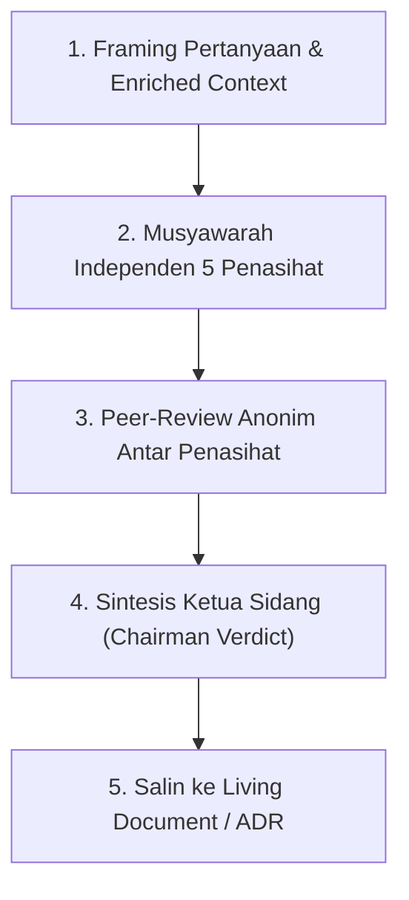

# Universal LLM Council Protocol (`llm-council`)

## Overview
**Origin**: *Andrej Karpathy's Multi-Agent LLM Council Architecture + Dialectical Inquiry & Devil's Advocacy Frameworks*.  
Skill ini adalah **"Protokol Musyawarah Dewan 5 Penasihat AI"**. Menggantikan bias jawaban tunggal AI yang cenderung asal setuju (*sycophancy*) dengan menggelar sidang dewan multi-agen independen: 5 persona penasihat dengan sudut pandang bertolak belakang menganalisis masalah, saling menguji argumen secara anonim (*peer-review*), lalu Ketua Sidang merumuskan sintesis rekomendasi konkret.

> **Analogi Sederhana (ELI5):**  
> Bayangkan Anda sedang bingung menentukan jalan bercabang untuk masa depan bisnis/sistem Anda:
> - **AI Tanpa Dewan (Satu Konsultan Asal Setuju)**: Konsultan hanya mengangguk dan berkata, *"Semua ide Anda brilian!"* tanpa memberitahu bahwa jalan yang Anda pilih jurangnya curam.
> - **Dengan LLM Council (Ruang Rapat 5 Penasihat Ahli)**: Anda mengumpulkan 5 orang di meja bundar:
>   1. **Si Pengkritik (*Contrarian*)**: Mencari di mana letak ranjau dan kenapa rencana ini bisa bangkrut/rusak.
>   2. **Si Pemikir Prinsip Dasar (*First Principles*)**: Menghapus asumsi rumit dan bertanya, *"Sebenarnya inti masalah apa yang sedang kita selesaikan?"*.
>   3. **Si Visioner (*Expansionist*)**: Menghitung potensi keuntungan terbesar jika sistem ini berkembang pesat.
>   4. **Si Pengamat Awam (*Outsider*)**: Melihat dengan kacamata orang luar yang tidak memiliki kepentingan emosional.
>   5. **Si Eksekutor Praktis (*Executor*)**: Bertanya tegas, *"Bagaimana cara mengerjakannya hari Senin besok dengan tenaga yang ada?"*.
> 
> Setelah kelimanya berdebat, Ketua Sidang memberikan kesimpulan: di mana mereka sepakat, di mana mereka bertengkar, dan jalan keluar paling aman untuk Anda.

---

## Landasan Teori & Referensi Industri Nyata

Skill ini dibangun di atas 3 pilar rekayasa musyawarah multi-agen dan dialektika keputusan strategis:

### 1. Multi-Agent Debate & Deliberative Consensus
Pengambilan keputusan berbasis perdebatan multi-agen independen untuk mengikis bias halusinasi dan kenaifan model tunggal.
*   **Referensi 1 (Metodologi Asli)**: *Andrej Karpathy*, "LLM Council: Multi-Model Querying, Peer-Review, and Chairman Synthesis".
*   **Referensi 2 (Riset Perdebatan Multi-Agen)**: *Yilun Du, Shuang Li, Antonio Torralba, Joshua B. Tenenbaum, & Igor Mordatch*, "Improving Factuality and Reasoning in Language Models through Multiagent Debate" (MIT CSAIL & Google DeepMind, arXiv:2305.14325).
*   **Referensi 3 (Konsensus Terdistribusi AI)**: *Percy Liang et al.*, "Holistic Evaluation of Language Models (HELM) & Multi-Perspective Evaluation" (Stanford CRFM).

### 2. Strategic Dialectical Inquiry & Devil's Advocacy
Teknik manajemen keputusan klasik untuk menguji asumsi tersembunyi dengan sengaja menciptakan pertentangan dialektis.
*   **Referensi 1 (Inkuiri Dialektis)**: *Richard O. Mason & Ian I. Mitroff*, "Challenging Strategic Planning Assumptions: Theory, Cases, and Techniques" (John Wiley & Sons).
*   **Referensi 2 (Advokasi Iblis / Pengkritik)**: *David M. Schweiger, William R. Sandberg, & James W. Ragan*, "Group Approaches for Improving Strategic Decision Making: A Comparative Evaluation of Dialectical Inquiry, Devil's Advocacy, and Consensus" (Academy of Management Journal).
*   **Referensi 3 (Pencegahan Groupthink)**: *Irving L. Janis*, "Victims of Groupthink: A Psychological Study of Foreign-Policy Decisions and Fiascoes" (Houghton Mifflin).

### 3. Multi-Criteria Architecture Trade-Off Synthesis
Metode pembobotan kompromi teknis lintas dimensi kualitas (kecepatan rilis vs skalabilitas masa depan).
*   **Referensi 1 (Standar SEI CMU)**: *Rick Kazman, Mark Klein, & Paul Clements*, "Evaluating Software Architectures: Methods and Case Studies (ATAM Tradeoff Synthesis)" (Addison-Wesley).
*   **Referensi 2 (Kompromi Arsitektur Modern)**: *Neal Ford & Mark Richards*, "Software Architecture: The Hard Parts" (O'Reilly Media).

---

## Kapan Menggunakan Council (*When to Use*)

### Pemicu Utama (Trigger Words)
Gunakan council saat mendeteksi kata kunci:
* `"council this"`, `"run the council"`, `"war room this"`, `"sidang dewan"`, `"debatkan opsi ini"`, `"stress-test keputusan ini"`.
* `"apakah sebaiknya A atau B"`, `"pilih arsitektur mana"`, `"pivot strategi"`, `"trade-off besar"`.

### Situasi yang Tepat:
* **Dilema Arsitektur & Teknologi**: Menimbang Monolith vs Microservices, PostgreSQL vs MongoDB, REST vs Event-Driven Queue.
* **Prioritas Fitur Produk & MVP**: Menentukan apakah fitur tertentu wajib masuk P0 atau ditunda ke P1/P2.
* **Strategi Bisnis & Monetisasi**: Menentukan model penetapan harga (*pricing model*), strategi peluncuran, atau perombakan fokus pengguna.
* **Keputusan Build vs Buy**: Memilih membuat modul sendiri atau berlangganan layanan pihak ketiga.

### DILARANG Menggunakan Council Untuk:
* Pertanyaan faktual dengan jawaban pasti (misal: *"Apa sintaks perulangan di Go?"*).
* Tugas koding mikro (misal: *"Tolong tambahkan validasi email di form ini"*).
* Perbaikan bug yang sudah jelas baris kodenya (gunakan `systematic-debugging`).

---

## Karakter 5 Penasihat Dewan (*The Five Advisors*)

```
┌─────────────────────────────────────────────────────────────┐
│                 DEWAN 5 PENASIHAT INDEPENDEN                │
├─────────────────────────────────────────────────────────────┤
│ 1. The Contrarian        : Menyerang celah & risiko fatal   │
│ 2. The First Principles  : Merombak masalah dari akar logika│
│ 3. The Expansionist      : Melihat potensi pertumbuhan & ROI│
│ 4. The Outsider          : Kacamata netral pengguna awam    │
│ 5. The Executor          : Kelayakan eksekusi & rilis cepat │
└─────────────────────────────────────────────────────────────┘
```

1. **The Contrarian (Si Pengkritik)**:
   - *Fokus*: Mengasumsikan rencana memiliki cacat tersembunyi. Mencari titik kegagalan, beban pemeliharaan tersembunyi, dan skenario terburuk (*worst-case*).
2. **The First Principles Thinker (Si Pemikir Prinsip Dasar)**:
   - *Fokus*: Membongkar dogma dan kebiasaan lama. Bertanya apa tujuan paling fundamental dan apakah pertanyaan yang diajukan sudah tepat.
3. **The Expansionist (Si Visioner)**:
   - *Fokus*: Melihat potensi nilai tambah terbesar. Apa yang terjadi jika ini berhasil 10x lipat? Peluang pasar atau integrasi apa yang belum dilirik?
4. **The Outsider (Si Pengamat Netral)**:
   - *Fokus*: Menghilangkan bias orang dalam (*curse of knowledge*). Menilai kejelasan nilai bagi pengguna luar yang tidak tahu seluk-beluk internal.
5. **The Executor (Si Praktisi Nyata)**:
   - *Fokus*: Kelayakan teknis, sumber daya tim, dan waktu eksekusi. *"Bisa tidak selesai dalam 2 sprint? Apa langkah pertamanya besok pagi?"*.

---

## Alur Sidang 3-Fase (*Council Session Workflow*)



### Fase 1: Framing & Pengayaan Konteks
Sebelum bersidang, agen memindai berkas relevan di repositori (`docs/ProblemFraming.md`, `docs/PRD.md`, `docs/Architecture.md`, atau `AGENTS.md`) untuk menyusun ringkasan konteks netral yang adil bagi seluruh penasihat.

### Fase 2: Deliberasi & Peer-Review Anonim
1. Setiap penasihat memberikan pandangan tanpa berkompromi atau bersikap basa-basi.
2. Penasihat meninjau argumen satu sama lain untuk menemukan kontradiksi logis atau asumsi lemah.

### Fase 3: Sintesis Ketua Sidang (*Chairman Verdict*)
Ketua sidang merangkum hasil musyawarah menjadi format laporan resmi.

---

## Format Standar Laporan Sidang Dewan

```markdown
# 🏛️ Hasil Sidang LLM Council: [Topik / Keputusan]

- **Konteks Masalah**: [Ringkasan singkat latar belakang dan pilihan opsi]
- **Tanggal**: [YYYY-MM-DD]

---

### 🗣️ Pandangan Ringkas 5 Penasihat

1. **The Contrarian**: [Kritik risiko dan potensi kegagalan terbesar]
2. **The First Principles**: [Esensi masalah dasar dan reka ulang solusi]
3. **The Expansionist**: [Peluang pertumbuhan dan nilai jangka panjang]
4. **The Outsider**: [Sudut pandang pengguna awam / pengamat eksternal]
5. **The Executor**: [Kelayakan eksekusi teknis dan batas waktu nyata]

---

### ⚖️ Matriks Titik Temu & Benturan Argumen

*   🤝 **Titik Konsensus (Semua Sepakat)**:
    - [Poin kesepakatan 1]
    - [Poin kesepakatan 2]
*   ⚡ **Titik Benturan Utama (Tensions & Trade-offs)**:
    - *[Dilema A vs B]*: [Penjelasan kompromi antara risiko vs kecepatan rilis]

---

### 🏆 Vonis Ketua Sidang & Rekomendasi Langkah Nyata

*   **Pilihan Terpilih**: **[Nama Opsi / Solusi Rekomendasi]**
*   **Alasan Penentuan**: [Sintesis rasional mengapa opsi ini mengalahkan alternatif lain]
*   **Langkah Aksi Konkret (Senin Pagi)**:
    1. [Langkah 1]
    2. [Langkah 2]
*   **Pencatatan Keputusan**: Salin vonis ini ke `docs/decisions/ADR-[YYYYMMDDHHmm].md` atau `PDR-[YYYYMMDDHHmm].md`.
```

---

## Integrasi dengan Skill Lain

*   **[`pero-problem-framing`](../pero-problem-framing/SKILL.md)**: Gunakan dewan saat memilih target persona utama atau menimbang arah pivot masalah.
*   **[`pero-prd-writing`](../pero-prd-writing/SKILL.md)**: Gunakan dewan saat memotong cakupan fitur MVP (P0 vs P1) yang kontroversial.
*   **[`pero-system-architecture`](../pero-system-architecture/SKILL.md)**: Gunakan dewan saat memilih teknologi dan arsitektur sistem tingkat tinggi.
*   **[`decision-recorder`](../decision-recorder/SKILL.md)**: Simpan langsung hasil sintesis dewan ke arsip keputusan resmi `docs/decisions/`.

---

## Anti-Patterns & Hal yang Dilarang

*   **Penasihat yang Banci / Asal Setuju**: Dilarang membuat seluruh penasihat setuju dengan opsi awal pengguna tanpa kritik tajam.
*   **Jawaban Abu-Abu Tanpa Vonis**: Ketua Sidang wajib menetapkan rekomendasi konkret, bukan sekadar berkata *"semua opsi ada baiknya"*.
*   **Mengabaikan Eksekusi Nyata**: Selalu sertakan langkah teknis terukur yang dapat langsung dikerjakan.

