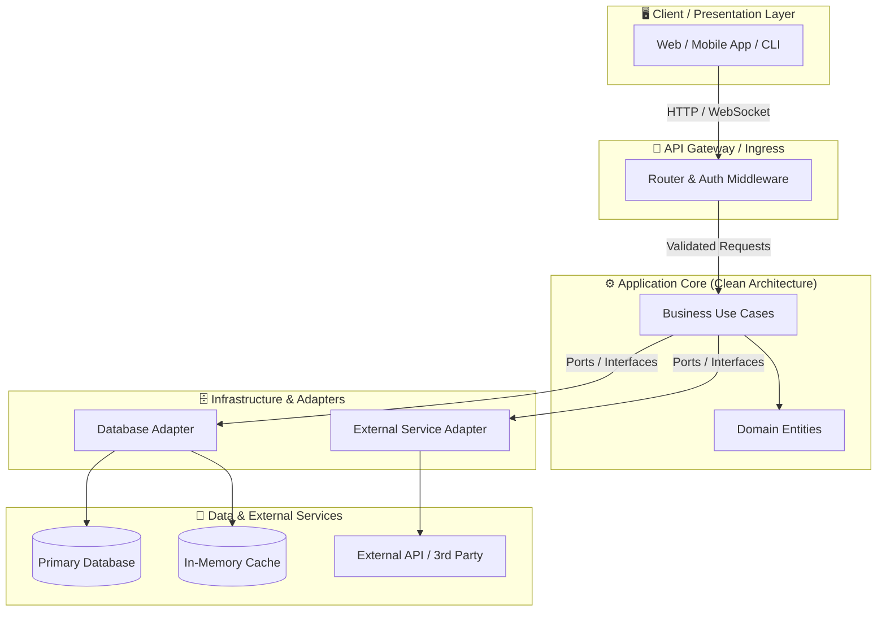

# Pero System Architecture (`pero:system-architecture`)

## Overview
**Origin**: *Pero Custom SDLC Pipeline - Stage 4 (Universal)*.
Skill ini bertindak sebagai **"Gambar Denah & Pondasi Bangunan Rumah"** (Menentukan bahan tiang kokoh yang dipakai, letak kamar, pipa air, kabel listrik, dan jalur darurat agar bangunan tahan gempa dan tidak roboh saat dihuni banyak orang). Tugasnya adalah menerjemahkan kebutuhan produk dari `docs/PRD.md` dan spesifikasi fungsional dari `docs/SystemSpec.md` menjadi cetak biru arsitektur teknis **`docs/Architecture.md`** yang kokoh, modular, aman, serta siap dieksekusi oleh tim pengembang di ekosistem pemrograman mana pun (Universal / Polyglot).

## Sub-Skill Integration (Perkakas Pendukung)
Dalam menjalankan tahapan perancangan arsitektur, agent WAJIB mengorkestrasi sub-skill berikut:
- **Upstream Context Reader**: **`MANDATORY`**: Wajib membaca `docs/PRD.md` dan `docs/SystemSpec.md` untuk memastikan arsitektur secara langsung menopang seluruh kebutuhan fitur MVP, kontrak API, dan entitas domain tanpa ada yang terlewat.
- **Dekomposisi Riset Arsitektur Paralel**: **`REQUIRED SUB-SKILL`**: Gunakan `dispatching-parallel-agents` untuk mendelegasikan 3 sub-agen riset independen secara paralel (*Sub-agen 1: Validasi API & Library via Context7, Sub-agen 2: Riset Benchmark & Industri via Web Search, Sub-agen 3: Desain Konkurensi & Storage Strategy*) guna menghindari halusinasi stack dan memperluas cakupan analisis.
- **Verifikasi Dokumentasi API & Versi Library Resmi**: **`REQUIRED SUB-SKILL`**: Gunakan `context-7` untuk mengecek dokumentasi resmi, kompatibilitas versi LTS/terkini, dan tanda tangan fungsi (*method signatures*) rilis resmi dari pustaka/framework yang dipilih sebelum dicatat ke arsitektur.
- **Riset Benchmark & Post-Mortem Industri**: **`REQUIRED SUB-SKILL`**: Gunakan `web-search` untuk memvalidasi performa nyata, throughput, batas memori, dan laporan kegagalan (*post-mortem failure analysis*) dari tumpukan teknologi yang diusulkan.
- **Musyawarah Dewan Arsitektur**: **`SUPPORTING / STRATEGIC SUB-SKILL`**: Gunakan `llm-council` untuk menguji perdebatan arsitektural berdampak besar (Monolith vs Microservices, Relasional vs Dokumen, REST vs Event-Driven, Pola Konkurensi) dan menyalurkan vonis sintesisnya ke dokumen ADR.
- **Validasi & Sinkronisasi Diagram**: **`SUPPORTING SUB-SKILL`**: Gunakan `living-doc-sync` untuk memastikan diagram Mermaid teruji valid, tidak rusak sintaksisnya, dan selalu sinkron dengan struktur kode terkini.
- **Pencatatan Keputusan Arsitektur**: **`SUPPORTING SUB-SKILL`**: Gunakan `decision-recorder` untuk membukukan keputusan arsitektural (pemilihan database, framework, pola konkurensi) ke `docs/decisions/ADR-[YYYYMMDDHHmm].md`.
- **Pemetaan Fondasi Design System UI**: **`CONDITIONAL SUB-SKILL`**: Jika perancangan mencakup antarmuka pengguna (Frontend/Landing Page/Web UI), gunakan `taste-skill` untuk memetakan arah desain (*Brief Inference*) dan menetapkan fondasi *Design System* resmi (Fluent, Material, Carbon, Radix, atau Tailwind) di `docs/Architecture.md`. Jika proyek murni backend/CLI/core tanpa UI, sub-skill ini tidak digunakan.

## Protokol Eksekusi Riset Nyata Arsitektur (*Mandatory Execution Protocol*)
Sebelum menulis berkas `docs/Architecture.md`, agen **WAJIB mengeksekusi 4 fase riset nyata di terminal/alat bantu**:

```
[Fase 1: Pendelegasian 3 Sub-Agen Riset Paralel (dispatching-parallel-agents)]
   │
   ├──> Sub-Agen 1: Riset Live API Specs & LTS Versi via Context7 (context-7)
   ├──> Sub-Agen 2: Riset Benchmark Nyata & Post-Mortem Industri (web-search)
   └──> Sub-Agen 3: Riset Pola Konkurensi & Isolasi State Transaksional
   │
[Fase 2: Sidang Trade-Off Arsitektur Berisiko Tinggi (llm-council)]
   │
[Fase 3: Deklarasi Toolchain & Server MCP Spesifik Stack (JIT MCP Provisioning)]
   │
[Fase 4: Penyusunan Cetak Biru docs/Architecture.md & Pencatatan ADR]
```

1. **Fase 1 — Eksekusi Riset Paralel 3 Jalur**:
   * **Sub-Agen 1 (Pustaka & SDK via `context-7`)**: Menjalankan query MCP Context7 (`resolve-library-id` dan `query-docs`) untuk memeriksa method signature nyata, tipe data argumen, dan lifecycle method resmi (misal: Fastify v4/v5, Axum, SwiftUI, Pydantic v2).
   * **Sub-Agen 2 (Benchmark Industri via `web-search`)**: Menjalankan pencarian web terarah untuk mendapatkan data throughput, latensi p99, batas memori, dan komparasi kegagalan teknis di industri.
   * **Sub-Agen 3 (Pola Konkurensi & Storage)**: Menentukan model isolasi mutasi state (Actor, Event Loop, Goroutines, Channels, Mutex) dan transaksi database ACID.

2. **Fase 2 — Sidang Dewan AI untuk Keputusan Kritis (`llm-council`)**:
   * Jika terdapat trade-off dengan konsekuensi jangka panjang (misal: SQLite vs PostgreSQL, Monolith Modular vs Microservices, REST vs WebSocket/gRPC), sidangkan opsi tersebut ke 5 persona AI untuk mendapatkan sintesis konsensus.

3. **Fase 3 — Deklarasi Toolchain & Server MCP**:
   * Menetapkan server MCP dan compiler runtime yang dibutuhkan proyek (seperti `xcodebuild-mcp` untuk Swift, `gopls` untuk Go, `postgres-mcp` untuk DB) di Bagian 2 dokumen arsitektur.

4. **Fase 4 — Sintesis Cetak Biru & Pembukuan ADR**:
   * Menyusun dokumen `docs/Architecture.md` lengkap dengan diagram Mermaid yang tervalidasi dan mencatat keputusan ke `docs/decisions/ADR-[YYYYMMDDHHmm].md`.

## When to Use
- Merancang arsitektur sistem tingkat tinggi (*High-Level Architecture*) sebelum koding dimulai.
- Menentukan pilihan teknologi (*Tech Stack Selection*) berbasis verifikasi resmi Context7 dan bukti benchmark industri nyata.
- Membagi sistem menjadi modul-modul independen dengan batas pemisah yang jelas (*Layered / Clean / Hexagonal Architecture*).
- Merancang model konkurensi, manajemen state, dan isolasi thread (*thread-safety* / actor model).
- Menentukan strategi penyimpanan data (*persistence*), indeks, dan caching.
- Menyusun perimeter keamanan, isolasi rahasia (*secret management*), serta strategi pemulihan kegagalan (*resilience & failover*).

## The 6-Section Architecture Framework

```
[1. High-Level Diagram (Mermaid)] ──> [2. Tech Stack & MCP Declaration (Context7 & Web Search)]
                                                                   │
[4. Concurrency & State Safety]   <── [3. Module & Clean Boundaries (Layered/Hexagonal)]
              │
[5. Persistence & Cache Strategy] ──> [6. Security & Failure Recovery (Resilience)]
```

### 1. High-Level Architecture Diagram
- Visualisasi hubungan antar komponen utama (Klien/UI, Gateway/API, Application Core, Worker/Queue, Database, External Services) menggunakan diagram Mermaid (`graph TB` atau `flowchart LR`).
- Memberikan gambaran alur data dari hulu ke hilir dengan node yang diberi label jelas dan aman dari error parsing (gunakan tanda petik dua pada label berkurung/simbol).

### 2. Tech Stack Selection, Toolchain & MCP Server Declaration
- Matriks pemilihan teknologi untuk setiap lapisan sistem (Runtime, Web/UI Framework, API Server, Database, Cache, Message Broker, Testing Tools).
- **Deklarasi Toolchain & Server MCP**: Menetapkan kebutuhan perkakas pengembangan dan server MCP (*Model Context Protocol*) spesifik domain (misalnya: `xcodebuild-mcp` untuk ekosistem Apple/Swift, `gopls` untuk Go, `postgres-mcp` untuk database, atau `chrome-devtools` untuk web) yang akan disiapkan oleh `find-skill` / installer.
- Setiap pilihan wajib didasari verifikasi resmi via `context-7` (memeriksa versi LTS/terkini, kompatibilitas, dan status pemeliharaan) serta verifikasi benchmark via `web-search`. Jika terdapat pilihan bertolak belakang dengan risiko tinggi, sidangkan opsi melalui `llm-council`.

### 3. Component & Module Breakdown (Clean / Hexagonal / Layered)
- Pemisahan tanggung jawab (*Separation of Concerns*) yang tegas:
  - **Presentation / Interface Layer**: Menangani HTTP request, WebSocket, CLI input, atau rendering UI (tanpa logika bisnis).
  - **Domain / Application Core Layer**: Menampung aturan bisnis murni, use cases, dan entitas data independen dari framework.
  - **Data / Infrastructure Layer**: Implementasi akses database, panggilan API eksternal, filesystem, dan messaging.
  - **Dependency Inversion / Ports & Adapters**: Core mendefinisikan interface/port, infrastructure mengimplementasikan adapter.

### 4. Concurrency Model, State Management & Thread Isolation
- Strategi menangani banyak tugas sekaligus secara aman (*Universal Concurrency & Thread-Safety*):
  - Model eksekusi (misal: Async/Await Event Loop di Node/Python, Goroutines/Channels di Go, Actors/Tasks di Swift/Rust/Erlang, Thread Pool di Java/C#).
  - Immutability & isolasi mutasi state (mencegah *race condition* atau *deadlock*).
  - Sinkronisasi transaksi dan mekanisme locking jika data diakses bersamaan.

### 5. Persistence, Caching & Data Storage Strategy
- Pemilihan media penyimpanan data utama (Relational vs Document vs Key-Value vs Embedded).
- Skema indexing untuk query berfrekuensi tinggi, strategi migrasi skema database, dan kebijakan transactional boundary (ACID).
- Strategi caching (In-Memory / Redis / LRU Cache), Time-to-Live (TTL), serta kebijakan invalidasi cache (*Cache Invalidation*).

### 6. External Dependencies, Security Boundaries & Failure Recovery
- **Security Boundaries**: Isolasi token dan credential (mematuhi `env-guard`), sanitasi input di perimeter terluar, enkripsi at-rest dan in-transit.
- **Resilience & Fallback**: Pola *Timeout*, *Retry with Exponential Backoff*, *Circuit Breaker*, dan *Graceful Degradation* jika layanan pihak ketiga tumbang.

## Deliverables & Output Artifacts

1. **Living Document**: `docs/Architecture.md`
2. **Decision Record**: `docs/decisions/ADR-[YYYYMMDDHHmm].md`

---

## Template: `docs/Architecture.md`

````markdown
# System Architecture: [Nama Sistem / Proyek]

- **Versi**: 1.0
- **Status**: Disetujui (Approved)
- **Tanggal**: [YYYY-MM-DD]
- **Dokumen Induk**: [docs/PRD.md](file:///docs/PRD.md) & [docs/SystemSpec.md](file:///docs/SystemSpec.md)
- **Decision Record**: [docs/decisions/ADR-[YYYYMMDDHHmm].md](file:///docs/decisions/ADR-[YYYYMMDDHHmm].md)

## 1. High-Level Architecture Diagram
[Jelaskan alur sistem secara global dalam 1-2 paragraf dengan analogi sederhana seperti denah rumah].



## 2. Tech Stack Selection, Toolchain & MCP Server Declaration

### 2.1. Matriks Teknologi Terverifikasi (Grounding via Context7 & Web Search)

| Lapisan / Komponen | Teknologi Terpilih | Versi Resmi (Context7) | Bukti Benchmark (Web Search) | Alasan Pemilihan & Nilai Tambah | Alternatif yang Ditolak |
|:---|:---|:---|:---|:---|:---|
| **Runtime / Platform** | [e.g. Node.js / Go / Swift / Rust / Python] | [e.g. Node 22 LTS / Swift 6.0] | [Throughput p99 < 5ms] | [Tipe data kuat, ekosistem matang] | [Alt X: Kurang tooling] |
| **API Framework** | [e.g. Fastify / Axum / FastAPI / Gin] | [Versi LTS Resmi] | [Benchmark req/sec tinggi] | [Overhead rendah, schema validation] | [Alt Y: Terlalu berat] |
| **Primary Database** | [e.g. PostgreSQL / SQLite] | [Versi Resmi] | [ACID integrity benchmark] | [Integritas relasional, indeks query] | [Alt Z: NoSQL unneeded] |
| **Caching Layer** | [e.g. Redis / In-Memory LRU] | [Versi Resmi] | [Latensi sub-milidetik] | [Mengurangi beban query database] | [Alt W: Overkill MVP] |

### 2.2. Deklarasi Server MCP & Development Toolchains
| Tumpukan Stack Proyek | Server MCP Terpilih | Runner / Command | Peran Khusus dalam Pipeline |
|:---|:---|:---|:---|
| [e.g. Apple / Swift] | `xcodebuild-mcp` | `npx -y @modelcontextprotocol/server-xcodebuild` | Eksekusi build, testing simulator iOS |
| [e.g. Web Frontend] | `chrome-devtools-mcp` | `npx -y @modelcontextprotocol/server-puppeteer` | Audit DOM, screenshot & inspeksi UI |
| [e.g. Database Core] | `postgres-mcp` | `npx -y @modelcontextprotocol/server-postgres` | Inspeksi skema & query migrasi DB |

## 3. Component & Module Breakdown (Clean Architecture)

```
┌─────────────────────────────────────────────────────────────┐
│ 1. Presentation Layer (Controllers, Resolvers, CLI Handlers) │
└──────────────────────────────┬──────────────────────────────┘
                               ▼
┌─────────────────────────────────────────────────────────────┐
│ 2. Domain / Core Layer (Entities, Use Cases, Port Interfaces)│
└──────────────────────────────┬──────────────────────────────┘
                               ▼
┌─────────────────────────────────────────────────────────────┐
│ 3. Infrastructure Layer (DB Repositories, Third-Party SDKs) │
└─────────────────────────────────────────────────────────────┘
```

- **Presentation / Ingress**: Bertindak seperti resepsionis/kasir yang menerima pesanan dari pengguna, memvalidasi tiket/token, dan meneruskan pesanan ke dapur tanpa memasak sendiri.
- **Domain Core**: Dapur utama yang berisi resep rahasia (aturan bisnis). Lapisan ini tidak boleh bergantung langsung pada merk wajan atau kompor (database/framework) tertentu.
- **Infrastructure & Adapters**: Pipa saluran dan perkakas luar (database SQL, pengirim email, penyimpanan file) yang disambungkan ke dapur melalui sambungan soket standar (*interface/ports*).

## 4. Concurrency Model, State Management & Thread Isolation

- **Model Konkurensi**: [Jelaskan model konkurensi sistem, misal: *Single-threaded Event Loop non-blocking I/O*, *Goroutine worker pool*, atau *Actor-based isolation*].
- **Isolasi Mutasi State**: State bersama (*shared state*) dilindungi dengan prinsip *Immutability* atau isolasi antrian pesan (*message passing*), sehingga tidak ada dua proses yang saling berebut mengubah data pada detik yang sama (*race-condition free*).
- **Penanganan Beban Puncak**: [Strategi backpressure, rate-limiting, atau pembatasan worker queue].

## 5. Persistence, Caching & Data Storage Strategy

- **Database Utama**: [Pola penyimpanan data, transaksi ACID, indeks query utama].
- **Strategi Caching**:
  - Pola: *Cache-Aside* / *Read-Through* / *Write-Through*.
  - TTL (Masa Berlaku): [misal: 60 detik untuk data dinamis, 24 jam untuk data statis].
  - Kebijakan Invalidasi: Cache dihapus seketika saat data induk diperbarui (*event-driven eviction*).
- **Migrasi Skema**: Setiap perubahan struktur database wajib menggunakan berkas migrasi berversi terurut (*versioned migrations*) yang dapat di-*rollback*.

## 6. External Dependencies, Security & Failure Recovery

### 6.1. Security Perimeter & Secrets Isolation
- **Secret Protection**: Tidak ada API key, token, atau password yang disimpan di kode sumber. Semua variabel rahasia dimuat dari file `.env` yang dilindungi oleh `env-guard`.
- **Sanitasi Perimeter**: Semua input dari luar disaring ketat di lapisan terluar sebelum menyentuh domain core.

### 6.2. Failure Recovery & Resilience
- **Timeout**: Setiap panggilan jaringan eksternal dibatasi maksimal [misal: 3000ms].
- **Retry with Exponential Backoff**: Panggilan gagal yang bersifat sementara (*transient error*) dicoba ulang bertahap (100ms -> 200ms -> 400ms) maksimal 3 kali.
- **Circuit Breaker & Fallback**: Jika layanan eksternal mati terus-menerus, sistem memutus sementara sambungan dan memberikan jawaban cadangan (*fallback / graceful degradation*) tanpa membuat seluruh sistem lumpuh (*crash*).
````

## Anti-Patterns & Common Mistakes
- **Overengineering & Premature Complexity**: Memaksakan arsitektur Microservices atau Kafka untuk aplikasi tahap awal yang seharusnya cukup Monolith modular atau SQLite/PostgreSQL sederhana.
- **Ungrounded Tech Stack Choices**: Memilih library atau framework hanya karena tren, tanpa memverifikasi dokumentasi resmi dan status pemeliharaan via `context-7`.
- **Global Mutable State (Race Conditions)**: Menggunakan variabel global yang dapat dimutasi secara acak dari berbagai thread/fungsi tanpa mekanisme isolasi atau synchronization lock.
- **Sintaksis Mermaid Rusak (Invalid Mermaid Syntax)**: Menggunakan karakter spesial (kurung, petik, slash) di dalam node Mermaid tanpa tanda kutip ganda `""`, atau membuat nesting subgraph yang saling bertabrakan.
- **Single Point of Failure (SPOF) Tanpa Mitigasi**: Mengasumsikan jaringan dan API pihak ketiga akan selalu hidup 100%, tanpa menyediakan timeout, retry, atau fallback response.
- **Mencampur Logika Bisnis ke Framework/Database (Leaky Abstractions)**: Menulis query database SQL mentah langsung di dalam komponen UI atau controller, membuat kode sulit diuji dan sulit dimigrasikan.
