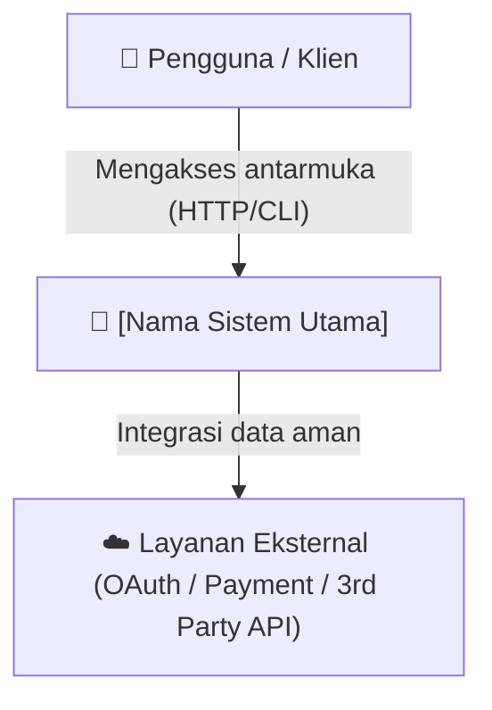
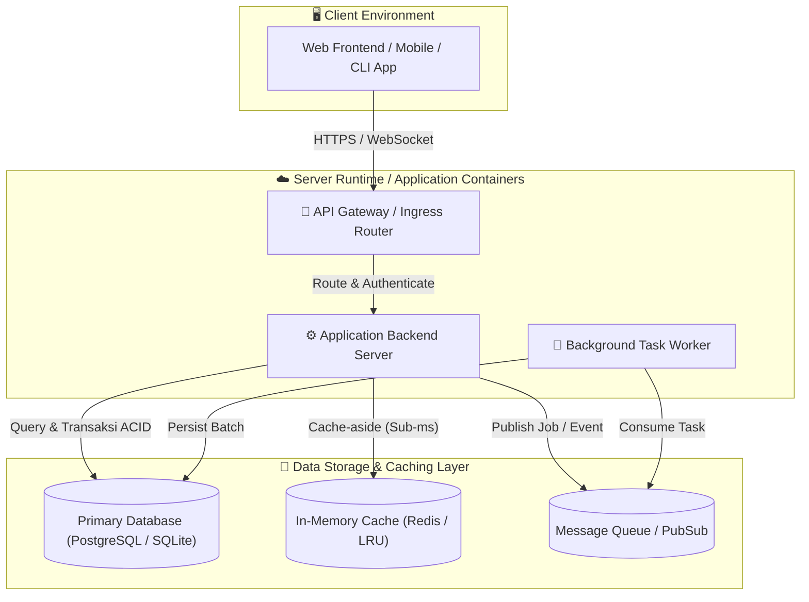
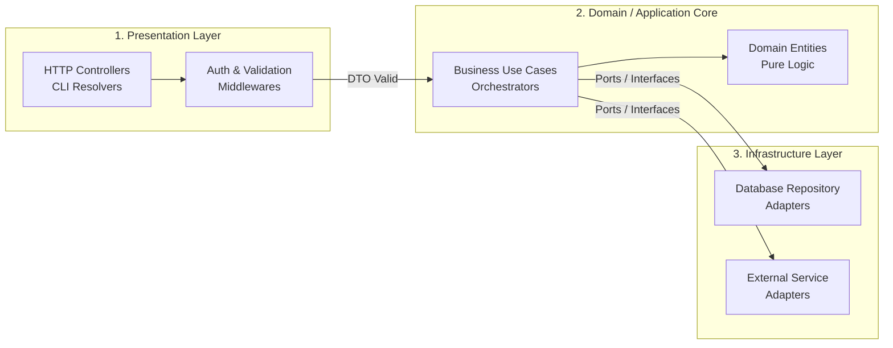

# Pero System Architecture (`pero:system-architecture`)

## Overview
**Origin**: *Pero Custom SDLC Pipeline - Stage 4 (Universal)*.  
**Pipeline Navigation**: [Stage 3: User Stories](../pero-user-stories/SKILL.md) ➔ **Stage 4: System Architecture** ➔ [Stage 5: UI/UX Design](../pero-uiux-design/SKILL.md)

Skill ini bertindak sebagai **"Gambar Denah & Pondasi Bangunan Rumah"** (Menentukan bahan tiang kokoh yang dipakai, letak kamar, pipa air, kabel listrik, dan jalur darurat agar bangunan tahan gempa dan tidak roboh saat dihuni banyak orang). Tugasnya adalah menerjemahkan kebutuhan produk dari `docs/PRD.md` dan spesifikasi fungsional dari `docs/SystemSpec.md` (atau `docs/system-spec/index.md`) menjadi cetak biru arsitektur teknis **`docs/Architecture.md`** yang kokoh, modular, aman, serta siap dieksekusi oleh tim pengembang di ekosistem pemrograman mana pun (Universal / Polyglot).

## Sub-Skill Integration (Perkakas Pendukung)
Dalam menjalankan tahapan perancangan arsitektur, agent WAJIB mengorkestrasi sub-skill berikut:
- **Upstream Context Reader**: **`MANDATORY`**: Wajib membaca `docs/PRD.md` dan `docs/SystemSpec.md` (atau `docs/system-spec/index.md` beserta sub-pod-nya) untuk memastikan arsitektur secara langsung menopang seluruh kebutuhan fitur MVP, kontrak API, dan entitas domain tanpa ada yang terlewat.
- **Dekomposisi Riset Arsitektur 5 Spesialis Tetap (*Fixed Architecture Squad*)**: **`REQUIRED SUB-SKILL`**: Gunakan [`dispatching-parallel-agents`](../dispatching-parallel-agents/SKILL.md) untuk mendelegasikan tim beranggotakan **5 Agen Spesialis Arsitektur Tetap** secara paralel yang masing-masing dibekali protokol [`context-7`](../context-7/SKILL.md) dan [`web-search`](../web-search/SKILL.md). Setiap spesialis wajib melakukan evaluasi relevansi awal (*Relevance Pre-Flight Check*). Jika domain relevan, agen dibatasi **minimal 2 dan maksimal 5 pencarian terarah via Search MCP**. Jika domain tidak relevan dengan PRD, agen wajib mendeklarasikan *Early-Exit* (`N/A: Not Applicable`) dan dilarang melakukan pencarian.
- **Verifikasi Dokumentasi API & Versi Library Resmi**: **`REQUIRED SUB-SKILL`**: Gunakan [`context-7`](../context-7/SKILL.md) untuk mengecek dokumentasi resmi, kompatibilitas versi LTS/terkini, dan tanda tangan fungsi (*method signatures*) rilis resmi dari pustaka/framework yang dipilih sebelum dicatat ke arsitektur.
- **Riset Literatur Ilmiah & Ekstraksi Teorema Peer-Reviewed**: **`REQUIRED SUB-SKILL`**: Gunakan [`scientific-research`](../scientific-research/SKILL.md) (OpenAlex MCP) dan [`pdf-reader`](../pdf-reader/SKILL.md) sebagai **Tier-1 Primary Tool** bagi Spesialis 2 (Penyimpanan/Algoritma Data), Spesialis 3 (Konkurensi Formal/Event Choreography), dan Spesialis 4 (Protokol Kriptografi) untuk membuktikan landasan algoritma sistem, ketahanan pembagian beban, dan mengekstrak formula naskah akademik ber-DOI ke dalam cetak biru arsitektur sebelum fallback ke `context-7` atau `web-search`.
- **Riset Benchmark & Post-Mortem Industri**: **`REQUIRED SUB-SKILL`**: Gunakan [`web-search`](../web-search/SKILL.md) via Search MCP (search_web / Tavily) dan pembaca semantik (`read_url_content` / Fetch MCP) untuk memvalidasi performa nyata, throughput, batas memori, dan laporan kegagalan (*post-mortem*) dari sumber primer tervalidasi HTTP 200 tanpa menggunakan terminal `curl`.
- **Musyawarah Dewan Arsitektur**: **`REQUIRED / STRATEGIC SUB-SKILL`**: Gunakan [`llm-council`](../llm-council/SKILL.md) untuk menguji perdebatan arsitektural berdampak besar (Monolith Modular vs Microservices, Relasional vs Dokumen, REST vs Event-Driven, Pola Konkurensi) melalui sidang 5 persona AI.
- **Wawancara Penguncian Arsitektur di Chat**: **`REQUIRED SUB-SKILL`**: Gunakan [`grilling`](../grilling/SKILL.md) secara interaktif langsung kepada pengguna via perkakas modal **`ask_question`** dengan batas volume berkisar antara **5 hingga 10 pertanyaan terarah**, pengelompokan pertanyaan fleksibel (1 mandiri atau 2–4 serentak per putaran), dan menyajikan opsi maksimal (2–5 alternatif konkret) diawali label `(Recommended)`. Agent WAJIB memanggil `ask_question` dan menunggu respon pengguna. DILARANG memilih stack sepihak.
- **Audit Konsistensi Arsitektur & Deteksi Drift**: **`REQUIRED SUB-SKILL`**: Gunakan [`pero-context-validation`](../pero-context-validation/SKILL.md) untuk memastikan cetak biru arsitektur tidak menyimpang (*zero architectural drift*) dari batasan di PRD dan SystemSpec.
- **Validasi & Sinkronisasi Diagram**: **`SUPPORTING SUB-SKILL`**: Gunakan [`living-doc-sync`](../living-doc-sync/SKILL.md) untuk memastikan diagram Mermaid teruji valid, tidak rusak sintaksisnya, dan selalu sinkron dengan struktur kode terkini.
- **Pencatatan Keputusan Arsitektur**: **`SUPPORTING SUB-SKILL`**: Gunakan [`decision-recorder`](../decision-recorder/SKILL.md) untuk membukukan keputusan arsitektural ke `docs/decisions/ADR-[YYYYMMDDHHmm].md` menggunakan format baku.
- **Pemetaan Runtime & Container UI**: **`CONDITIONAL SUB-SKILL`**: Jika sistem mencakup antarmuka pengguna (Frontend/Web/Mobile), tetapkan pilihan container platform dan runtime resmi (Next.js, Vite, Flutter, Tailwind CLI) pada diagram C4. Perancangan visual mendalam (*Design System*, token semantik, dan *3 Dials*) didelegasikan penuh ke Tahap 5 ([`pero-uiux-design`](../pero-uiux-design/SKILL.md)). Jika proyek murni backend/CLI/core tanpa UI, sub-skill ini tidak digunakan.

---

## Landasan Teori & Referensi Industri Nyata

Skill ini dibangun di atas 3 pilar perancangan arsitektur perangkat lunak, observabilitas terdistribusi, dan rekayasa ketahanan sistem:

### 1. Structural Architectural Modeling & Modular Monolith Trade-offs
Pemodelan arsitektur sistem hierarkis (C4 Model) dan pembobotan empiris batas pemisahan layanan (Modular Monolith vs Microservices).
*   **Referensi 1 (Foundational Classic / Asal-Usul Historis)**: *Simon Brown*, "Software Architecture for Developers: Visualise, document and explore your software architecture (C4 Model)".
*   **Referensi 2 (Prioritas 1: Validasi Empiris Peer-Reviewed 2021–2026)**: *J. Bogner, S. Wagner, et al.*, "To Microservices and Back Again? An Empirical Study on the Return to Modular Monoliths" (IEEE Software, Vol. 41, No. 1, pp. 58–66, IEEE, 2024).
*   **Referensi 3 (Prioritas 2: Standar Resmi / Fallback Specification)**: *ISO/IEC/IEEE 42010:2022*, "Software, systems and enterprise — Architecture description" (Standar Internasional Arsitektur Sistem Edisi 2022).

### 2. Quantitative Capacity Engineering & Distributed Observability (RED & Tracing)
Kalkulasi matematis kapasitas lalu lintas (*back-of-the-envelope estimation*) dan pelacakan telemetri korelasi lintas komponen.
*   **Referensi 1 (Foundational Classic / Asal-Usul Historis)**: *Tom Wilkie*, "The RED Method: Rate, Errors, Duration" & *Brendan Gregg*, "Systems Performance: Enterprise and the Cloud" (Addison-Wesley).
*   **Referensi 2 (Prioritas 1: Validasi Empiris Peer-Reviewed 2021–2026)**: *C. Stewart et al.*, "Telemetry and Distributed Tracing in Modern Cloud-Native Architectures: Evaluation and Best Practices" (ACM Transactions on Modeling and Performance Evaluation of Computing Systems - TOMPECS, Vol. 8, 2023).
*   **Referensi 3 (Prioritas 2: Standar Resmi / Fallback Specification)**: *World Wide Web Consortium (W3C)*, "W3C Trace Context Level 2 Specification" (w3.org/TR/trace-context-2/, 2023) & *Cloud Native Computing Foundation (CNCF)*, "OpenTelemetry Semantic Conventions" (2023–2024).

### 3. Failure Resilience Patterns & Zero-Downtime Evolutionary Database Design
Mitigasi kegagalan kaskade (*circuit breaker, retry backoff*) dan pola evolusi skema data tanpa penghentian layanan (*expand-and-contract*).
*   **Referensi 1 (Foundational Classic / Asal-Usul Historis)**: *Michael T. Nygard*, "Release It! Design and Deploy Production-Ready Software (Circuit Breaker Pattern)" (Pragmatic Bookshelf).
*   **Referensi 2 (Prioritas 1: Validasi Empiris Peer-Reviewed 2021–2026)**: *A. Gorbenko & V. Kharchenko*, "Resilience Engineering in Cloud-Native Architectures: Patterns, Anti-Patterns, and Fault-Injection Testing" (IEEE Transactions on Reliability, Vol. 72, No. 3, pp. 1045–1060, IEEE, 2023).
*   **Referensi 3 (Prioritas 2: Standar Resmi / Fallback Specification)**: *Google Cloud Architecture Center*, "Disaster Recovery Planning Guide: RPO and RTO Targets for Highly Available Cloud Systems" (Google Cloud Whitepaper, 2023).

---

## The 5-Stage System Architecture Framework

```
[0. Ingestion docs/PRD.md & docs/SystemSpec.md (atau docs/system-spec/index.md)]
                       │
                       ▼
[1. Riset 5 Spesialis Arsitektur + Context7 & Web Search]
    (Runtime, Storage, Concurrency, Security, Infra dengan Early-Exit N/A)
                       │
                       ▼
[2. Sidang Trade-Off Arsitektur Kritis (LLM Council)]
    (5 Persona AI membedah Monolith vs Microservices, SQL vs NoSQL, dsb.)
                       │
                       ▼
[3. Wawancara Penguncian Arsitektur via ask_question]
    (Modal Interaktif 5-10 Tanya: kunci hosting, stack, DB, toleransi risiko)
                       │
                       ▼
[4. Penyusunan Dokumen Architecture.md (C4 Model & Deployment Topology)]
                       │
                       ▼
[5. Pembukuan Rekam Keputusan ADR Formal & Audit Konsistensi]
```

### 1. Dekomposisi Riset Paralel Berbasis 5 Spesialis Arsitektur Tetap
Mendelegasikan tim 5 agen spesialis arsitektur tetap via `dispatching-parallel-agents` yang masing-masing dibekali protokol `context-7` dan Search MCP (tanpa scraping terminal `curl`):

#### A. 5 Peran Spesialis Arsitektur Tetap (*Fixed Architecture Roles*):
1. **Spesialis 1: Runtime, Bahasa & Web Framework (*Runtime & Framework Specialist*)**:
   - *Fokus*: Memeriksa versi LTS resmi, tipe data, method signature resmi via `context-7`, benchmark throughput req/sec serta batas memori via `web-search`, dan menyusun perhitungan kasar estimasi beban throughput (*Queries Per Second / QPS: rata-rata vs jam sibuk*).
2. **Spesialis 2: Penyimpanan Data, ORM & Strategi Caching (*Storage & Caching Specialist*)**:
   - *Fokus*: Meneliti pemilihan basis data (Relasional vs Embedded vs Dokumen), driver/ORM resmi, strategi pooling koneksi, indeks query, masa berlaku cache (*cache eviction*), menyusun estimasi kapasitas (*Storage Sizing*), serta memprioritaskan [`scientific-research`](../scientific-research/SKILL.md) (OpenAlex MCP dengan filter topik Computer Science) dan [`pdf-reader`](../pdf-reader/SKILL.md) sebagai Tier-1 untuk mengutip bukti empiris algoritma penyimpanan/distribusi.
3. **Spesialis 3: Konkurensi, Background Worker & Aliran Event (*Concurrency & Events Specialist*)**:
   - *Fokus*: Meneliti model konkurensi (Actor / Event Loop / Goroutines / Thread-Pool), pencegahan *deadlock/race condition*, antrian pesan (Redis / RabbitMQ / Kafka), serta memprioritaskan [`scientific-research`](../scientific-research/SKILL.md) (OpenAlex MCP dengan filter topik Computer Science) dan [`pdf-reader`](../pdf-reader/SKILL.md) sebagai Tier-1 untuk memvalidasi model konsensus formal (Paxos, Raft) dan pembuktian invarian matematis.
4. **Spesialis 4: Perimeter Keamanan, Middleware & Manajemen Rahasia (*Security & Secrets Specialist*)**:
   - *Fokus*: Meneliti proteksi rahasia (`env-guard`), mitigasi OWASP API Security, enkripsi at-rest/in-transit, sanitasi perimeter, pembatasan laju (*rate limiting*), strategi korelasi log (*Correlation ID*), serta memprioritaskan [`scientific-research`](../scientific-research/SKILL.md) (OpenAlex MCP) dan [`pdf-reader`](../pdf-reader/SKILL.md) sebagai Tier-1 untuk protokol kriptografi modern.
5. **Spesialis 5: Infrastruktur, Topologi Penerapan & Toolchain / MCP (*Infra & Toolchain Specialist*)**:
   - *Fokus*: Meneliti containerization (Docker / Compose), kebutuhan runtime compiler, server MCP spesifik ekosistem proyek (`gopls`, `xcodebuild-mcp`, `postgres-mcp`), serta target pemulihan bencana (*RPO & RTO*).

#### B. Mekanisme Evaluasi Relevansi Awal & Pintu Keluar Dini (*Relevance Pre-Flight Check & Early Exit*):
- Setiap spesialis membaca `docs/PRD.md` dan `docs/SystemSpec.md` (atau `docs/system-spec/index.md`) sebelum menjalankan riset.
- Jika domain spesialis tersebut **sama sekali tidak relevan** (misalnya: Spesialis 3 pada aplikasi CLI sekuensial tanpa proses latar belakang, atau Spesialis 4 pada modul lokal internal tanpa koneksi luar):
  - Spesialis **WAJIB** mendeklarasikan: `Status: Not Applicable (N/A). Alasan: [Penjelasan mengapa domain ini tidak dibutuhkan]`.
  - Agen berstatus `N/A` **DILARANG melakukan pencarian (0 search)** dan **DILARANG mengarang arsitektur palsu**.

#### C. Pagar Batas Riset & Pencarian (*Guardrails*):
- **Academic-First Priority**: Spesialis 2 (Storage), Spesialis 3 (Concurrency), dan Spesialis 4 (Security) **WAJIB memanggil `scientific-research` (OpenAlex MCP) sebagai rujukan garda pertama (Tier-1)** sebelum beralih ke pencarian web biasa. Web search hanya digunakan sebagai cadangan jika tidak ada literatur ilmiah yang relevan.
- Untuk domain yang relevan: **Minimal 2 pencarian terarah** (wajib merujuk dokumentasi resmi Context7 atau benchmark web industri) dan **Maksimal 5 pencarian terarah** per agen.
- Untuk domain `N/A`: **0 pencarian**.
- Setiap agen spesialis aktif wajib menyertakan minimal 1 tautan URL / dokumentasi resmi dalam laporannya.

### 2. Musyawarah Dewan Arsitektur (via `llm-council`)
- Menyidangkan trade-off arsitektural berdampak besar ke 5 persona dewan AI (*Product Strategist, Skeptic Auditor, Domain Specialist, Tech Feasibility, User Advocate*) melalui *blind peer-review*.
- Topik sidang: Monolith Modular vs Microservices, SQLite vs PostgreSQL vs Document Store, REST vs WebSocket/gRPC, Framework A vs Framework B.
- Dewan menghasilkan sintesis konsensus, analisis risiko, dan opsi kompromi teknis komprehensif (2 hingga 5 alternatif realistis) untuk diserahkan ke sesi wawancara via `ask_question`.

### 3. Wawancara Penguncian Arsitektur di Chat (via `grilling` & `ask_question`)
- **RAMBU HENTI WAJIB (MANDATORY PAUSE GATE)**:
  - Agent **DILARANG** langsung membuat berkas `docs/Architecture.md` sebelum menyepakati pilihan teknologi, lingkungan penerapan (*deployment*), dan batasan operasional dengan pengguna via perkakas modal **`ask_question`**.
  - Dilarang keras menentukan stack atau penyedia hosting secara sepihak.
- **Pagar Batas & Format Pertanyaan (Volume & Delivery Guardrails)**:
  - **Batas Kuantitas**: Sesi wawancara dibatasi total akumulasi **5 hingga 10 pertanyaan** terarah (untuk menguji seluruh fondasi arsitektur).
  - **Pengelompokan Fleksibel (*Flexible Batching*)**: Diajukan secara adaptif via `ask_question`: bisa **1 pertanyaan mandiri** atau **2 hingga 4 pertanyaan serentak** jika membahas rangkaian komponen arsitektur yang saling terkait (misal paket Runtime + Framework + Database).
  - **Opsi Maksimal & Rekomendasi**: Menyajikan **2 hingga 5 opsi realistis**. Opsi teknis terbaik AI selalu ditempatkan di nomor 1 dengan label `(Recommended)`.
- **Fokus Topik Wawancara (via `ask_question`)**:
  1. Lingkungan Penerapan Target (*Target Hosting*: Server Docker/Compose, Cloud VPS, Serverless, atau Komputer Lokal Mandiri).
  2. Batasan Ekosistem Tim (*Team Stack Constraints*: Preferensi bahasa Go/Node/Swift/Python/Rust dan framework resminya).
  3. Strategi Basis Data Operasional (SQLite lokal mandiri vs PostgreSQL terkelola vs Hybrid Caching).
  4. Estimasi Skala Lalu Lintas & Kapasitas Data (Perkiraan DAU, rata-rata vs puncak QPS, dan volume transaksi).
  5. Toleransi Ketersediaan & Biaya (*High Availability vs Minimal Cost*).
  6. Target Pemulihan Bencana (*Disaster Recovery*: Toleransi kehilangan data / RPO dan batas waktu server pulih / RTO).
  7. Strategi Migrasi & Cadangan Data (*Backup & Recovery Window*).
- Tunggu respon pemilihan pengguna dari modal interaktif sebelum melanjutkan perancangan arsitektur.

### 4. Penyusunan Dokumen Architecture.md Formal
- Menyusun dokumen lengkap `docs/Architecture.md` berbasis diagram standar **C4 Model** (Level 1 Context, Level 2 Container, Level 3 Component), perhitungan matematika estimasi kapasitas, pola observabilitas hulu-hilir, dan topologi deployment nyata.

### 5. Pembukuan Rekam Keputusan ADR Formal & Audit Konsistensi
- Membukukan seluruh keputusan arsitektural krusial ke `docs/decisions/ADR-[YYYYMMDDHHmm].md` menggunakan template standar resmi.
- Menjalankan audit konsistensi hulu-hilir via `pero-context-validation` untuk memastikan zero architectural drift terhadap PRD dan SystemSpec.

## When to Use
- Merancang arsitektur sistem tingkat tinggi (*High-Level Architecture*) sebelum koding dimulai.
- Menghitung estimasi kapasitas, throughput (QPS), dan pertumbuhan storage data secara matematis.
- Menentukan pilihan teknologi (*Tech Stack Selection*) berbasis verifikasi resmi Context7 dan bukti benchmark industri nyata.
- Membagi sistem menjadi modul-modul independen dengan batas pemisah yang jelas (*Layered / Clean / Hexagonal Architecture*).
- Merancang model konkurensi, manajemen state, dan isolasi thread (*thread-safety* / actor model).
- Menentukan strategi penyimpanan data (*persistence*), indeks, migrasi tanpa henti layanan (*zero-downtime*), dan caching.
- Menyusun perimeter keamanan, fondasi observabilitas (*Correlation ID & RED metrics*), isolasi rahasia (*secret management*), serta strategi pemulihan kegagalan dan bencana (*resilience, RPO/RTO*).

## The 7-Section Architecture Framework

```
[1. C4 Architecture Diagrams (Mermaid)] ──> [2. Tech Stack & Sizing (Math Grounding)]
                                                               │
[4. Concurrency & State Safety]         <── [3. Module Breakdown (Clean Architecture)]
              │
[5. Persistence & Zero-Downtime DB]     ──> [6. Security, Observability & Resilience]
                                                               │
                                            [7. Deployment Topology & Disaster Recovery]
```

### 1. C4 Architecture Diagrams (Context, Container, Component)
- **Level 1 (System Context)**: Memetakan relasi antara Pengguna (*User Persona*), Batasan Sistem, dan Layanan Pihak Ketiga (*External Services*).
- **Level 2 (Container / Services)**: Memetakan aplikasi/layanan yang berjalan terpisah (Frontend App, API Gateway, Database, In-Memory Cache, Background Worker).
- **Level 3 (Component / Clean Architecture)**: Memetakan struktur modul internal di dalam kode (Presentation Ingress $\rightarrow$ Domain Core $\rightarrow$ Infrastructure Adapters).

### 2. Tech Stack Selection, Capacity Sizing & MCP Declaration
- **Perhitungan Kasar Matematika (*Back-of-the-Envelope Estimation*)**: Estimasi QPS rata-rata vs puncak dan proyeksi pertumbuhan storage 1 tahun ke depan untuk menjustifikasi pemilihan teknologi secara objektif.
- Matriks pemilihan teknologi resmi terverifikasi via `context-7` (versi LTS, method signatures) dan bukti benchmark nyata via Search MCP & pembaca semantik (bebas dari terminal `curl`).
- Deklarasi server MCP spesifik ekosistem proyek (`gopls`, `xcodebuild-mcp`, `postgres-mcp`, `chrome-devtools`) untuk otomatisasi perkakas.

### 3. Component & Module Breakdown (Clean / Hexagonal Architecture)
- Pemisahan tanggung jawab (*Separation of Concerns*): Presentation / Ingress $\rightarrow$ Domain Core $\rightarrow$ Infrastructure Adapters berbasis *Ports & Adapters*.

### 4. Concurrency Model, State Management & Thread Isolation
- Strategi model konkurensi (Event Loop / Goroutines / Actors / Thread-Pool), pencegahan *race conditions*, dan isolasi mutasi state bersama.

### 5. Persistence, Caching & Zero-Downtime Migration Strategy
- Pemilihan media penyimpanan data (transaksi ACID), indeks query utama, strategi caching dan invalidasi, serta pola migrasi skema tanpa henti layanan (*Zero-Downtime Expand-and-Contract Pattern*).

### 6. Security Boundaries, Observability & Failure Recovery
- Proteksi rahasia (`env-guard`), sanitasi perimeter, dan fondasi observabilitas (*Structured Logging, Distributed Correlation ID, RED Metrics: Rate/Errors/Duration*).
- Batas timeout, *retry with exponential backoff*, dan pola *circuit breaker*.

### 7. Deployment Topology, Environment Matrix & Disaster Recovery
- Topologi lingkungan (Local Dev, Docker Compose, Staging, Production), spesifikasi resource minimum, prosedur health check, serta target pemulihan bencana (*RPO & RTO Targets*).

## Deliverables & Output Artifacts

1. **Living Document**: `docs/Architecture.md`
2. **Decision Record**: `docs/decisions/ADR-[YYYYMMDDHHmm].md`

---

## Template: `docs/Architecture.md`

````markdown
# System Architecture: [Nama Sistem / Proyek]

- **Versi**: 1.0
- **Status**: Disetujui (Approved)
- **Tanggal**: [YYYY-MM-DD]
- **Dokumen Induk**: `docs/PRD.md` & `docs/SystemSpec.md` (atau `docs/system-spec/index.md`)
- **Decision Record**: `docs/decisions/ADR-[YYYYMMDDHHmm].md`

## 1. C4 Architecture Diagrams

### 1.1. Level 1: System Context Diagram
[Jelaskan posisi sistem terhadap pengguna dan layanan eksternal dalam analogi sederhana].



### 1.2. Level 2: Container / Services Diagram
[Jelaskan aplikasi dan layanan terpisah yang menyusun sistem ini].



### 1.3. Level 3: Component Breakdown Diagram (Clean Architecture)


## 2. Tech Stack Selection, Capacity Sizing & MCP Server Declaration

### 2.1. Estimasi Kapasitas, Throughput & Pertumbuhan Storage (Back-of-the-Envelope Calculation)
- **Estimasi Pengguna Aktif & Lalu Lintas (Traffic Sizing)**:
  - Target Pengguna Harian (*DAU*): [e.g. 10.000 pengguna aktif]
  - Rata-rata Throughput (*Average QPS*): [e.g. 5 req/sec]
  - Beban Puncak Jam Sibuk (*Peak QPS - 5x buffer*): [e.g. 25–50 req/sec]
- **Estimasi Volume & Pertumbuhan Data (*Storage Capacity Sizing*)**:
  - Ukuran Rata-rata Record / Transaksi: [e.g. 2 KB per record]
  - Pertumbuhan Data Harian: [e.g. 5.000 transaksi/hari × 2 KB = 10 MB/hari]
  - Proyeksi Storage 1 Tahun: [e.g. 10 MB × 365 ≈ 3,65 GB/tahun (Sangat aman untuk single-node DB tanpa sharding)]
- **Justifikasi Sizing**: [Alasan matematis mengapa stack dan spesifikasi server/DB yang dipilih proporsional dan tidak over-engineered].

### 2.2. Matriks Teknologi Terverifikasi (Grounding via Context7 & Web Search)

| Lapisan / Komponen | Teknologi Terpilih | Versi Resmi (Context7) | Bukti Benchmark (Web Search) | Alasan Pemilihan & Nilai Tambah | Alternatif yang Ditolak |
|:---|:---|:---|:---|:---|:---|
| **Runtime / Platform** | [e.g. Node.js / Go / Swift / Rust / Python] | [e.g. Node 22 LTS / Swift 6.0] | [Throughput p99 < 5ms] | [Tipe data kuat, ekosistem matang] | [Alt X: Kurang tooling] |
| **API Framework** | [e.g. Fastify / Axum / FastAPI / Gin] | [Versi LTS Resmi] | [Benchmark req/sec tinggi] | [Overhead rendah, schema validation] | [Alt Y: Terlalu berat] |
| **Primary Database** | [e.g. PostgreSQL / SQLite] | [Versi Resmi] | [ACID integrity benchmark] | [Integritas relasional, indeks query] | [Alt Z: NoSQL unneeded] |
| **Caching Layer** | [e.g. Redis / In-Memory LRU] | [Versi Resmi] | [Latensi sub-milidetik] | [Mengurangi beban query database] | [Alt W: Overkill MVP] |

### 2.3. Deklarasi Server MCP & Development Toolchains
| Tumpukan Stack Proyek | Server MCP Terpilih | Runner / Command | Peran Khusus dalam Pipeline |
|:---|:---|:---|:---|
| [e.g. Apple / Swift] | `xcodebuild-mcp` | `npx -y @modelcontextprotocol/server-xcodebuild` | Eksekusi build, testing simulator iOS |
| [e.g. Web Frontend] | `chrome-devtools-mcp` | `npx -y @modelcontextprotocol/server-puppeteer` | Audit DOM, screenshot & inspeksi UI |
| [e.g. Database Core] | `postgres-mcp` | `npx -y @modelcontextprotocol/server-postgres` | Inspeksi skema & query migrasi DB |

## 3. Component & Module Breakdown (Clean Architecture)

- **Presentation / Ingress**: Bertindak seperti resepsionis/kasir yang menerima pesanan dari pengguna, memvalidasi tiket/token, dan meneruskan pesanan ke dapur tanpa memasak sendiri.
- **Domain Core**: Dapur utama yang berisi resep rahasia (aturan bisnis). Lapisan ini tidak boleh bergantung langsung pada merk wajan atau kompor (database/framework) tertentu.
- **Infrastructure & Adapters**: Pipa saluran dan perkakas luar (database SQL, pengirim email, penyimpanan file) yang disambungkan ke dapur melalui sambungan soket standar (*interface/ports*).

## 4. Concurrency Model, State Management & Thread Isolation

- **Model Konkurensi**: [Jelaskan model konkurensi sistem, misal: *Single-threaded Event Loop non-blocking I/O*, *Goroutine worker pool*, atau *Actor-based isolation*].
- **Isolasi Mutasi State**: State bersama (*shared state*) dilindungi dengan prinsip *Immutability* atau isolasi antrian pesan (*message passing*), sehingga tidak ada dua proses yang saling berebut mengubah data pada detik yang sama (*race-condition free*).
- **Penanganan Beban Puncak**: [Strategi backpressure, rate-limiting, atau pembatasan worker queue].

## 5. Persistence, Caching & Data Storage Strategy

- **Database Utama**: [Pola penyimpanan data, transaksi ACID, indeks query utama].
- **Strategi Caching**:
  - Pola: *Cache-Aside* / *Read-Through* / *Write-Through*.
  - TTL (Masa Berlaku): [misal: 60 detik untuk data dinamis, 24 jam untuk data statis].
  - Kebijakan Invalidasi: Cache dihapus seketika saat data induk diperbarui (*event-driven eviction*).
- **Migrasi Skema Tanpa Henti Layanan (Zero-Downtime Expand-and-Contract Pattern)**:
  - Setiap perubahan struktur tabel yang memecah kompatibilitas (*breaking schema change*) wajib mengikuti 3 langkah:
    1. **Langkah 1 (Expand / Perluas)**: Tambahkan kolom/tabel baru berdampingan dengan kolom lama. Kode backend baru menulis ke kedua kolom sekaligus.
    2. **Langkah 2 (Migrate / Salin)**: Pindahkan data historis dari kolom lama ke kolom baru menggunakan background worker tanpa mengganggu query aktif.
    3. **Langkah 3 (Contract / Ciutkan)**: Arahkan seluruh pembacaan ke kolom baru. Setelah aman dan terverifikasi, hapus kolom lama pada siklus rilis berikutnya.
  - Seluruh migrasi wajib menggunakan berkas migrasi berversi terurut (*versioned migrations*) yang dapat di-*rollback*.

## 6. External Dependencies, Security, Observability & Failure Recovery

### 6.1. Security Perimeter & Secrets Isolation
- **Secret Protection**: Tidak ada API key, token, atau password yang disimpan di kode sumber. Semua variabel rahasia dimuat dari file `.env` yang dilindungi oleh `env-guard`.
- **Sanitasi Perimeter**: Semua input dari luar disaring ketat di lapisan terluar sebelum menyentuh domain core.

### 6.2. Observability, Telemetry & Distributed Tracing
- **Structured Logging**: Seluruh log aplikasi ditulis dalam format JSON terstruktur dengan timestamp UTC, level log (`debug`/`info`/`warn`/`error`), dan modul sumber.
- **Distributed Correlation ID (`X-Correlation-ID`)**: Setiap permintaan dari klien diberikan tiket pelacak unik (UUID v4) di Gateway. ID ini disematkan ke setiap log, transaksi database, dan antrian worker latar belakang untuk investigasi insiden instan dari hulu ke hilir.
- **Metrik Kunci (Metode RED)**:
  - **Rate**: Mengukur jumlah permintaan per detik (RPS).
  - **Errors**: Mengukur rasio kegagalan permintaan (HTTP 5xx / timeout).
  - **Duration**: Mengukur latensi respon pada persentil p50, p95, dan p99.

### 6.3. Failure Recovery & Resilience
- **Timeout**: Setiap panggilan jaringan eksternal dibatasi maksimal [misal: 3000ms].
- **Retry with Exponential Backoff**: Panggilan gagal yang bersifat sementara (*transient error*) dicoba ulang bertahap (100ms -> 200ms -> 400ms) maksimal 3 kali.
- **Circuit Breaker & Fallback**: Jika layanan eksternal mati terus-menerus, sistem memutus sementara sambungan dan memberikan jawaban cadangan (*fallback / graceful degradation*) tanpa membuat seluruh sistem lumpuh (*crash*).

## 7. Deployment Topology, Environment Matrix & Disaster Recovery

### 7.1. Matriks Lingkungan Sistem (Environment Matrix)
| Parameter | Pengembangan Lokal (Local Dev) | Pementasan (Staging) | Produksi (Production) |
|:---|:---|:---|:---|
| **Runtime Mode** | Local Process / Hot Reload | Docker Compose / Container | Docker / Cloud Kubernetes |
| **Primary Database** | SQLite / Local PostgreSQL | Dockerized PostgreSQL | Managed Cloud DB (Multi-AZ) |
| **Cache & Queue** | In-Memory / Local Redis | Dockerized Redis | Managed Redis Cluster |
| **Log Level** | `debug` (Console output) | `info` (Structured JSON) | `warn` / `error` (Structured Log) |

### 7.2. Prosedur Uji Kesehatan Sistem (Health Check Protocol)
- **Liveness Probe**: `GET /health/live` (Mengembalikan 200 OK jika proses server berjalan dan merespon).
- **Readiness Probe**: `GET /health/ready` (Mengembalikan 200 OK jika koneksi database utama dan cache aktif dan siap menerima query).

### 7.3. Rencana Pemulihan Bencana (Disaster Recovery: RPO & RTO Targets)
- **Target RPO (Recovery Point Objective)**: Maksimal [misal: 0 detik untuk transaksi finansial via replikasi multi-AZ / 1 jam untuk data analitik]. Batas toleransi kehilangan data saat insiden fatal.
- **Target RTO (Recovery Time Objective)**: Maksimal [misal: 15–30 menit] untuk mengembalikan layanan ke kondisi beroperasi penuh setelah server cadangan diaktifkan.
- **Strategi Pencadangan**: Snapshot harian terotomatisasi + pengarsipan log transaksi (*Write-Ahead Log / Point-in-Time Recovery*) yang disimpan di lokasi penyimpanan terpisah (*off-site / multi-region*).
````

---

## Template: `docs/decisions/ADR-[YYYYMMDDHHmm].md`

````markdown
# ADR-[YYYYMMDDHHmm]: [Judul Keputusan Arsitektur, misal: Pemilihan PostgreSQL sebagai Primary DB]

- **Status**: Diterima (Accepted) / Ditinjau (Proposed) / Digantikan (Superseded)
- **Tanggal**: [YYYY-MM-DD]
- **Pengambil Keputusan**: Pengguna & Dewan Arsitektur AI
- **Dokumen Terkait**: `docs/Architecture.md`, `docs/PRD.md`, & `docs/SystemSpec.md`

## 1. Konteks Masalah
[Jelaskan latar belakang masalah teknis, batasan bisnis, atau kebutuhan spesifik yang memicu perlunya keputusan arsitektur ini].

## 2. Keputusan yang Diambil
[Jelaskan secara tegas pilihan arsitektur atau teknologi yang disepakati bersama pengguna beserta argumen rasionalnya].

## 3. Alternatif yang Dipertimbangkan & Ditolak
| Alternatif Opsi | Alasan Penolakan |
|:---|:---|
| [Opsi Alternatif 1] | [Mengapa tidak dipilih / risiko yang tidak dapat ditoleransi] |
| [Opsi Alternatif 2] | [Kelemahan teknis / beban operasional berlebih] |

## 4. Konsekuensi & Kompromi (Trade-offs)
- **Konsekuensi Positif**: [Keuntungan performa, kestabilan, atau kecepatan pengembangan yang diperoleh]
- **Konsekuensi Negatif / Beban**: [Tantangan teknis atau beban pemeliharaan yang harus dimitigasi tim]
- **Strategi Mitigasi**: [Langkah konkret untuk meredam dampak negatif di atas]
````

## Anti-Patterns & Common Mistakes
- **Simulated Architecture Deciding**: Menentukan sendiri bahasa pemrograman, database, atau penyedia hosting di dalam dokumen tanpa pernah melakukan wawancara grilling di chat bersama pengguna.
- **Zero-Math Architecture (Ungrounded Capacity Sizing)**: Memilih framework, database, atau ukuran instans server tanpa menghitung estimasi matematis QPS dan proyeksi pertumbuhan storage data.
- **Unobservable Blind Systems**: Merancang sistem tanpa correlation ID dan log terstruktur, sehingga tim pengembang meraba-raba di kegelapan saat terjadi error di produksi.
- **Destructive Database Migrations**: Mengubah atau menghapus kolom database secara langsung tanpa pola *Expand-and-Contract*, memicu downtime atau error fatal pada aplikasi yang sedang berjalan.
- **Question Avalanche or Premature Cessation**: Mengirimkan lebih dari 4 pertanyaan serentak per putaran via modal `ask_question` (atau memaksakan pertanyaan acak di luar klaster topik), bertanya total kurang dari 5 pertanyaan (terlalu malas/dangkal), atau melampaui batas akumulasi 10 pertanyaan pada sesi wawancara Tahap 4 (memicu kelelahan pengguna dan *analysis paralysis*).
- **Forced Irrelevant Specialization**: Memaksakan riset arsitektur yang tidak dibutuhkan proyek (misalnya memaksakan arsitektur event-streaming Kafka rumit pada skrip batch sekuensial sederhana), alih-alih mendeklarasikan status `N/A`.
- **Unbounded Web Search Avalanche**: Melakukan kurang dari 2 pencarian terarah pada domain yang relevan (riset dangkal tanpa dasar standar), melampaui batas 5 pencarian per agen, atau tetap mencari pada domain `N/A`.
- **Overengineering & Premature Complexity**: Memaksakan arsitektur Microservices atau Kafka untuk aplikasi tahap awal yang seharusnya cukup Monolith modular atau SQLite/PostgreSQL sederhana.
- **Ungrounded Tech Stack Choices**: Memilih library atau framework hanya karena tren, tanpa memverifikasi dokumentasi resmi dan status pemeliharaan via `context-7`.
- **Global Mutable State (Race Conditions)**: Menggunakan variabel global yang dapat dimutasi secara acak dari berbagai thread/fungsi tanpa mekanisme isolasi atau synchronization lock.
- **Sintaksis Mermaid Rusak (Invalid Mermaid Syntax)**: Menggunakan karakter spesial (kurung, petik, slash) di dalam node Mermaid tanpa tanda kutip ganda `""`, atau membuat nesting subgraph yang saling bertabrakan.
- **Single Point of Failure (SPOF) Tanpa Mitigasi**: Mengasumsikan jaringan dan API pihak ketiga akan selalu hidup 100%, tanpa menyediakan timeout, retry, atau fallback response.
- **Mencampur Logika Bisnis ke Framework/Database (Leaky Abstractions)**: Menulis query database SQL mentah langsung di dalam komponen UI atau controller, membuat kode sulit diuji dan sulit dimigrasikan.
