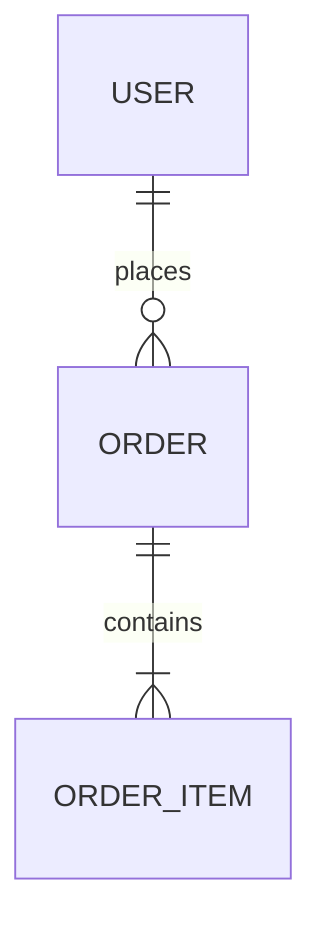

# Pero User Stories & System Spec (`pero:user-stories`)

## Overview
**Origin**: *Pero Custom SDLC Pipeline - Stage 3 (Universal)*.
Skill ini bertindak sebagai **"Buku Komik Cerita Pengguna & Aturan Main Game"** (Menjelaskan siapa pemainnya, apa yang dia lakukan, dan apa tanda bahwa dia menang atau berhasil). Tugasnya adalah menerjemahkan kebutuhan produk tingkat tinggi dari `docs/PRD.md` menjadi dokumen **System Specification (`docs/SystemSpec.md`)** yang presisi, mendalam, dan langsung dapat dieksekusi oleh tim engineering: merinci user stories berformat Gherkin (*Given-When-Then*), kamus data entitas domain inti, kontrak antarmuka API/IPC, serta matriks penanganan error standar.

## Sub-Skill Integration (Perkakas Pendukung)
Dalam menjalankan tahapan ini, agent WAJIB mengorkestrasi sub-skill berikut:
- **Upstream PRD Alignment & Traceability**: **`MANDATORY`**: Wajib membaca `docs/PRD.md` untuk memetakan seluruh fitur P0 dan P1 ke dalam User Stories (`US-xxx`) tanpa ada fitur yang tertinggal (*100% Traceability*).
- **Dekomposisi Riset Paralel Berbasis 5 Spesialis Tetap (*Fixed Specialist Squad*)**: **`REQUIRED SUB-SKILL`**: Gunakan `dispatching-parallel-agents` untuk mendelegasikan tim yang beranggotakan **5 Agen Spesialis Tetap (*Fixed Specialized Roles*)** secara paralel yang masing-masing dibekali alat `web-search`. Setiap spesialis wajib melakukan evaluasi relevansi awal (*Relevance Pre-Flight Check*). Jika domain relevan, agen dibatasi **minimal 2 dan maksimal 5 pencarian web terarah** untuk mengambil standar industri nyata (RFC/ISO/OWASP). Jika domain tidak relevan dengan PRD, agen wajib mendeklarasikan *Early-Exit* (`N/A: Not Applicable`) dan dilarang melakukan pencarian web.
- **Perancangan Kontrak & Standar Envelope**: **`REQUIRED SUB-SKILL`**: Gunakan `api-contract-design` untuk menyusun struktur payload endpoint REST, GraphQL, gRPC, WebSocket, atau pesan IPC secara konsisten (*standard response envelope*, header idempotensi `X-Idempotency-Key` untuk mutasi data, dan metadata paginasi untuk query daftar).
- **Validasi Skema & Batasan Tipe Data**: **`REQUIRED SUB-SKILL`**: Gunakan `schema-validator` untuk mendefinisikan batasan tipe data konkret (UUID, String, Int64, Float, Boolean, ISO-8601, Enum) dan batasan batas (*boundary constraints*).
- **Wawancara Aturan Batas & Logika Bisnis di Chat**: **`REQUIRED SUB-SKILL`**: Gunakan `grilling` secara interaktif langsung kepada pengguna di chat dengan batas **minimal 5 dan maksimal 10 pertanyaan** bertahap (1–2 pertanyaan per putaran) untuk menguji kondisi batas (soft vs hard delete, duplikasi/idempotensi, batas paginasi, dan konkurensi). Agent WAJIB menghentikan eksekusi (*pause*) dan menunggu respon pengguna. DILARANG mengarang keputusan sepihak.
- **Audit Konsistensi PRD-ke-Stories**: **`REQUIRED SUB-SKILL`**: Gunakan `pero-context-validation` untuk memastikan tidak ada User Story fiktif (*Zero Scope Bleed*) dan seluruh fitur PRD terpetakan tuntas.
- **Pencatatan Keputusan Sistem**: **`SUPPORTING SUB-SKILL`**: Gunakan `decision-recorder` untuk membukukan keputusan ke `docs/decisions/SDR-[YYYYMMDDHHmm].md`.

## Protokol Integritas Format Markdown (*Strict Markdown Integrity Protocol*)
Untuk mencegah kerusakan tampilan berkas (*broken markdown format*), agen WAJIB mematuhi 3 aturan penulisan:
1. **Sanitasi Karakter Pipa (`\|`)**: Seluruh karakter garis tegak/pipa di dalam teks sel tabel WAJIB di-escape menggunakan tanda `\|` agar struktur tabel Markdown tidak rusak.
2. **Isolasi Blok Kode**: Seluruh blok kode (Gherkin, JSON, TypeScript, SQL) WAJIB diawali dan diakhiri dengan triple backticks terisolasi pada baris tersendiri dan disertai identifier bahasa yang valid (` ```gherkin `, ` ```json `, ` ```mermaid `).
3. **Diagram Mermaid Bebas Glitch**: Seluruh node label pada diagram Mermaid WAJIB dibungkus dengan tanda kutip dua (`["Label (Keterangan)"]`) dan dilarang menggunakan tag HTML mentah.

## When to Use
- Mengubah spesifikasi kebutuhan produk dari `docs/PRD.md` menjadi cerita pengguna teknis yang terperinci.
- Merumuskan kriteria penerimaan pengujian berbasis perilaku (*Behavior-Driven*) dengan sintaks Gherkin 3-lapis (*Given-When-Then*: Happy Path, Negative Path, Edge Cases).
- Menyusun kamus entitas data domain inti (*Core Domain Entities, ERD & Data Dictionary*).
- Menetapkan kontrak antarmuka API, protokol IPC, atau alur pesan (*Message Flow Contracts*) dengan format envelope terstandarisasi.
- Merumuskan aturan validasi data dan matriks penanganan error terstruktur.

## The 5-Stage System Spec Framework

```
[0. Ingestion docs/PRD.md secara Utuh]
                 │
                 ▼
[1. Fixed 5-Specialist Squad + Web Search] ──> 5 Spesialis Tetap (Gherkin, ERD, API,
    (Min 2, Max 5 search jika relevan,         Security, Concurrency) dengan Pre-Flight
     0 search jika deklarasi N/A)              Relevance Check & Early Exit
                 │
                 ▼
[2. Validasi Skema & Integritas Kontrak]   ──> schema-validator & api-contract-design
                 │
                 ▼
[3. Wawancara Aturan Batas di Chat]        ──> Rambu Henti Wajib (Min 5, Max 10 Tanya)
                 │
                 ▼
[4. Penulisan Dokumen SystemSpec.md & SDR] ──> Kontrak Bersih, Idempotensi & Paginasi
                 │
                 ▼
[5. Audit Keterlacakan Hulu-Hilir]         ──> 100% Traceability & Zero Scope Bleed
```

### 1. Dekomposisi Riset Paralel Berbasis 5 Spesialis Tetap (*Fixed Specialist Squad*)
Mendelegasikan tim 5 agen spesialis tetap via `dispatching-parallel-agents` yang masing-masing dibekali alat `web-search`. Setiap spesialis beroperasi dalam batas domainnya secara ketat:

#### A. 5 Peran Spesialis Tetap (*Fixed Specialized Roles*):
1. **Spesialis 1: Alur Perilaku & Skenario Gherkin BDD (*BDD & Behavior Specialist*)**:
   - *Fokus*: Merumuskan cerita pengguna terperinci dan skenario 3-tier Gherkin (*Happy Path, Negative Path, Edge Cases*) lengkap dengan nilai input konkret dan kriteria penerimaan terukur.
2. **Spesialis 2: Struktur Entitas, Relasi Data & Mesin Status (*Data, ERD & State Machine Specialist*)**:
   - *Fokus*: Merancang diagram relasi Mermaid ERD (`erDiagram`), menyusun kamus data polyglot lengkap dengan penanda Unik dan Indeks, serta merumuskan Matriks Transisi Status (*Finite State Machine / FSM*).
3. **Spesialis 3: Kontrak Antarmuka & Protokol Komunikasi (*API/IPC & Event Contract Specialist*)**:
   - *Fokus*: Merancang endpoint sinkron (REST/gRPC), skema envelope standar (sukses/gagal), header idempotensi `X-Idempotency-Key`, skema paginasi, serta skema pesan event asinkron (*Event/Webhook Envelope*).
4. **Spesialis 4: Keamanan, Hak Akses & Privasi (*Security, Auth & RBAC Specialist*)**:
   - *Fokus*: Menyusun Matriks Hak Akses Peran (*RBAC Matrix*) untuk mencegah celah IDOR/BOLA, kepatuhan OWASP API Security Top 10, skema token (JWT/OAuth2), sanitasi input, dan enkripsi data sensitif.
5. **Spesialis 5: Konkurensi & Ketahanan Sistem (*Concurrency & Resilience Specialist*)**:
   - *Fokus*: Meneliti mitigasi *race conditions*, validasi transisi status FSM ilegal, strategi penguncian optimistik (*optimistic locking*), penanganan transaksi ganda, timeout jaringan, dan mekanisme pemulihan kegagalan (*failover*).

#### B. Mekanisme Evaluasi Relevansi Awal & Pintu Keluar Dini (*Relevance Pre-Flight Check & Early Exit*):
Untuk mencegah pemaksaan masalah palsu (*over-engineering*) pada proyek sederhana:
- Setiap spesialis wajib membaca `docs/PRD.md` sebelum melakukan tindakan apapun.
- Jika domain spesialis tersebut **sama sekali tidak relevan** dengan spesifikasi produk (misalnya: Spesialis 4 pada aplikasi CLI lokal tanpa login, atau Spesialis 5 pada skrip batch sederhana tanpa konkurensi):
  - Agen spesialis **WAJIB** mendeklarasikan: `Status: Not Applicable (N/A). Alasan: [Penjelasan mengapa domain ini tidak dibutuhkan di PRD]`.
  - Agen spesialis yang menyatakan `N/A` **DILARANG melakukan pencarian web (0 pencarian)** dan **DILARANG mengarang fitur palsu**.

#### C. Pagar Batas Pencarian Web (*Web Search Guardrails*):
- **Batas Kuantitas**:
  - Untuk domain yang relevan: **Minimal 2 pencarian web terarah** (wajib merujuk standar industri nyata) dan **Maksimal 5 pencarian web terarah** (mencegah pemborosan token dan risiko terkena rate limit).
  - Untuk domain `N/A`: **0 pencarian web**.
- **Integritas Bukti**: Setiap agen spesialis aktif wajib menyertakan minimal 1 tautan URL referensi resmi (RFC, dokumentasi framework, standar OWASP/ISO) dalam laporannya.

### 2. Validasi Skema & Integritas Kontrak (via `schema-validator` + `api-contract-design`)
- Memvalidasi konsistensi internal secara otomatis sebelum diuji ke pengguna:
  - Memastikan nama atribut dan tipe data pada skema Request/Response API sinkron 100% dengan Kamus Data Entitas ERD.
  - Memastikan seluruh endpoint mutasi (`POST`/`PUT`/`DELETE`) mendukung header idempotensi dan seluruh endpoint daftar data menyertakan metadata paginasi.
  - Memastikan pembungkus envelope standar seragam: `{ "status": "success", "data": {...} }` dan `{ "status": "error", "error": {...} }`.

### 3. Wawancara Aturan Batas & Logika Bisnis di Chat (via `grilling`)
- **RAMBU HENTI WAJIB (MANDATORY PAUSE GATE)**:
  - Agent **DILARANG** langsung membuat berkas `docs/SystemSpec.md` sebelum menyepakati aturan batas bisnis dan skenario ekstrem dengan pengguna di obrolan (*chat*).
  - Dilarang keras melakukan *self-answering* (menentukan sendiri kebijakan penghapusan data, paginasi, idempotensi, atau penanganan duplikasi).
- **Pagar Batas Pertanyaan (Volume & Delivery Guardrails)**:
  - **Batas Kuantitas**: Sesi wawancara dibatasi **minimal 5 pertanyaan** (untuk menguji seluruh kondisi batas dan titik kegagalan sistem) dan **maksimal 10 pertanyaan** (mencegah kelelahan pengguna).
  - **Penyampaian Bertahap (*Anti-Question Avalanche*)**: DILARANG memberondong pertanyaan sekaligus. Ajukan 1–2 dilema batas per putaran chat dengan opsi konkret (Opsi A vs Opsi B) dan rekomendasi teknis AI.
- **Fokus Topik Wawancara**:
  1. Kebijakan Retensi & Hapus Data (Soft-delete vs Hard-delete permanen).
  2. Penanganan Transaksi Ganda / Idempotensi (Idempotency Key vs Client-Side Debounce).
  3. Batas Paginasi & Volume Kuota (Default page size, max limit, cursor vs offset).
  4. Batas Input Ekstrem (Format validasi karakter khusus, sanitasi, batas ukuran file upload).
  5. Penanganan Konflik Konkurensi (Optimistic locking vs Last-write-wins).
  6. Validasi Transisi Status FSM (Legalitas perubahan status data dan otorisasi eksekutornya).
  7. Matriks Hak Akses Peran / RBAC (Batas wewenang antar-peran dan kepemilikan data tenant/user).
- **Hentikan pemanggilan tools (STOP)** dan tunggu keputusan pengguna di chat pada setiap putaran.

### 4. Penyusunan Dokumen SystemSpec.md Formal & Rekam Keputusan SDR
- Menyusun dokumen lengkap `docs/SystemSpec.md` mematuhi *Strict Markdown Integrity Protocol* (sanitasi `\|`, blok kode terisolasi, diagram Mermaid bersih).
- Membukukan alasan di balik penetapan kontrak antarmuka dan pemodelan data ke `docs/decisions/SDR-[YYYYMMDDHHmm].md` via `decision-recorder`.

### 5. Audit Keterlacakan Hulu-Hilir (via `pero-context-validation`)
- Mengaudit keterlacakan spesifikasi secara otomatis sebelum diserahkan:
  - **100% Traceability**: Seluruh fitur PRD (P0 dan P1) wajib terpetakan ke User Story (`US-xxx`).
  - **Zero Scope Bleed**: Dilarang membuat User Story fiktif yang tidak memiliki induk fitur di `docs/PRD.md`.

## Deliverables & Output Artifacts

1. **Living Document**: `docs/SystemSpec.md`
2. **Decision Record**: `docs/decisions/SDR-[YYYYMMDDHHmm].md`

---

## Template: `docs/SystemSpec.md`

````markdown
# System Specification: [Nama Sistem / Modul]

- **Versi**: 1.0
- **Status**: Disetujui (Approved)
- **Tanggal**: [YYYY-MM-DD]
- **Dokumen Induk**: [docs/PRD.md](docs/PRD.md)
- **Decision Record**: [docs/decisions/SDR-[YYYYMMDDHHmm].md](docs/decisions/SDR-[YYYYMMDDHHmm].md)

## 1. Traceability Matrix & Functional Scope

| ID Fitur PRD | Nama Fitur | ID User Story | Modul Sistem | Status Cakupan |
|:---|:---|:---|:---|:---|
| F-01 (P0) | [Nama Fitur 1] | `US-001` | [Modul Auth / Core] | Lengkap |
| F-02 (P0) | [Nama Fitur 2] | `US-002` | [Modul Data / Processing] | Lengkap |

## 2. Matriks Hak Akses Peran (Role-Based Access Control / RBAC Matrix)

| ID User Story / Endpoint | Pengunjung (Guest) | Pengguna Terdaftar (User) | Admin Sistem | Aturan Keamanan & Pembatasan Kepemilikan Data |
|:---|:---|:---|:---|:---|
| `US-001` (Autentikasi & Registrasi) | Create (Daftar/Login) | Read (Profil Sendiri) | CRUD (Kelola Semua) | Mencegah eskalasi hak akses role saat registrasi |
| `US-002` (Pengelolaan Data Utama) | Ditolak (403) | CRUD (Hanya Milik Sendiri) | CRUD (Semua Data) | Mencegah IDOR (Validasi session `user_id == record.user_id`) |

## 3. User Stories & Gherkin Acceptance Criteria

### US-001: [Judul User Story 1]
- **Rujukan PRD**: F-01
- **Deskripsi**: Sebagai *[persona]*, saya ingin *[tindakan]*, sehingga *[manfaat]*.
- **Prioritas**: P0 (MVP)

#### Acceptance Criteria (Gherkin):
```gherkin
Scenario: [Happy Path - Registrasi Pengguna Berhasil]
  Given sistem dalam kondisi normal dan email "budi@example.com" belum terdaftar
  When pengguna mengirim permintaan registrasi dengan nama "Budi", email "budi@example.com", dan password "Rahasia123!"
  Then sistem mengembalikan kode respon 201 Created
  And status pengguna tercatat sebagai "PENDING"
  And sistem membuat record audit log registrasi

Scenario: [Negative Path - Validasi Format Email Gagal]
  Given pengguna berada di formulir pendaftaran
  When pengguna memasukkan email "budi-tanpa-domain" dan password "Rahasia123!"
  Then sistem menolak permintaan dengan kode error 422 Unprocessable Entity
  And mengembalikan kode error "ERR_VALIDATION_FAILED" pada field "email"

Scenario: [Edge Case - Penanganan Pengiriman Ganda (Idempotency)]
  Given pengguna mengirimkan transaksi dengan header "X-Idempotency-Key: 9b1deb4d-3b7d-4bad-9bdd-2b0d7b3dcb6d"
  When pengguna tidak sengaja menekan tombol submit dua kali dalam selang waktu 200ms
  Then sistem hanya memproses satu transaksi pertama
  And permintaan kedua mengembalikan respon yang sama tanpa menduplikasi data di database
```

## 4. Core Domain Entities, ERD & Data Dictionary

### 4.1. Entity Relationship Diagram (ERD)


### 4.2. Kamus Data: Entitas `[NamaEntitas]`

| Field / Atribut | Tipe Data | Wajib / Opsional | Unik? | Indeks? | Nilai Default | Keterangan & Batasan Validasi |
|:---|:---|:---|:---|:---|:---|:---|
| `id` | UUID | Wajib | Ya | Ya (PK) | UUID v4 | Identitas unik entitas |
| `email` | String | Wajib | Ya | Ya (B-Tree Unique) | - | Format email standar RFC 5322, lowercase |
| `name` | String | Wajib | Tidak | Tidak | - | Panjang 1–100 karakter, tidak boleh kosong |
| `status` | Enum (`ACTIVE`, `PENDING`, `ARCHIVED`) | Wajib | Tidak | Ya (B-Tree) | `PENDING` | Status siklus hidup data |
| `created_at` | DateTime (ISO-8601) | Wajib | Tidak | Ya (B-Tree Desc) | `now()` | Timestamp pembuatan data UTC |
| `updated_at` | DateTime (ISO-8601) | Wajib | Tidak | Tidak | `now()` | Timestamp pembaruan data terakhir |

### 4.3. Matriks Transisi Status Entitas (Finite State Machine / FSM)

| Status Awal | Aksi / Peristiwa Pemicu | Status Akhir | Syarat Validasi & Otorisasi |
|:---|:---|:---|:---|
| `PENDING` | Pengguna verifikasi email sukses | `ACTIVE` | Token verifikasi valid & belum kadaluarsa |
| `ACTIVE` | Pengguna mengajukan arsip akun | `ARCHIVED` | Tidak ada tagihan tertunggak atau pesanan aktif |
| `ARCHIVED` | Pengguna mencoba login/edit | *DITOLAK* | Akun yang diarsipkan bersifat read-only |

## 5. API / IPC / Message Flow Contracts

### 5.1. Contract Mutasi: `[POST /api/v1/resource]` (Dengan Idempotency)
- **Tujuan**: Membuat entitas baru secara aman tanpa risiko duplikasi.
- **Protokol / Metode**: `POST` (REST) / `gRPC` / `WebSocket` / `IPC`
- **Header**:
  - `Content-Type`: `application/json`
  - `Authorization`: `Bearer <token>`
  - `X-Idempotency-Key`: `string (UUID v4)` *(Wajib untuk mencegah duplikasi eksekusi)*

#### Request Payload:
```json
{
  "name": "Contoh Nama",
  "status": "ACTIVE"
}
```

#### Response Envelope — Sukses (201 Created):
```json
{
  "status": "success",
  "data": {
    "id": "123e4567-e89b-12d3-a456-426614174000",
    "name": "Contoh Nama",
    "status": "ACTIVE",
    "created_at": "2026-08-27T12:00:00Z"
  },
  "meta": {
    "timestamp": "2026-08-27T12:00:00Z"
  }
}
```

#### Response Envelope — Gagal / Error (400 / 422 / 500):
```json
{
  "status": "error",
  "error": {
    "code": "ERR_VALIDATION_FAILED",
    "message": "Data yang dikirimkan tidak valid",
    "details": [
      {
        "field": "name",
        "issue": "Field 'name' wajib diisi dan minimal 1 karakter"
      }
    ]
  }
}
```

### 5.2. Contract Daftar Data: `[GET /api/v1/resource]` (Dengan Paginasi)
- **Tujuan**: Mengambil daftar entitas dengan pemecahan halaman aman.
- **Query Parameters**:
  - `page`: `integer` (default: `1`, min: `1`)
  - `per_page`: `integer` (default: `20`, max: `100`)

#### Response Envelope — Sukses Berpaginasi (200 OK):
```json
{
  "status": "success",
  "data": [
    {
      "id": "123e4567-e89b-12d3-a456-426614174000",
      "name": "Contoh Nama",
      "status": "ACTIVE"
    }
  ],
  "pagination": {
    "page": 1,
    "per_page": 20,
    "total_records": 150,
    "total_pages": 8
  },
  "meta": {
    "timestamp": "2026-08-27T12:00:00Z"
  }
}
```

### 5.3. Contract Pesan Event Asinkron: `[user.registered]` (Event / Webhook Envelope)
- **Tujuan**: Menerbitkan notifikasi latar belakang saat pengguna berhasil mendaftar (untuk pengiriman email & sinkronisasi data).
- **Protokol / Antrian**: Kafka / RabbitMQ / Redis PubSub / Webhook Outbound

#### Payload Event Envelope Standar:
```json
{
  "event_id": "evt_123e4567-e89b-12d3-a456-426614174000",
  "event_type": "user.registered",
  "occurred_at": "2026-08-27T12:00:00Z",
  "producer": "auth-service",
  "payload": {
    "user_id": "123e4567-e89b-12d3-a456-426614174000",
    "email": "budi@example.com",
    "status": "PENDING"
  },
  "meta": {
    "correlation_id": "corr_9b1deb4d-3b7d-4bad-9bdd-2b0d7b3dcb6d",
    "retry_count": 0
  }
}
```

## 6. Validation Rules & Error Handling Matrices

| Kode Error | HTTP / IPC Code | Pemicu / Kondisi | Pesan Pengguna (ELI5) | Solusi / Mitigasi |
|:---|:---|:---|:---|:---|
| `ERR_NOT_FOUND` | 404 | ID entitas tidak ditemukan di database | "Data yang Anda cari tidak ditemukan atau telah dihapus." | Periksa kembali ID atau segarkan halaman. |
| `ERR_VALIDATION_FAILED` | 422 / 400 | Format data atau tipe field melanggar batas | "Ada isian yang belum sesuai, silakan periksa petunjuk." | Lengkapi isian formulir sesuai aturan. |
| `ERR_UNAUTHORIZED` | 401 | Token kadaluarsa atau otentikasi hilang | "Sesi masuk Anda telah berakhir. Silakan login kembali." | Arahkan pengguna ke antarmuka login. |
| `ERR_FORBIDDEN` | 403 | Pengguna tidak memiliki izin hak akses | "Anda tidak memiliki izin untuk membuka bagian ini." | Hubungi administrator sistem. |
| `ERR_INTERNAL_SERVER` | 500 | Kegagalan sistem internal tak terduga | "Sistem sedang mengalami kendala teknis. Tim kami sedang menanganinya." | Log detail error ke server, sediakan tombol coba lagi. |
````

## Anti-Patterns & Common Mistakes
- **Forced Irrelevant Specialization**: Memaksakan pembuatan fitur yang tidak dibutuhkan proyek (misalnya memaksakan sistem otentikasi login pada CLI lokal atau arsitektur event rumit pada skrip sederhana), alih-alih mendeklarasikan status `N/A`.
- **Unbounded Web Search Avalanche**: Melakukan kurang dari 2 pencarian web terarah pada domain yang relevan (riset dangkal tanpa dasar standar), melampaui batas 5 pencarian web per agen, atau tetap melakukan pencarian web pada domain yang berstatus `N/A`.
- **Missing State Transition Boundaries (FSM)**: Mendefinisikan status Enum tanpa tabel transisi status yang sah, membuka celah manipulasi status data ilegal di backend (misal: data dibatalkan tiba-tiba berubah menjadi dibayar).
- **Missing RBAC Authorization Matrix**: Menulis cerita pengguna tanpa matriks hak akses peran yang jelas, memicu kerentanan eskalasi hak akses (IDOR/BOLA) saat implementasi kode.
- **Missing Uniqueness & Indexing in Data Dictionary**: Mengabaikan penanda kolom unik dan indeks pencarian di kamus data, yang memicu degradasi performa database saat data bertambah banyak.
- **Simulated Boundary Deciding**: Menentukan sendiri aturan batas teknis (seperti hard vs soft delete, idempotency key, atau limit paginasi) tanpa melakukan wawancara grilling di chat.
- **Question Avalanche or Premature Cessation**: Mengirimkan lebih dari 2 pertanyaan sekaligus dalam satu balon chat, bertanya kurang dari 5 pertanyaan (terlalu malas/dangkal), atau melampaui batas 10 pertanyaan pada Tahap 3 (memicu kelelahan pengguna dan *analysis paralysis*).
- **Vague Gherkin Slop**: Menulis langkah pengujian Gherkin yang abstrak dan mengambang tanpa data input konkret (misalnya tanpa menyebut atribut field dan nilai batas uji).
- **Missing Idempotency & Pagination**: Merancang endpoint mutasi (`POST`/`PUT`/`DELETE`) tanpa header idempotensi atau merancang query daftar tanpa skema paginasi.
- **Broken Markdown Formatting**: Menulis tabel dengan pipa tidak ter-escape (`|` tanpa `\|`) atau blok kode tidak tertutup, yang merusak render dokumen.
- **Orphan User Stories**: Menulis cerita pengguna yang tidak memiliki padanan fitur di PRD (*unanchored specs*).
- **Format Payload Inkonsisten**: Menggunakan envelope respon yang berbeda-beda antar endpoint tanpa pembungkus standar `{ "status": "...", "data": {...} }`.
