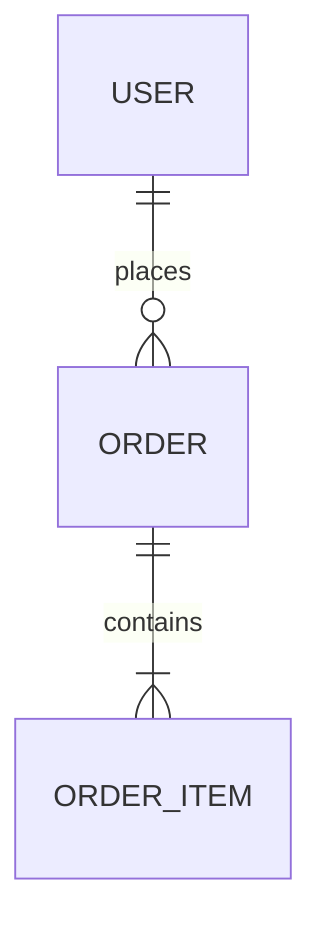

# Pero User Stories & System Spec (`pero:user-stories`)

## Overview
**Origin**: *Pero Custom SDLC Pipeline - Stage 3 (Universal)*.
Skill ini bertindak sebagai **"Buku Komik Cerita Pengguna & Aturan Main Game"** (Menjelaskan siapa pemainnya, apa yang dia lakukan, dan apa tanda bahwa dia menang atau berhasil). Tugasnya adalah menerjemahkan kebutuhan produk tingkat tinggi dari `docs/PRD.md` menjadi dokumen **System Specification (`docs/SystemSpec.md`)** yang presisi, mendalam, dan langsung dapat dieksekusi oleh tim engineering: merinci user stories berformat Gherkin (*Given-When-Then*), kamus data entitas domain inti, kontrak antarmuka API/IPC, serta matriks penanganan error standar.

## Sub-Skill Integration (Perkakas Pendukung)
Dalam menjalankan tahapan ini, agent WAJIB mengorkestrasi sub-skill berikut:
- **Upstream PRD Alignment & Traceability**: **`MANDATORY`**: Wajib membaca `docs/PRD.md` untuk memetakan seluruh fitur P0 dan P1 ke dalam User Stories (`US-xxx`) tanpa ada fitur yang tertinggal (*100% Traceability*).
- **Dekomposisi Riset Paralel Lintas Domain**: **`REQUIRED SUB-SKILL`**: Gunakan `dispatching-parallel-agents` untuk mendelegasikan 3 sub-agen spesialis secara paralel (*Sub-agen 1: Gherkin Scenarios & Behavior Specs, Sub-agen 2: Domain Entity, ERD & Data Dictionary, Sub-agen 3: API/IPC Contract Envelopes & Error Matrix*) guna memperluas cakupan spesifikasi tanpa membebani context window tunggal.
- **Perancangan Kontrak & Standar Envelope**: **`REQUIRED SUB-SKILL`**: Gunakan `api-contract-design` untuk menyusun struktur payload endpoint REST, GraphQL, gRPC, WebSocket, atau pesan IPC secara konsisten (*standard response envelope* format sukses & gagal).
- **Validasi Skema & Batasan Tipe Data**: **`REQUIRED SUB-SKILL`**: Gunakan `schema-validator` untuk mendefinisikan batasan tipe data konkret (UUID, String, Int64, Float, Boolean, ISO-8601, Enum) dan batasan batas (*boundary constraints*).
- **Wawancara Skenario Ekstrem & Boundary Grilling**: **`REQUIRED SUB-SKILL`**: Gunakan `grilling` untuk menguji kondisi batas, skenario konkurensi/duplikasi data, dan titik kegagalan sistem.
- **Audit Konsistensi PRD-ke-Stories**: **`REQUIRED SUB-SKILL`**: Gunakan `pero-context-validation` untuk memastikan tidak ada User Story fiktif (*Zero Scope Bleed*) dan seluruh fitur PRD terpetakan tuntas.
- **Pencatatan Keputusan Sistem**: **`SUPPORTING SUB-SKILL`**: Gunakan `decision-recorder` untuk membukukan keputusan ke `docs/decisions/SDR-[YYYYMMDDHHmm].md`.

## Protokol Integritas Format Markdown (*Strict Markdown Integrity Protocol*)
Untuk mencegah kerusakan tampilan berkas (*broken markdown format*), agen WAJIB mematuhi 3 aturan penulisan:
1. **Sanitasi Karakter Pipa (`\|`)**: Seluruh karakter garis tegak/pipa di dalam teks sel tabel WAJIB di-escape menggunakan tanda `\|` agar struktur tabel Markdown tidak rusak.
2. **Isolasi Blok Kode**: Seluruh blok kode (Gherkin, JSON, TypeScript, SQL) WAJIB diawali dan diakhiri dengan triple backticks terisolasi pada baris tersendiri dan disertai identifier bahasa yang valid (` ```gherkin `, ` ```json `, ` ```mermaid `).
3. **Diagram Mermaid Bebas Glitch**: Seluruh node label pada diagram Mermaid WAJIB dibungkus dengan tanda kutip dua (`["Label (Keterangan)"]`) dan dilarang menggunakan tag HTML mentah.

## When to Use
- Mengubah spesifikasi kebutuhan produk dari `docs/PRD.md` menjadi cerita pengguna teknis yang terperinci.
- Merumuskan kriteria penerimaan pengujian berbasis perilaku (*Behavior-Driven*) dengan sintaks Gherkin 3-lapis (*Given-When-Then*: Happy Path, Negative Path, Edge Cases).
- Menyusun kamus entitas data domain inti (*Core Domain Entities, ERD & Data Dictionary*).
- Menetapkan kontrak antarmuka API, protokol IPC, atau alur pesan (*Message Flow Contracts*) dengan format envelope terstandarisasi.
- Merumuskan aturan validasi data dan matriks penanganan error terstruktur.

## The 5-Section System Spec Framework

```
[1. Traceability Matrix & Scope] ──> [2. User Stories & Gherkin AC (3-Tier)]
                                                    │
[4. API / IPC Contracts (Envelope)] <── [3. Core Entities, ERD & Dictionary]
              │
[5. Validation Rules & Standard Error Matrix]
```

### 1. Traceability Matrix & Functional Scope
- Tabel pemetaan 1-ke-1 antara Fitur PRD (P0/P1) dengan ID User Story (`US-001`, `US-002`, dst.) guna menjamin tidak ada fitur yang terlewat atau mengambang.

### 2. User Stories with 3-Tier Gherkin Acceptance Criteria
- Format Cerita: `Sebagai [persona], saya ingin [tindakan], sehingga [manfaat]`.
- Kriteria Penerimaan Gherkin 3-Lapis:
  - **Happy Path**: Skenario ideal saat alur berjalan sukses.
  - **Negative Path**: Skenario saat validasi gagal, otentikasi ditolak, atau data tidak valid.
  - **Edge Cases & Boundary Limits**: Skenario kondisi ekstrem (nilai batas min/max, duplikasi data, timeout, atau koneksi terputus).

### 3. Core Domain Entities, ERD & Data Dictionary
- Diagram relasi Mermaid ERD (`erDiagram`) yang memetakan relasi 1:1, 1:N, dan N:M.
- Tabel kamus data polyglot dengan atribut, tipe data konkret (UUID, String, Int64, Float, Boolean, DateTime ISO-8601, Enum), status *Required/Optional*, default value, serta aturan validasi.

### 4. API / IPC / Message Flow Contracts (Standard Envelope)
- Kontrak antarmuka (*Contract-First*):
  - Endpoint & Protokol (misal: REST `POST /api/v1/resource`, RPC method, IPC event channel).
  - Request Payload Schema dengan tipe data dan aturan validasi.
  - Envelope Respons Standar mematuhi `api-contract-design` (Format Sukses `{ "status": "success", "data": {...} }` dan Format Gagal `{ "status": "error", "error": {...} }`).

### 5. Validation Rules & Error Handling Matrices
- Matriks kode error sistem yang terstruktur: kode unik, status HTTP/IPC, kondisi pemicu, pesan pengguna ramah awam (ELI5), dan mitigasi.

## Deliverables & Output Artifacts

1. **Living Document**: `docs/SystemSpec.md`
2. **Decision Record**: `docs/decisions/SDR-[YYYYMMDDHHmm].md`

---

## Template: `docs/SystemSpec.md`

````markdown
# System Specification: [Nama Sistem / Modul]

- **Versi**: 1.0
- **Status**: Disetujui (Approved)
- **Tanggal**: [YYYY-MM-DD]
- **Dokumen Induk**: [docs/PRD.md](docs/PRD.md)
- **Decision Record**: [docs/decisions/SDR-[YYYYMMDDHHmm].md](docs/decisions/SDR-[YYYYMMDDHHmm].md)

## 1. Traceability Matrix & Functional Scope

| ID Fitur PRD | Nama Fitur | ID User Story | Modul Sistem | Status Cakupan |
|:---|:---|:---|:---|:---|
| F-01 (P0) | [Nama Fitur 1] | `US-001` | [Modul Auth / Core] | Lengkap |
| F-02 (P0) | [Nama Fitur 2] | `US-002` | [Modul Data / Processing] | Lengkap |

## 2. User Stories & Gherkin Acceptance Criteria

### US-001: [Judul User Story 1]
- **Rujukan PRD**: F-01
- **Deskripsi**: Sebagai *[persona]*, saya ingin *[tindakan]*, sehingga *[manfaat]*.
- **Prioritas**: P0 (MVP)

#### Acceptance Criteria (Gherkin):
```gherkin
Scenario: [Happy Path - Nama Skenario Sukses]
  Given [kondisi awal atau prasyarat sistem]
  When [pengguna melakukan aksi tertentu]
  Then [sistem memberikan hasil sukses yang diharapkan]
  And [status data berubah sesuai aturan]

Scenario: [Negative Path - Validasi Input Gagal]
  Given [pengguna berada di formulir atau antarmuka terkait]
  When [pengguna memasukkan data tidak valid atau mengosongkan field wajib]
  Then [sistem menolak permintaan dengan kode error yang sesuai]
  And [menampilkan pesan error yang jelas dan mudah dipahami]

Scenario: [Edge Case - Penanganan Nilai Batas / Duplikasi Data]
  Given [kondisi ekstrem seperti batas kuota atau percobaan submit ganda]
  When [pengguna mencoba mengirim permintaan]
  Then [sistem menangani kondisi tersebut secara aman tanpa duplikasi data]
```

## 3. Core Domain Entities & Data Dictionary

### 3.1. Entity Relationship Diagram (ERD)


### 3.2. Kamus Data: Entitas `[NamaEntitas]`

| Field / Atribut | Tipe Data | Wajib / Opsional | Nilai Default | Keterangan & Batasan Validasi |
|:---|:---|:---|:---|:---|
| `id` | UUID | Wajib | UUID v4 | Identitas unik entitas |
| `name` | String | Wajib | - | Panjang 1–100 karakter, tidak boleh kosong |
| `status` | Enum (`ACTIVE`, `PENDING`, `ARCHIVED`) | Wajib | `PENDING` | Status siklus hidup data |
| `created_at` | DateTime (ISO-8601) | Wajib | `now()` | Timestamp pembuatan data UTC |
| `updated_at` | DateTime (ISO-8601) | Wajib | `now()` | Timestamp pembaruan data terakhir |

## 4. API / IPC / Message Flow Contracts

### 4.1. Contract: `[POST /api/v1/resource]` (atau IPC Channel)
- **Tujuan**: [Deskripsi fungsi kontrak ini]
- **Protokol / Metode**: `POST` (REST) / `gRPC` / `WebSocket` / `IPC`
- **Header**:
  - `Content-Type`: `application/json`
  - `Authorization`: `Bearer <token>`

#### Request Payload:
```json
{
  "name": "Contoh Nama",
  "status": "ACTIVE"
}
```

#### Response Envelope — Sukses (200 / 201):
```json
{
  "status": "success",
  "data": {
    "id": "123e4567-e89b-12d3-a456-426614174000",
    "name": "Contoh Nama",
    "status": "ACTIVE",
    "created_at": "2026-08-27T12:00:00Z"
  },
  "meta": {
    "timestamp": "2026-08-27T12:00:00Z"
  }
}
```

#### Response Envelope — Gagal / Error (400 / 422 / 500):
```json
{
  "status": "error",
  "error": {
    "code": "ERR_VALIDATION_FAILED",
    "message": "Data yang dikirimkan tidak valid",
    "details": [
      {
        "field": "name",
        "issue": "Field 'name' wajib diisi dan minimal 1 karakter"
      }
    ]
  }
}
```

## 5. Validation Rules & Error Handling Matrices

| Kode Error | HTTP / IPC Code | Pemicu / Kondisi | Pesan Pengguna (ELI5) | Solusi / Mitigasi |
|:---|:---|:---|:---|:---|
| `ERR_NOT_FOUND` | 404 | ID entitas tidak ditemukan di database | "Data yang Anda cari tidak ditemukan atau telah dihapus." | Periksa kembali ID atau segarkan halaman. |
| `ERR_VALIDATION_FAILED` | 422 / 400 | Format data atau tipe field melanggar batas | "Ada isian yang belum sesuai, silakan periksa petunjuk." | Lengkapi isian formulir sesuai aturan. |
| `ERR_UNAUTHORIZED` | 401 | Token kadaluarsa atau otentikasi hilang | "Sesi masuk Anda telah berakhir. Silakan login kembali." | Arahkan pengguna ke antarmuka login. |
| `ERR_FORBIDDEN` | 403 | Pengguna tidak memiliki izin hak akses | "Anda tidak memiliki izin untuk membuka bagian ini." | Hubungi administrator sistem. |
| `ERR_INTERNAL_SERVER` | 500 | Kegagalan sistem internal tak terduga | "Sistem sedang mengalami kendala teknis. Tim kami sedang menanganinya." | Log detail error ke server, sediakan tombol coba lagi. |
````

## Anti-Patterns & Common Mistakes
- **Broken Markdown Formatting**: Menulis tabel dengan pipa tidak ter-escape (`|` tanpa `\|`) atau blok kode tidak tertutup, yang merusak render dokumen.
- **Orphan User Stories**: Menulis cerita pengguna yang tidak memiliki padanan fitur di PRD (*unanchored specs*).
- **Vague Acceptance Criteria**: Menulis kriteria penerimaan tanpa format Gherkin konkret (`Given-When-Then`) yang dapat diuji otomatis.
- **Missing Error & Negative Scenarios**: Hanya merancang alur sukses tanpa memetakan skenario validasi gagal, duplikasi data, atau timeout jaringan.
- **Format Payload Inkonsisten**: Menggunakan envelope respon yang berbeda-beda antar endpoint tanpa pembungkus standar `{ "status": "...", "data": {...} }`.
