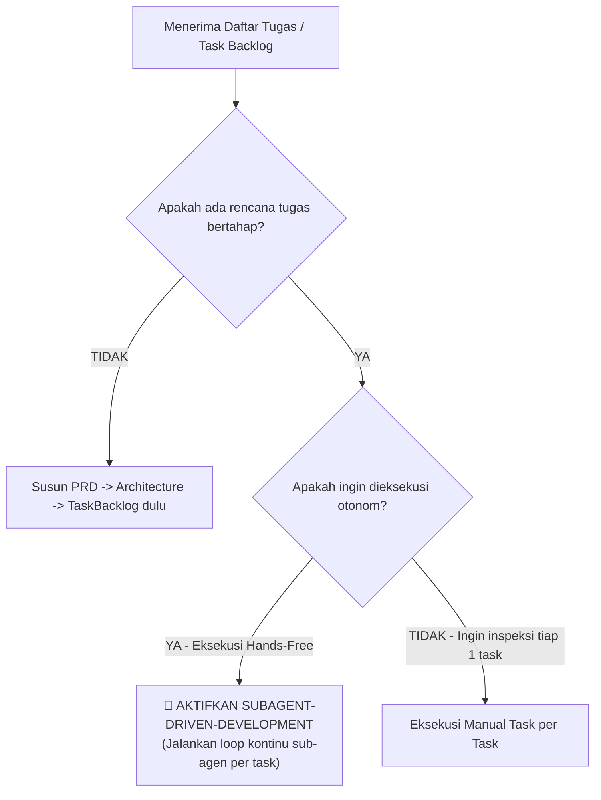

# Subagent-Driven Development (`subagent-driven-development`)

## Overview
**Origin**: *obra/superpowers Subagent-Driven Development (SDD) Pattern + Autonomous Multi-Agent Orchestration*.  
Skill ini adalah **"Mesin Konveyor Eksekusi Otonom & Orkestrator Sub-Agen Terisolasi"**. Bertanggung jawab mengeksekusi seluruh daftar rencana tugas dari `docs/TaskBacklog.md` (atau `docs/task-backlog/index.md`) atau dokumen rencana implementasi secara berkesinambungan (*continuous autonomous execution*) tanpa interupsi, dengan meluncurkan sub-agen baru per tugas (*fresh context subagent*), mengawal siklus TDD, dan melakukan audit mutu sebelum tugas berikutnya dimulai.

> **Analogi Sederhana (ELI5):**  
> Bayangkan sebuah **Pabrik Mobil Otomatis Modern**:
> - **Koding Manual AI Biasa (Pekerja Kelelahan & Lupa)**: Satu pekerja disuruh merakit 10 mobil sendirian dari pagi sampai malam di satu ruangan yang sama. Pada mobil ke-7, pekerja mulai pusing, lupa baut mana yang sudah dipasang, dan melakukan banyak kesalahan fatal karena otaknya kepenuhan (*context bloat*).
> - **Subagent-Driven Development (Ban Konveyor Otomatis)**: Mandor utama (*Controller*) menyalakan ban konveyor.
>   1. Ban konveyor membawa **Rangka Mobil #1** (Tugas 1).
>   2. Mandor memanggil **Teknisi Segar #1** (*Fresh Implementer*) yang masih berenergi penuh untuk merakit dan mengetes mesinnya dengan TDD.
>   3. Setelah selesai, **Pengawas Mutu #1** (*Task Reviewer*) memeriksa apakah mobil sesuai pesanan dan tidak ada baut yang longgar.
>   4. Begitu lolos uji, mandor memberi tanda centang `[x]`, ban konveyor otomatis berjalan ke **Rangka Mobil #2**, memanggil teknisi baru yang segar, dan mengulanginya sampai seluruh mobil selesai dirakit tanpa perlu kita tungguin atau beri perintah berulang kali.

---

## Landasan Teori & Referensi Industri Nyata

Skill ini dibangun di atas 3 pilar rekayasa kecerdasan agen otonom dan arsitektur alur kerja multi-agen:

### 1. Context Window Preservation & Attention Decay Mitigation
Mitigasi penurunan kualitas penalaran model LLM akibat akumulasi riwayat percakapan panjang (*needle-in-a-haystack attention degradation*).
*   **Referensi 1 (Fenomena Lost-in-the-Middle)**: *Nelson F. Liu et al.*, "Lost in the Middle: How Language Models Use Long Contexts" (Transactions of the Association for Computational Linguistics, MIT Press).
*   **Referensi 2 (Arsitektur Model Context Protocol)**: *Anthropic*, "Model Context Protocol (MCP) & Context Isolation Design Patterns" ([modelcontextprotocol.io](https://modelcontextprotocol.io)).
*   **Referensi 3 (Framework Superpowers)**: *Jesse Vincent (obra)*, "Superpowers: Subagent-Driven Development for Autonomous Coding" ([github.com/obra/superpowers](https://github.com/obra/superpowers)).

### 2. Dual-Agent Verification Loop (Actor-Critic & Separation of Concerns)
Pemisahan peran mutlak antara agen pelaksana (*implementer*) dan agen penguji (*reviewer*) untuk mengeliminasi bias konfirmasi (*self-grading bias*).
*   **Referensi 1 (Arsitektur Actor-Critic)**: *Richard S. Sutton & Andrew G. Barto*, "Reinforcement Learning: An Introduction - Policy Gradient & Actor-Critic Methods" (MIT Press).
*   **Referensi 2 (Pola Pengujian Software Klasik)**: *Glenford J. Myers*, "The Art of Software Testing - The Principle of Independent Testing" (John Wiley & Sons).
*   **Referensi 3 (Prinsip Clean Code & Review)**: *Robert C. Martin (Uncle Bob)*, "Clean Code: A Handbook of Agile Software Craftsmanship - Two-Phase Review Gates" (Prentice Hall).

### 3. Continuous Autonomous Execution & Deterministic Stop Conditions
Prinsip bahwa sistem otonom harus mengeksekusi alur secara berkesinambungan tanpa menanyakan izin sepele, dan hanya berhenti pada kondisi pembatas yang deterministik (*deterministic halting*).
*   **Referensi 1 (Teori Automata & Mesin Turing)**: *Michael Sipser*, "Introduction to the Theory of Computation - Decidability and Halting Conditions" (Cengage Learning).
*   **Referensi 2 (Standar Industri DevOps)**: *Gene Kim, Jez Humble, Patrick Debois*, "The DevOps Handbook: How to Create World-Class Agility, Reliability, and Security in Technology Organizations" (IT Revolution Press).

---

## Pohon Keputusan: Kapan Menggunakan SDD



---

## 5 Siklus Eksekusi Otonom (*The 5-Step Continuous Execution Cycle*)

```
┌─────────────────────────────────────────────────────────────┐
│          ALUR EKSEKUSI OTONOM SUBAGENT-DRIVEN DEV           │
├─────────────────────────────────────────────────────────────┤
│ 1. Pre-Flight Backlog Scan  : Cek konflik & dependensi      │
│ 2. Dispatch Fresh Implementer: Sub-agen TDD & Anti-Slop     │
│ 3. Dispatch Task Reviewer   : Audit Spec & Kualitas Kode    │
│ 4. Update Progress Ledger   : Centang [x] di TaskBacklog    │
│ 5. Final Whole-Branch Polish: Full Suite Test & Buat PR     │
└─────────────────────────────────────────────────────────────┘
```

### 1. Pre-Flight Backlog Scan (Pindai Awal Sebelum Mulai)
Sebelum meluncurkan Tugas #1:
- **Verifikasi Gerbang Validasi Konteks (Stage 9 Gate)**: Periksa `docs/ValidationReport.md`. Pastikan status keseluruhan berstatus **🟢 GO (Pass)**. Jika berstatus **🔴 NO-GO (Blocker)**, eksekusi backlog otonom DILARANG berjalan sebelum blocker diselesaikan dan diselaraskan via `pero-context-validation`.
- **Deteksi Mode Backlog & Scope Milestone**:
  - Deteksi lokasi backlog `$BACKLOG_PATH`: gunakan `docs/task-backlog/index.md` jika direktori modular tersedia, atau fallback ke `docs/TaskBacklog.md`.
  - Periksa bagian `📦 Milestone Registry & Status` di `$BACKLOG_PATH`.
  - **Mode A (Greenfield Initial Build)**: Jika mengerjakan MVP v1.0, pindai urutan 5 fase linier (Phase 1 ➡️ Phase 5). Pada mode modular, tugas tersimpan di `docs/task-backlog/phase-*.md`.
  - **Mode B (Incremental Milestone Evolution)**: Jika mengerjakan sprint fitur baru (v1.1+ atau proyek *brownfield*), cari blok **`## 🚀 Active Milestone: vX.Y`** (pada file monolitik atau di `docs/task-backlog/active-milestone.md`). Sub-agen membatasi eksekusi HANYA pada tugas di dalam Active Milestone tersebut (Step 1 s/d Step 4). Seluruh tugas yang tersimpan di dalam arsip (*Archived Milestones*) **DIABAIKAN** dan dilarang dieksekusi ulang.
- Pastikan urutan fase/step logis dan tidak ada instruksi yang saling bertentangan.
- Jika ada kontradiksi nyata di awal, ajukan 1 pertanyaan klarifikasi kepada pengguna sebelum mulai. Jika aman, **langsung mulai eksekusi tanpa menunggu persetujuan lanjutan**.

### 2. Dispatch Fresh Implementer (Kirim Pekerja Segar)
- Koordinator mengekstrak kartu tugas ke file ringkasan via skrip (adaptif terhadap lokasi direktori `skills/` atau `.agents/skills/`):
  ```bash
  CMD_BRIEF=$( [ -f "./skills/subagent-driven-development/scripts/task-brief" ] && echo "./skills/subagent-driven-development/scripts/task-brief" || echo "./.agents/skills/subagent-driven-development/scripts/task-brief" )
  BACKLOG_FILE=$( [ -f "docs/task-backlog/index.md" ] && echo "docs/task-backlog/index.md" || echo "docs/TaskBacklog.md" )
  $CMD_BRIEF "$BACKLOG_FILE" "1.1"
  ```
- **Penanganan Khusus Tugas UI (Google Stitch MCP)**:
  - Jika tugas menargetkan antarmuka (Mode A Phase 4 atau Mode B Step 3), Implementer wajib membaca `docs/DesignSystem.md` dan memeriksa kode HTML prototipe di `assets/stitch-code/` serta screenshot visual di `assets/stitch-screens/`.
- Koordinator meluncurkan Implementer Subagent menggunakan templat [`implementer-prompt.md`](./implementer-prompt.md).
- Sub-agen menjalankan siklus TDD terisolasi ([`test-driven-development`](../test-driven-development/SKILL.md)), membersihkan kode ([`anti-slop`](../anti-slop/SKILL.md)), dan membuat commit Caveman ([`git-ops`](../git-ops/SKILL.md)).
- Implementer menulis laporannya ke berkas `.pero/sdd/task-1.1-report.md`.

### 3. Dispatch Task Reviewer & Re-Review Loop (Audit Kualitas Dua Lapis)
- Koordinator membungkus paket diff perubahan tugas via skrip:
  ```bash
  CMD_REV=$( [ -f "./skills/subagent-driven-development/scripts/review-package" ] && echo "./skills/subagent-driven-development/scripts/review-package" || echo "./.agents/skills/subagent-driven-development/scripts/review-package" )
  $CMD_REV [BASE_SHA] [HEAD_SHA]
  ```
- Koordinator meluncurkan Task Reviewer Subagent menggunakan templat [`task-reviewer-prompt.md`](./task-reviewer-prompt.md).
- Peninjau memeriksa perbedaan kode (*git diff*):
  1. **Spec Compliance**: Apakah semua kriteria kartu tugas terpenuhi? Pada tugas UI, apakah tampilan dan status interaksi mematuhi `docs/DesignSystem.md` dan prototipe Google Stitch MCP?
- Jika ada temuan kritis (*Critical/Important*), gunakan [`systematic-debugging`](../systematic-debugging/SKILL.md) untuk mengisolasi akar masalah, panggil *Fix Subagent*, lalu luncurkan Re-Reviewer Subagent menggunakan templat [`re-review-prompt.md`](./re-review-prompt.md).
- **Circuit Breaker Re-Review Loop (`MAX_REVIEW_CYCLES = 3`)**:
  1. Maksimum 3 siklus peninjauan per kartu tugas (1 Initial Review + 2 Fix & Re-Review rounds).
  2. Re-Reviewer dilarang memunculkan catatan nitpicking baru di luar daftar temuan sisa sebelumnya, kecuali jika kode perbaikan memicu regresi baru.
  3. Jika putaran ke-3 masih berstatus `NEEDS_FIXES`, **Circuit Breaker aktif seketika**: otomasi wajib berhenti dan dilarang meluncurkan Fix Subagent putaran ke-4 untuk mencegah *infinite loop* dan ledakan biaya token.
  4. Koordinator wajib memicu eskalasi interaktif kepada pengguna manusia via modal `ask_question` dengan 4 opsi terstruktur:
     - **Opsi 1 (Recommended)**: *"Override & Catat Tech Debt: Terima implementasi saat ini, catat temuan tersisa sebagai Tech Debt di docs/decisions/, dan lanjutkan ke tugas berikutnya."*
     - **Opsi 2**: *"Panduan Manual: Masukkan arahan arsitektur/kode konkret satu kali untuk 1 putaran perbaikan terpandu terakhir."*
     - **Opsi 3**: *"Revisi Spesifikasi: Panggil pero-change-management (CRDR) untuk mendekomposisi tugas atau menyelaraskan kriteria penerimaan yang kontradiktif."*
     - **Opsi 4**: *"Rollback Task: Batalkan perubahan tugas ini (git reset ke BASE_SHA) dan hentikan eksekusi sementara."*

### 4. Update Progress Ledger (Catat Kemajuan)
- Perbarui centang di `docs/TaskBacklog.md` (atau pada pod fase terkait `docs/task-backlog/phase-*.md` / `active-milestone.md` dan tabel ringkasan di `index.md`) dari `- [ ]` menjadi `- [x]`.
- Jika seluruh tugas dalam blok `Active Milestone` telah selesai, tandai Milestone sebagai selesai di `📦 Milestone Registry & Status`, dan perbarui arsip milestone terkait.
- Tanpa berhenti atau menanyakan *"Bolehkah saya lanjut?"*, koordinator otomatis mengambil kartu tugas berikutnya dan kembali ke Langkah 2.

### 5. Final Whole-Branch Polish & PR (Penyelesaian Akhir)
Setelah seluruh tugas selesai 100%:
- Jalankan seluruh suite tes proyek di terminal untuk membuktikan nol regresi (*exit code 0* via [`verification-before-completion`](../verification-before-completion/SKILL.md)).
- Jalankan audit review menyeluruh tingkat cabang ([`code-reviewer`](../code-reviewer/SKILL.md)).
- Sinkronkan diagram dokumentasi ([`living-doc-sync`](../living-doc-sync/SKILL.md)).
- Buat Pull Request resmi menggunakan [`git-ops`](../git-ops/SKILL.md).

---

## Struktur Berkas Modular Skill (`subagent-driven-development`)

```
skills/subagent-driven-development/
├── SKILL.md                   # Panduan orkestrasi alur kerja agen utama (file ini)
├── implementer-prompt.md      # Templat prompt mandiri untuk Implementer Subagent
├── task-reviewer-prompt.md    # Templat prompt mandiri untuk Task Reviewer Subagent
├── re-review-prompt.md        # Templat prompt mandiri untuk Re-Reviewer Subagent
└── scripts/
    ├── sdd-workspace          # Menyiapkan direktori kerja sementara .pero/sdd
    ├── task-brief             # Mengekstrak kartu tugas spesifik dari backlog ke berkas terpisah
    └── review-package         # Menghasilkan berkas git diff BASE..HEAD untuk direview
```

---

## Integrasi dengan Skill Lain di Repositori

*   **[`pero-task-decomposition`](../pero-task-decomposition/SKILL.md)**: Menyediakan struktur backlog dual-mode (Mode A: 5-Fase Greenfield & Mode B: 4-Langkah Incremental Milestone) yang siap dieksekusi oleh SDD.
*   **[`pero-granular-refinement`](../pero-granular-refinement/SKILL.md)**: Menyediakan kartu tugas presisi (path file, signatures, boundary cases) yang langsung menjadi prompt bagi Implementer.
*   **[`pero-uiux-design`](../pero-uiux-design/SKILL.md)**: Menyediakan prototipe visual Google Stitch MCP (`stitch.withgoogle.com`), token desain di `docs/DesignSystem.md`, dan aset kode HTML di `assets/stitch-code/` yang diimplementasikan sub-agen.
*   **[`test-driven-development`](../test-driven-development/SKILL.md)**: Standar koding mutlak yang wajib dipatuhi oleh Implementer Subagent.
*   **[`anti-slop`](../anti-slop/SKILL.md)**: Filter kualitas agar sub-agen tidak menghasilkan kode atau komentar sampah.
*   **[`systematic-debugging`](../systematic-debugging/SKILL.md)**: Digunakan untuk mengisolasi akar kegagalan jika reviewer menemukan bug atau tes gagal sebelum mencoba perbaikan.
*   **[`dispatching-parallel-agents`](../dispatching-parallel-agents/SKILL.md)**: Dipanggil oleh SDD ketika menemukan tugas-tugas di dalam fase yang sama yang sepenuhnya independen dan dapat dijalankan serentak.
*   **[`pero-change-management`](../pero-change-management/SKILL.md)**: Dipanggil seketika jika pengguna meminta perubahan arah, penambahan fitur baru, atau penghapusan alur di tengah eksekusi backlog, untuk menertibkan status tugas aktif (*pause/supersede*) dan mencegah eksekusi tugas zombie.
*   **[`verification-before-completion`](../verification-before-completion/SKILL.md)**: Penegak bukti eksekusi terminal sebelum cabang dianggap tuntas.
*   **[`code-reviewer`](../code-reviewer/SKILL.md)**: Digunakan untuk Task Reviewer dan Final Merge Reviewer.

---

## Anti-Patterns & Hal yang Dilarang

*   ❌ **Interupsi Basa-Basi (*Premature Asking*)**: Berhenti di setiap akhir tugas untuk bertanya *"Apakah saya boleh melanjutkan ke task 2?"*. (Jika tidak ada eror yang memblokir, **lanjutkan otomatis!**).
*   ❌ **Pikiran Menumpuk (*Context Leakage*)**: Mengerjakan semua 10 tugas dalam satu sub-agen panjang tanpa memanggil sub-agen baru.
*   ❌ **Penilai Diri Sendiri (*Self-Grading*)**: Menganggap tugas selesai tanpa melalui verifikasi sub-agen peninjau (*task reviewer*).
*   ❌ **Menembus Larangan TDD**: Menulis kode implementasi sebelum membuat failing test.
*   ❌ **Eksekusi Buta Saat Terjadi Pivot (*Blind Pivot Execution*)**: Tetap melanjutkan pengerjaan tugas lama yang sudah tidak relevan saat pengguna meminta perubahan arah di tengah jalan tanpa memanggil `pero-change-management`.

