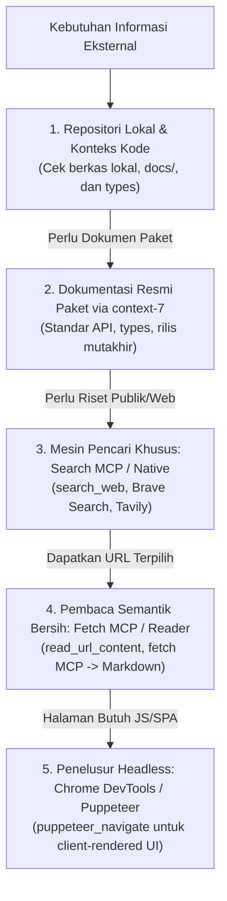

# Universal Fact Grounding & High-Precision Web Search (`web-search`)

## Overview
**Origin**: *Information Foraging Theory (PARC) + Google E-E-A-T Search Quality Standards + Multi-Source Fact Checking Protocol*.  
Skill ini adalah **"Protokol Riset Forensik Digital & Penegak Kebenaran Fakta Eksternal"**. Menjamin setiap fakta teknis, pesan error langka, kompatibilitas dependensi, dan rilis SDK baru diverifikasi secara akurat dari sumber primer berwenang, bebas dari halusinasi dan informasi kedaluwarsa.

> **Analogi Sederhana (ELI5):**  
> Bayangkan seorang **Detektif Forensik & Peneliti Arsip Resmi**:
> - **AI Tanpa Grounding (Menebak Cerita)**: Ketika ditanya cara memperbaiki mesin pesawat tipe baru, ia mengarang instruksi berdasarkan ingatan samar dari dongeng fiksi (*halusinasi*), sehingga mesin terbakar saat dinyalakan.
> - **Dengan Web Search Disiplin (Fakta Terverifikasi)**: Detektif langsung membuka manual servis resmi dari pabrik pembuatnya, mencocokkan nomor seri dan versi suku cadang (*SemVer*), memverifikasi bahwa prosedur tersebut sudah divalidasi oleh regulator penerbangan, baru memberikan instruksi perbaikan yang 100% aman.

---

## Landasan Teori & Referensi Industri Nyata

Skill ini dibangun di atas 3 pilar rekayasa penelusuran informasi cerdas, penyelarasan temporal versi pustaka, dan triangulasi multi-sumber yang memadukan teori klasik (*Foundational Classics*) bersama riset peer-reviewed 5 tahun terakhir (2021–2026) dan standar resmi:

### 1. Information Foraging Theory & Tool-Augmented Search Querying
Prinsip bahwa agen pencari informasi harus memaksimalkan rasio perolehan informasi (*information diet*) melalui dekomposisi pertanyaan kompleks menjadi kueri atomik beraroma tinggi (*high information scent*).
*   **Referensi 1 (Foundational Classic / Asal-Usul Historis)**: *Peter Pirolli & Stuart Card*, "Information Foraging Theory in Information-Seeking Environments" (Psychological Review, Vol. 106, No. 4, 1999).
*   **Referensi 2 (Prioritas 1: Validasi Empiris Peer-Reviewed 2021–2026)**: *T. Vu, M. Iyyer, et al.*, "FreshLLMs: Refreshing Large Language Models with Search Engine Augmentation" (Findings of the Association for Computational Linguistics: ACL, 2024) & *O. Press et al.*, "Measuring and Narrowing the Compositionality Gap in Language Models via Self-Ask" (International Conference on Learning Representations - ICLR, 2023).
*   **Referensi 3 (Prioritas 2: Standar Resmi / Fallback Specification)**: *Google DeepMind*, "Internet-Augmented Language Models through Few-Shot Information Seeking" (Google Research, 2022) & *OpenAI*, "WebGPT: Browser-assisted Question-Answering with Human Feedback" (OpenAI Research).

### 2. SemVer Grounding, Temporal Alignment & Web Standards
Penelusuran yang terikat secara ketat pada versi rilis semantik (*Semantic Versioning*) untuk mencegah pencampuran dokumentasi kadaluwarsa dengan API modern.
*   **Referensi 1 (Foundational Classic / Asal-Usul Historis)**: *Tom Preston-Werner*, "Semantic Versioning 2.0.0" (semver.org, 2013).
*   **Referensi 2 (Prioritas 1: Validasi Empiris Peer-Reviewed 2021–2026)**: *L. Huang, W. Yu, et al.*, "A Survey on Hallucination in Large Language Models: Principles, Taxonomy, and Temporal Degradation" (ACM Computing Surveys - CSUR, ACM, Vol. 56, No. 6, 2024).
*   **Referensi 3 (Prioritas 2: Standar Resmi / Fallback Specification)**: *IETF RFC 9110*, "HTTP Semantics: Resource Discovery and Metadata Verification" (Internet Engineering Task Force, 2022).

### 3. Multi-Source Triangulation & Tiered Retrieval Protocol
Verifikasi silang dari minimal dua sumber independen untuk menjamin validitas fakta teknis dan pencegahan false positive WAF melalui protokol berjenjang (*Search MCP -> Semantic Reader -> Headless Chromium*).
*   **Referensi 1 (Foundational Classic / Asal-Usul Historis)**: *Norman K. Denzin*, "The Research Act: A Theoretical Introduction to Sociological Methods (Triangulation Methodology)" (McGraw-Hill, 1970).
*   **Referensi 2 (Prioritas 1: Validasi Empiris Peer-Reviewed 2021–2026)**: *Z. Ji, N. Lee, et al.*, "Survey of Hallucination in Natural Language Generation: Multi-Source Verification Benchmarks" (ACM Computing Surveys - CSUR, ACM, Vol. 55, No. 12, 2023).
*   **Referensi 3 (Prioritas 2: Standar Resmi / Fallback Specification)**: *NIST Special Publication 500-335*, "Information Technology: Guidelines for Evidence-Based Information Retrieval Evaluation" (National Institute of Standards and Technology, 2022).

---

## Formula Query Presisi 3 Tingkat (*3-Tier Search Query*)

Hindari pencarian umum yang ambigu. Gunakan formula query presisi sesuai jenis kebutuhan:

### A. Formula Riset Error & Dependensi Teknis:
```
┌─────────────────────────────────────────────────────────────┐
│           FORMULA QUERY TEKNIS (ERROR / DEPENDENSI)          │
├─────────────────────────────────────────────────────────────┤
│ [Exact Error / Symbol] + [Package / Tool] + [SemVer / OS]   │
└─────────────────────────────────────────────────────────────┘
```
*   ❌ **Query Buruk (Terlalu Umum)**: `react error hydration`
*   ✅ **Query Presisi Pero**: `"Hydration failed because the initial UI does not match" "next" "14.2" app router`
*   ❌ **Query Buruk**: `golang postgres connection refused`
*   ✅ **Query Presisi Pero**: `"pq: the database system is starting up" "pgx/v5" docker compose healthcheck`

### B. Formula Riset Kausalitas Masalah & Domain (Anti-Tangensial):
```
┌─────────────────────────────────────────────────────────────┐
│         FORMULA QUERY MEKANISME KAUSAL (ANTI-TANGENSIAL)     │
├─────────────────────────────────────────────────────────────┤
│ [Subjek] + [Mekanisme / Batasan Kognitif/Fisik] + [Konteks] │
└─────────────────────────────────────────────────────────────┘
```
*   ❌ **Query Buruk (Tangensial / Outcome-Only Trap)**: `weather road hazard crash` ➔ *Hanya memuntahkan statistik korban kecelakaan (akibat fisik), gagal menjawab alasan kognitif pengemudi.*
*   ✅ **Query Kausal Presisi Pero**: `"driver situation awareness" "weather metrics" cognitive gap road risk` ➔ *Langsung mengungkap literatur batas persepsi pengemudi dalam menginterpretasikan data cuaca.*
*   ❌ **Query Buruk**: `slow database query reasons` ➔ *Hasil terlalu luas dan generik.*
*   ✅ **Query Kausal Presisi Pero**: `"b-tree index" random I/O lock contention high concurrency postgres` ➔ *Langsung membidik mekanisme kegagalan I/O dan konkurensi.*

---

## Batasan Kuota Query Riset (*Search Query Budget*)

Untuk menjamin efisiensi eksekusi dan mencegah pemborosan token atau *endless rabbit hole*, terapkan batasan kuota query resmi:

| Aturan Kuota | Batas Jumlah | Keterangan & Tujuan |
|---|---|---|
| **Batas Minimal (Verifikasi Silang)** | **Min 2 Pencarian** | Wajib melakukan minimal 2 pencarian terarah untuk triangulasi fakta dari dua sumber independen sebelum menyimpulkan solusi teknis. |
| **Batas Maksimal (Anti-Spam / Loop)** | **Max 5 Pencarian** | Maksimal 5 pencarian per kasus riset teknis. Jika dalam 5 query solusi tidak ditemukan, hentikan pencarian, evaluasi ulang asumsi, atau konsultasikan via `grilling` / `llm-council`. |
| **Kondisi Khusus (Domain Internal)** | **0 Pencarian** | Diizinkan 0 pencarian jika tugas murni modifikasi logika bisnis internal lokal tanpa ketergantungan paket baru, rilis SDK, atau error eksternal. |

---

## Hierarki Otoritas Sumber Data (*E-E-A-T Source Hierarchy*)

Saat mengevaluasi hasil pencarian, prioritaskan sumber berdasarkan tingkat kepercayaannya:

| Tingkat Otoritas | Jenis Sumber | Tingkat Kepercayaan |
|---|---|---|
| 🥇 **Tier 1 (Primer)** | Dokumentasi resmi vendor/library, repositori resmi GitHub/GitLab (Issues & Releases), RFC resmi, MDN Web Docs. | **Mutlak (100%)** — Jadikan rujukan utama. |
| 🥈 **Tier 2 (Sekunder)** | Blog resmi tim inti pembuat library, changelog resmi paket manajer (npm, PyPI, crates.io, pkg.go.dev). | **Sangat Tinggi (90%)** — Sangat tepercaya untuk breaking changes. |
| 🥉 **Tier 3 (Komunitas)** | StackOverflow (Jawaban berstatus Accepted & memiliki skor vote tinggi), diskusi resmi GitHub, artikel teknik insinyur terverifikasi. | **Sedang (75%)** — Wajib diverifikasi ulang di lingkungan lokal. |
| ❌ **Tier 4 (Terlarang)** | Situs web agregator scraper otomatis, blog hasil generatif AI tak berpenulis, tutorial usang (>3 tahun tanpa update). | **Ditolak (0%)** — Dilarang dijadikan rujukan. |

---

---

## Protokol Penelusuran & Pembacaan Web Bertingkat (*Universal Tiered Retrieval*)

Untuk mencegah pemborosan token dari kode HTML mentah, menghindari blokir sistem proteksi web (Cloudflare 403), dan menutup celah keamanan jaringan, agen WAJIB menggunakan alur penelusuran bertingkat:



1. **Pemeriksaan Dokumen & Konteks Lokal**: Sebelum melompat ke internet, periksa selalu repositori lokal, berkas spesifikasi, atau referensi di `docs/`.
2. **Dokumentasi Resmi Paket (via `context-7`)**: Jika membutuhkan panduan pustaka atau SDK populer, gunakan `context-7` untuk mengambil dokumentasi resmi secara langsung.
3. **Mesin Pencari Khusus (*Search MCP / Native Tool*)**:
   - Manfaatkan perkakas mesin pencari bawaan seperti `search_web`, Brave Search (`brave_web_search`), atau Tavily (`tavily_search`).
   - Lakukan penelusuran berfokus untuk menemukan URL rujukan primer (dokumentasi resmi, rilis GitHub, atau standar RFC).
4. **Pembaca Semantik Bersih (*Fetch MCP / Reader Tool*)**:
   - Ambil isi konten tautan menggunakan pembaca semantik seperti `read_url_content` atau Fetch MCP (`fetch`).
   - Pembaca semantik ini otomatis menyaring sampah kode antarmuka (tag iklan, skrip JavaScript pelacak, dan gaya CSS), mengubahnya menjadi teks markdown murni yang bersih, mudah dibaca, dan sangat hemat memori obrolan.
5. **Penelusur Headless Chromium (*SPA Fallback*)**:
   - Jika halaman web menggunakan teknologi Single Page Application (SPA) di mana kontennya baru digambar setelah JavaScript berjalan di peramban, gunakan perkakas `chrome-devtools` (`puppeteer_navigate`) untuk mengambil isi dokumen final yang telah ter-render sempurna.

---

## Larangan Mutlak Terminal Scraping (*Hard Ban on Terminal Scraping*)

> [!CAUTION]
> **DILARANG KERAS Menjalankan `curl`, `wget`, atau skrip shell untuk web scraping / ping link!**
> Menggunakan perintah terminal `curl` untuk mengecek atau membaca halaman web adalah anti-pola berbahaya:
> - **Blokir Palsu (False 403 Forbidden)**: Sistem keamanan seperti Cloudflare dan Akamai otomatis memblokir User-Agent bawaan `curl`, sehingga tautan dokumentasi yang sebenarnya valid malah dianggap mati.
> - **Buta Aplikasi Modern (SPA Blindness)**: `curl` hanya menerima wadah HTML kosong (`<div id="root"></div>`) pada framework modern seperti Next.js, Vite, atau Docusaurus.
> - **Banjir Memori (Token Flooding)**: `curl` memuntahkan ribuan baris kode mentah minified JS dan CSS ke dalam jendela konteks obrolan.
> - **Celah Keamanan Jaringan (SSRF Risk)**: Perintah shell bypass proteksi sandbox dan berisiko membocorkan alamat server internal.

---

## Protokol Triangulasi Anti-Halusinasi & Integritas Tautan Hidup

1. **Cocokkan Versi SemVer**: Pastikan solusi yang ditemukan sesuai dengan versi dependensi yang tercantum di `package.json`, `go.mod`, `Cargo.toml`, atau `pyproject.toml` lokal.
2. **Verifikasi Tanda Tangan Fungsi (*Function Signature*)**: Jangan mengasumsikan parameter baru ada jika belum diverifikasi pada dokumentasi resmi rilis terkait.
3. **Kuncian Tautan Persis (*Verbatim URL Pinning*)**: DILARANG KERAS mereka-reka, memodifikasi, mempercantik, atau menyintesis struktur tautan URL dari ingatan internal (*parametric memory*). URL wajib disalin persis (karakter demi karakter) langsung dari keluaran perkakas `search_web` atau Search MCP.
4. **Uji Ketersediaan Pra-Terbit (*Pre-Flight Health Check*)**: Sebelum mencantumkan URL ke dalam dokumen atau laporan, agen WAJIB memverifikasi ketersediaan fisik halaman web:
   - Gunakan perkakas pembaca semantik resmi: `read_url_content` atau Fetch MCP (`fetch`).
   - Pastikan halaman dapat diakses secara stabil dan mengembalikan konten teks yang dapat dibaca.
   - Jika menerima status kegagalan, halaman kosong tak terbaca, atau waktu tunggu habis (*timeout*), tautan tersebut dinyatakan TIDAK VALID (*invalid*) dan dilarang dicantumkan.
5. **Jaring Pengaman Portal Resmi (*Domain Portal Fallback*)**: Jika tautan ke artikel spesifik atau laporan tertentu gagal uji kesehatan, agen WAJIB beralih (*fallback*) ke akar portal dokumentasi resmi vendor yang permanen dan stabil (misalnya: `https://docs.docker.com/` alih-alih artikel pihak ketiga yang sudah dihapus).
6. **Standar Atribusi Bersih Tanpa Slop Mesin (*Zero-Slop Attribution*)**: Setiap kali mengusulkan perbaikan atau mencantumkan bukti empiris, cantumkan atribusi yang berwibawa dan mudah diverifikasi manusia:
   - **Jurnal Ilmiah**: `[Nama Penulis et al., Tahun] — "Judul Artikel", Nama Jurnal. URL/DOI` (contoh: `[Endsley, 1995] — "Toward a Theory of Situation Awareness in Dynamic Systems", Human Factors.`)
   - **Website Resmi**: `[Nama Organisasi/Institusi/Pemerintah] — "Judul Laporan/Halaman". URL` (contoh: `[WMO - World Meteorological Organization] — "Guidelines on Multi-hazard Impact-based Forecast and Warning Services". https://...`)
   - **DILARANG KERAS** menyematkan teks status teknis jaringan internal seperti `(Status: 200 OK)` atau `HTTP 200` pada sitasi akhir atau laporan pengguna.

---

## Tabel Anti-Pola Penelusuran (*Web Search Anti-Patterns*)

| Pola Terlarang | Mengapa Dilarang Keras? | Solusi Wajib |
|---|---|---|
| **Terminal Curl Scraping** | Menjalankan `curl -Is -L` atau `curl | grep` di terminal bash untuk membaca web. | Gunakan perkakas resmi `search_web`, `read_url_content`, atau MCP reader terintegrasi. |
| **Tangential Evidence Matching** | Mengutip referensi yang sekadar memuat kata benda yang sama tanpa membuktikan mekanisme kausal pertanyaan (misal: statistik korban kecelakaan saat ditanya batas persepsi kognitif pengemudi). | Terapkan Formula Query Kausal dan pastikan isi kutipan menerangkan mekanisme sebab-akibat langsung (*Claim-Evidence Entailment*). |
| **Transport Status Leakage** | Membocorkan status kode internal jaringan seperti `(Status: 200 OK)` atau `HTTP 200` ke laporan pengguna. | Hilangkan status kode jaringan dari laporan; gunakan format atribusi formal `[Penulis, Tahun]` atau `[Lembaga]`. |
| **Hallucinated Package** | Menyarankan library eksternal yang sebenarnya tidak pernah ada di registry resmi. | Lakukan pencarian registry (`npm`, `pypi`, `crates.io`) untuk memverifikasi eksistensi paket. |
| **Outdated Recipe** | Mengambil cuplikan kode dari artikel tahun 2018 yang menggunakan API usang (*deprecated*). | Tambahkan filter tahun atau kata kunci versi spesifik pada query pencarian. |
| **Unattributed Claim** | Mengklaim *"Library X sekarang mendukung fitur Y"* tanpa menyertakan tautan changelog resmi. | Sertakan tautan rilis atau dokumentasi resmi vendor terkait via Search MCP. |
| **Hallucinated / Broken URL** | Menuliskan tautan fiktif hasil rekaan AI yang menghasilkan halaman 404 atau rusak saat diklik pengguna. | Lakukan *Verbatim Pinning* langsung dari hasil search dan uji keterbacaan konten dengan `read_url_content` sebelum disajikan. |

---

## Checklist Verifikasi Mandiri (*Self-Validation Gate*)

Sebelum menyajikan hasil riset web kepada pengguna atau menerapkannya ke kode:
- [ ] Mematuhi kuota query pencarian terarah (minimal 2 untuk triangulasi fakta, maksimal 5 per topik riset teknis).
- [ ] Menggunakan formula pencarian presisi (error teknis spesifik ATAU formula mekanisme kausal anti-tangensial).
- [ ] Menggunakan alur penelusuran bertingkat (MCP Search -> Semantic Fetch / Puppeteer) tanpa terminal `curl`.
- [ ] Informasi berasal dari sumber Tier 1 atau Tier 2 yang terverifikasi.
- [ ] Memastikan kompatibilitas versi semantik (SemVer) sesuai dengan proyek lokal.
- [ ] Menerapkan *Verbatim URL Pinning* (URL disalin persis dari hasil pencarian tanpa modifikasi).
- [ ] Melakukan *Pre-Flight Link Health Check* via pembaca semantik (`read_url_content`) memastikan dokumen dapat diakses secara stabil.
- [ ] Format sitasi bersih dari bocoran status jaringan (bebas dari `200 OK` / `HTTP 200`), menggunakan format `[Penulis, Tahun]` atau `[Lembaga]`.
- [ ] Menggunakan *Domain Portal Fallback* jika tautan artikel spesifik tidak dapat diakses secara stabil.


